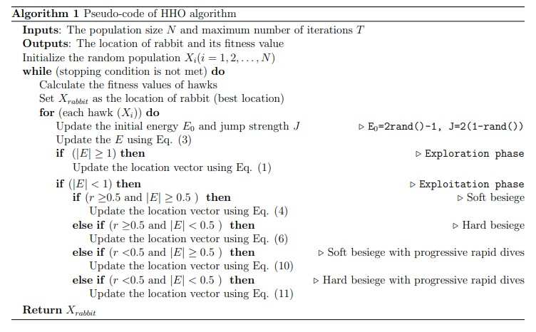

# 哈里斯鹰优化算法(Harris Hawks Optimizer,HHO)

## 1 引言

近几十年来，随着智能计算的不断发展，越来越多的智能优化算法在被创造和改进，不管这些算法的多样性如何，都有一个共同的特点：搜索步骤有两个阶段：

- 探索（多样化）
- 开发（强化）

**探索阶段:** 算法应尽可能利用和推广其随机化算子，深入探索特征空间的各个区域和侧面。因此，设计良好的优化器的探索行为应该具有足够丰富的随机性，以便在搜索过程的早期步骤中有效地将更多随机生成的解决方案分配给问题拓扑的不同区域。
**开发阶段:** 该阶段通常在探索阶段之后执行。在这个阶段，优化器尝试关注位于特征空间内的质量更好的解决方案的邻域。它实际上加强了局部区域的搜索过程，而不是景观的全包区域。一个组织良好的优化器应该能够在探索和开发倾向之间做出合理的、精细的平衡。否则，陷入局部最优 ($LO$) 和不成熟收敛缺点的可能性会增加。

在本文中，提出了一种新的基于种群的、受自然启发的优化范式，称为$Harris\quad Hawks\quad Optimizer (HHO)$。 $HHO$的主要灵感来自于哈里斯的鹰在自然界中的合作行为和追逐风格，称为惊喜突袭。在这个聪明的策略中，几只鹰合作从不同方向突袭猎物，试图给它一个惊喜。哈里斯鹰可以根据场景的动态性和猎物的逃跑模式揭示各种追逐模式。这项工作在数学上模仿这种动态模式和行为来开发优化算法。

## 2 哈里斯鹰优化算法(Harris hawks optimization,HHO)

在$HHO$中，作者模拟了提议的探索和利用阶段，其灵感来自于哈里斯鹰探索猎物、突然突袭和不同的攻击策略。图 1 显示了 HHO 的所有阶段。

### 2.1 探索阶段

如果考虑哈里斯鹰的性质，它们可以通过强大的眼睛跟踪和发现猎物，但有时猎物不容易被看到。 因此，老鹰等待、观察和监视沙漠地点，可能在几个小时后发现猎物。 在 $HHO$ 中，哈里斯鹰是候选解，每一步中的最佳候选解被认为是预期的猎物或接近最优解。 在 $HHO$ 中，哈里斯的鹰在某些位置随机栖息，并根据两种策略等待检测猎物。 如果我们考虑每个栖息策略的机会 $q$ 均等，它们会根据其他家庭成员的位置（攻击时离他们足够近）和兔子的位置栖息，该情形抽象为等式（1）中 $q<0.5$ 的条件模型，或栖息在随机高大的树上（组的家庭范围内的随机位置），该情形抽象为等式（1）中 q ≥ 0.5 的条件模型。

$$
X(t+1)=\begin{cases}
    X_{rand}(t)-r_1|X_{rand}(t)-2r_2X(t)|&q\geq 0.5\\
    (X_{rabbit}(t)-X_m(t))-r_3(LB+r_4(UB-LB))&q\lt 0.5
\end{cases}\tag{1}
$$

>其中$X(t + 1)$是鹰在下一次迭代$t$中的位置向量，$X_{rabbit}(t)$是兔子的位置，$X(t)$是鹰的当前位置向量，$r_1、r_2、r_3、r_4$和$q$是(0,1)内的随机数，每次迭代都会更新，$LB$和$UB$表示变量的上下界，$X_{rand}(t)$是从当前种群中随机选择的鹰，$X_m(t)$是目前的鹰群平均位置。

作者提出了一个简单的模型来生成该组的家庭范围$（LB，UB）$内的随机位置。 第一条规则根据随机位置和其他鹰派生成解决方案。 在等式（1）的第二条规则中，有迄今为止最好的位置与组的平均位置的差异加上一个基于变量范围的随机缩放分量，而 $r_3$ 是一个缩放系数，以进一步增加随机 一旦 $r_4$ 接近于 1，规则的性质就会出现类似的分布模式。 在这条规则中，作者向 LB 添加了一个随机缩放的移动长度。 然后，作者为组件考虑了一个随机缩放系数，以提供更多的多样化趋势并探索特征空间的不同区域。 可以构建不同的更新规则，但作者使用了最简单的规则，它能够模仿鹰的行为。

鹰群的平均位置是使用公式（2）获得的：

$$
X_m(t)=\frac{1}{N}\sum_{i=1}^N X_i(t)\tag{2}
$$

>其中 $X_i(t)$ 表示迭代 $t$ 中每只鹰的位置，$N$ 表示鹰的总数。

### 2.2 从探索到开发的转变

$HHO$算法可以从探索转移到利用，然后根据猎物的逃逸能量在不同的利用行为之间变化。 在逃跑的过程中，猎物的能量会大大降低。 为了模拟这一事实，猎物的能量被建模为：

$$
E=2E_0(1-\frac{t}{T})\tag{3}
$$

>其中$E$表示猎物的逃逸能量，$T$是最大迭代次数，$E_0$是其能量的初始状态。

在$HHO$中，$E_0$在每次迭代时在区间(-1，1)内随机变化。当$E_0$的值从0减少到-1时，兔子身体萎靡不振，而当$E_0$的值从0增加到1时，这意味着兔子的身体状况在增强。在迭代期间，动态逃逸能量$E$具有减小的趋势。当逃逸能量$|E|≥1$时，鹰搜索不同的区域以探索兔子的位置，因此，$HHO$执行探索阶段，并且当$|E|<1$时，算法尝试在探索步骤期间探索解的邻域。简而言之，探索发生在$|E|≥1$时，而开发发生在$|E|<1$时。

### 2.3 开发阶段

在这一阶段，哈里斯鹰通过攻击前一阶段探测到的预定猎物来执行突袭。然而，猎物经常试图逃离危险的环境。因此，在真实的情况下会出现不同的追逐方式。根据猎物的逃跑行为和哈里斯鹰的追逐策略，在$HHO$中提出了四种可能的策略来模拟攻击阶段。猎物总是试图逃离危险的环境。假设$r$是猎物在突袭前成功逃脱$(r <0.5)$或不成功逃脱$(r ≥0.5)$的几率。无论猎物做什么，鹰都会执行一个硬的或软的围攻来抓住猎物。这意味着它们会根据猎物保留的能量，从不同的方向或软或硬地包围猎物。在真实情况下，鹰会越来越靠近目标猎物，通过突袭来增加合作杀死兔子的机会。几分钟后，逃跑的猎物会失去越来越多的能量；然后，鹰强化围攻过程，毫不费力地抓住筋疲力尽的猎物。为了对该策略进行建模并使$HHO$能够在软硬包围过程之间切换，使用了参数$E$。对此，当$|E|≥0.5$时，发生软围攻，当$|E|<0.5$时，发生硬围攻。

#### 2.3.1 软围攻

当$r ≥ 0.5$且$|E| ≥ 0.5$时，兔子仍有足够的能量，并试图通过一些随机的误导性跳跃来逃脱但最终无法逃脱。在这些尝试中，哈里斯的鹰轻轻地包围兔子，使它更加疲惫，然后进行突然袭击。此行为由以下规则建模:

$$
X(t+1)=\Delta X(t)-E|JX_{rabbit}(t)-X(t)|\tag{4}
$$

$$
\Delta X(t)=X_{rabbit}(t)-X(t)\tag{5}
$$

>其中$X(t)$是兔子的位置向量与迭代t中的当前位置之差，$r_5$是$(0，1)$中的随机数，$J = 2(1-r_5)$表示兔子在整个逃脱过程中的随机跳跃强度。J值在每次迭代中随机变化，以模拟兔子运动。

#### 2.3.2 硬围攻

当$r≥0.5$且$|E|<0.5$时，猎物是极度疲惫，它具有较低的逃逸能量。此外，哈里斯鹰很难包围预定的猎物，以最终执行突袭。在这种情况下，使用等式(6)更新当前位置。

$$
X(t+1)=X_{rabbit}(t)-E|\Delta X(t)|\tag{6}
$$

#### 2.3.3 渐进式突击的软包围

当$E$保持$|E|≥0.5$但$r <0.5$时，兔子有足够的能量成功逃脱，并在突袭前仍构成一次软围攻。这个过程比以前的情况更加智能。

为了对猎物的逃脱模式和跳跃运动进行数学建模，在HHO算法中使用了莱维飞行(Levy Flight,LF)概念。LF用于模拟猎物(特别是兔子)在逃跑阶段的真实之字形欺骗性运动，以及鹰在逃跑的猎物周围不规则、突然和快速的俯冲。实际上，鹰在兔子周围进行了几次团队快速俯冲，并试图根据猎物的欺骗性运动逐步纠正它们的位置和方向。这一机制也得到了自然界中其他竞争情况下的真实观察的支持。已经证实，在非破坏性觅食条件下，基于LF的活动是觅食者/捕食者的最佳搜索策略。此外，已经发现基于LF的模式可以在像猴子和鲨鱼这样的动物的追逐活动中检测到。因此，基于低频的运动被用于$HHO$技术的这一阶段。

受鹰的真实行为启发，作者认为当它们希望在竞争中捕捉猎物时，它们可以逐步选择最佳的俯冲方式。因此，为了进行软围攻，作者假设鹰群可以根据等式(7)中规则评估(决定)他们的下一步行动:

$$
Y=X_{rabbit}(t)-E|JX_{rabbit}(t)-X(t)|\tag{7}
$$

然后，它们将这一动作的可能结果与前一次俯冲进行比较，以检测这是否是一次好的俯冲。如果这是不合理的(当它们看到猎物在做更具欺骗性的动作时)，当接近兔子时，它们也会开始做不规则的、突然的、快速的俯冲。作者假设他们将使用公式(8)的规则进行低频模式俯冲:

$$
Z=Y+S\times LF(D)\tag{8}
$$

>其中$D$是问题的维数，$S$是大小为$1 × D$的随机向量，LF是levy飞行函数，使用等式(9-1)计算:

$$
LF(x)=0.01\times \frac{u\times \delta}{|v|^{\frac{1}{\beta}}}\tag{9-1}
$$

>其中$u,v$是(0,1)之间的随机数。

$\delta$的计算方式如下：

$$
\delta=\left(\frac{\Gamma(1+\beta)\times sin(\frac{\pi \beta}{2})}{\Gamma(\frac{1+\beta}{2})\times \beta\times 2^{\frac{\beta-1}{2}}}\right)\tag{9-2}
$$

>其中$\beta$是一个常数，数值为1.5.

因此，在软围攻阶段更新鹰的位置的最终策略按照等式(10)执行。

$$
X(t+1)=\left\{\begin{matrix}Y，F(Y)>F(X(t))\\Z，F(Z)\leq F(X(t)) \end{matrix}\right.\tag{10}
$$

>其中$Y$和$Z$分别使用公式(7)、(8)计算。

### 2.3.4 渐进式突击的硬围攻

当|E| <0.5和r <0.5时，兔子没有足够的能量逃跑，在突然扑上来捕捉和杀死猎物之前构筑了一个艰难的包围。在这个步骤中猎物的情况和软围攻中的情况类似，但这一次，老鹰试图减小自己平均位置与逃跑猎物的距离。因此，在硬包围条件下执行以下规则:

$$
X(t+1)=\left\{\begin{matrix}Y，F(Y)>F(X(t))\\Z，F(Z)\leq F(X(t)) \end{matrix}\right.\tag{111}
$$

>在渐进式突击的硬围攻执行时，等式(11)中$Y$,$Z$分别使用新的规则(12),(13)来执行。

$$
Y=X_{rabbit}(t)-E|JX_{rabbit}(t)-X_m(t)|\tag{12}
$$

$$
Z=Y+S\times LF(D)\tag{13}
$$

>其中$X_m(t)$利用公式(2)进行计算。

### 2.3 算法伪代码

算法整体结构及伪代码如下所示：

## 3 代码实现

>详细代码实现见$code$文件夹,需要说明的是，HHO作者提供了官方的matlab,Java,Python等版本，需要的可自行下载。

<http://evo-ml.com/2019/03/02/hho/>

## 参考文献

[1]Heidari A A, Mirjalili S, Faris H, et al. Harris hawks optimization: Algorithm and applications[J]. Future generation computer systems, 2019, 97: 849-872.
