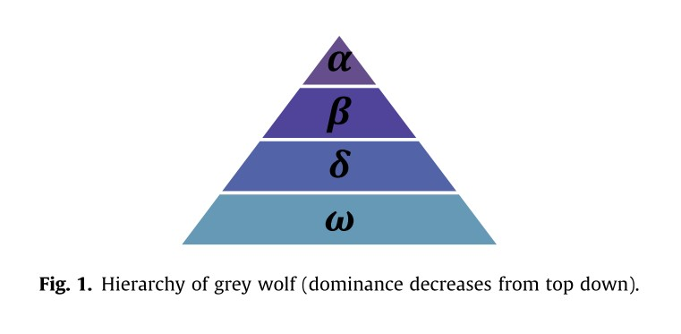

# 灰狼优化算法(Grey Wolf Optimizer)

## 1 引言

本文描述了一种新的元启发式称为灰狼优化(GWO)的灵感来自灰狼(Canis lupus)。GWO算法模拟了自然界中灰狼的领导阶层和狩猎机制。采用alpha、beta、delta和omega四种类型的灰狼来模拟领导阶层。此外，还实现了狩猎、寻找猎物、包围猎物和攻击猎物三个主要步骤。然后在29个已知的测试函数上对算法进行了基准测试，并与粒子群优化(PSO)、引力搜索算法(GSA)、差分进化(DE)、进化规划(EP)和进化策略(ES)进行了对比研究，验证了算法的结果。结果表明，与这些著名的元启发式算法相比，GWO算法能够提供非常有竞争力的结果。本文还考虑了三个经典的工程设计问题(拉伸/压缩弹簧、焊接梁和压力容器设计)，并给出了该方法在光学工程领域的实际应用。经典工程设计问题和实际应用的结果表明，该算法适用于具有未知搜索空间的挑战性问题。
**元启发式算法的优势**

- 首先，元启发式相当简单。它们的灵感大多来自非常简单的概念。这些灵感通常与物理现象、动物行为或进化概念有关。这种简单性允许计算机科学家模拟不同的自然概念，提出新的元启发法，混合两个或更多的元启发法，或改进当前的元启发法。此外，这种简单性有助于其他科学家快速学习元启发式，并将它们应用到他们的问题中。
- 其次，灵活性是指在不改变算法结构的情况下，元启发式算法对不同问题的适用性。元启发式很容易适用于不同的问题，因为它们大多将问题假定为黑盒。换句话说，对于元启发式，只有系统的输入和输出是重要的。因此，设计师所需要的就是知道如何为元启发式表示他/她的问题。
- 第三，大多数元启发式具有无派生机制。与基于梯度的优化方法相比，元启发式方法是随机优化问题的。优化过程从随机解开始，不需要计算搜索空间的导数来找到最优解。这使得元启发式非常适合于具有昂贵或未知衍生信息的实际问题。
最后，与传统的优化技术相比，元启发式在避免局部最优方面具有更强的能力。这是由于元启发式的随机特性，它允许它们避免在局部解中停滞，并广泛地搜索整个搜索空间。真实问题的搜索空间通常是未知的，并且非常复杂，有大量的局部最优值，所以元启发式是优化这些具有挑战性的真实问题的很好的选择。
- 最后，与传统的优化技术相比，元启发式在避免局部最优方面具有更强的能力。这是由于元启发式的随机特性，它允许它们避免在局部解中停滞，并广泛地搜索整个搜索空间。真实问题的搜索空间通常是未知的，并且非常复杂，有大量的局部最优值，所以元启发式是优化这些具有挑战性的真实问题的很好的选择。
**元启发式可以分为两种:**

- 单一解决方案
- 基于种群
  
  >- 单一解决方案的例如模拟退火，搜索过程从一个候选解决方案开始。然后，在迭代过程中对这个单一的候选解决方案进行改进。
  >- 基于种群的元启发式使用一组解决方案(种群)执行优化。在这种情况下，搜索过程从一个随机初始填充(多个解决方案)开始，并且在迭代过程中这个填充会得到增强。

**与基于单一解决方案的算法相比，基于种群的元启发式有一些优势:**
>
>- 多个候选解决方案共享关于搜索空间的信息，从而导致突然向搜索空间中有前途的部分跳跃。
>- 多个候选解相互帮助，避免局部最优解。
>- 与基于单一解决方案的算法相比，基于群体的元启发式算法通常具有更大的探索意义。

**元启发式算法中的大多数都使用了群体智能(Swarm Intelligence, SI)相关知识，群体智能类算法具有以下优势：**
>
>- SI算法在迭代过程中保留关于搜索空间的信息，而进化算法(EA)丢弃了前几代的信息。
>- SI算法经常利用内存来保存到目前为止得到的最佳解。
>- 单位制算法通常需要调整的参数较少。
>- 与进化方法(交叉、变异、精英化等)相比，SI算法有更少的运算符。
>- SI算法很容易实现。

无论元启发式之间的差异如何，一个共同的特征是将搜索过程划分为两个阶段:**探索和利用**。

- **探索阶段：** 是指尽可能广泛地调查搜索空间中有希望的区域的过程。为了支持这一阶段，算法需要随机算子对搜索空间进行随机和全局搜索。而
- **开发阶段：** 是指在勘探阶段所获得的有希望区域周围的局部搜索能力。

## 2 算法介绍

### 2.1 算法生物学描述

灰狼(Canis lupus)属于犬科动物。他们有一个非常严格的社会等级制度，如图1所示。

- **种群领导者-$\alpha$**: 领导者是异性各一，称为$\alpha$。阿尔法狼主要负责决定狩猎、睡觉的地点、醒来的时间等等。$\alpha$狼的决定是由狼群决定的。然而，人们也观察到一些民主的行为，比如一只$\alpha$狼会跟随狼群中的其他狼。在聚会的时候，整个狼群都会把尾巴垂下来以示对首领的认可。$\alpha$狼也被称为统治狼，因为他/她的命令应该由整个狼群来执行。$\alpha$狼只允许在狼群中交配。有趣的是，$\alpha$不一定是团队中最强大的成员，但在管理团队方面是最好的。这表明一个狼群的组织和纪律比它的力量重要得多。
- **灰狼第二级-$\beta$**：$\beta$狼是一种从属的狼，在决策或其他群体活动中帮助首领。$\beta$狼可以是雄性或雌性，他/她可能是成为$\alpha$狼的最佳人选，以防其中一只$\alpha$狼去世或变得非常老。$\beta$狼应该尊重$\alpha$狼，但也要指挥其他低级狼。它扮演着首领的顾问和狼群的纪律执行者的角色。$\beta$加强了$\alpha$在整个族群中的命令，并向$\alpha$提供反馈。
- **灰狼最低等级-$\omega$**：$\omega$是替罪羊的角色。$\omega$狼总是要服从于其他所有的狼。它们是最后被允许进食的狼群。看起来$\omega$在族群中并不是一个重要的个体，但据观察，如果失去$\omega$，整个族群将面临内部斗争和问题。这是由于$\omega$对所有狼人暴力和挫折的发泄。这有助于满足整个族群的需求并维持主导结构。在某些情况下，$\omega$还是族群中的保姆。
- **灰狼的其他等级-$\delta$**：如果一只狼不是$\alpha$、$\beta$或$\omega$，他/她被称为下属(或在某些参考文献中称为$\delta$)。$\delta$狼不得不屈从于阿尔法和贝塔，但它们主宰着$\omega$。侦察兵、哨兵、长老、猎人和看护者都属于这一类。侦察兵负责观察领地的边界，并在任何危险情况下警告狼群。哨兵保护并保证族群的安全。长者是有经验的狼人，他们曾经是$\alpha$狼或$\beta$狼。猎人帮助$\alpha$和$\beta$狩猎猎物，并为狼群提供食物。最后，看护人负责照顾狼群中虚弱、生病和受伤的狼。

**除了狼的社会等级，群居狩猎是灰狼另一种有趣的社会行为。灰狼狩猎的主要阶段如下:**

- 追踪，追逐，接近猎物。
- 追逐，包围和骚扰猎物直到它停止移动。
- 攻击猎物。

### 2.2 算法的数学模型

#### 2.2.1 等级模型

为了在设计 GWO 时对狼的社会等级进行数学建模，我们将最适合的解决方案视为 $\alpha$ (a)。 因此，第二个和第三个最佳解决方案分别命名为 $\beta$ (b) 和 $\delta$ (d)。 其余的候选解被假定为 $\omega$ (x)。 在 GWO 算法中，搜索（优化）由 a、b 和 d 引导。 x 狼跟随这三只狼。

>在这里，即将当前搜索到的解决方案使用对应问题模型进行评价，并将评价位置按适应度进行排序，使用前三个最优解对种群中的其余狼进行引导。

#### 2.2.2 包围猎物

灰狼在狩猎过程中会包围猎物。包围猎物的移动方程如下：
$$
\vec{D}=|\vec{C}\cdot\vec{X_p}(t)-\vec{X_t}|\tag{1}
$$

$$
\vec{X}(t+1)=\vec{X_p}(t)-\vec{A}\cdot\vec{D}\tag{2}
$$

>其中$t$表示当前迭代，$\vec{A}$和$\vec{C}$是系数向量，$\vec{X_p}$是猎物的位置向量，$\vec{X}$表示灰狼的位置向量。

向量$\vec{A}$和$\vec{C}$计算公式如下：

$$
\vec{A}=2\vec{a}\cdot\vec{r_1}-\vec{a}\tag{3}
$$
$$
\vec{C}=2\cdot\vec{r_2}\tag{4}
$$

>其中$\vec{a}$的分量在迭代过程中从 2 线性减少到 0，而$r_1、r_2$是 [0, 1] 中的随机向量。

#### 2.2.3 捕食

灰狼具有识别猎物位置并包围它们的能力。 狩猎通常由$\alpha$引导。$\beta$和$\delta$也可能偶尔参与狩猎。 然而，在抽象的搜索空间中，我们不知道最佳位置（猎物）的位置。 为了在数学上模拟灰狼的狩猎行为，作者假设$\alpha$（最佳候选解决方案）$\beta$和$\delta$对猎物的潜在位置有更好的了解。 因此，我们保存目前获得的前三个最佳解决方案，并强制其他搜索代理（包括 $\omega$）根据最佳搜索代理的位置更新他们的位置。 在这方面提出以下公式。

$$
\begin{cases}
    \vec{D_{\alpha}}=|\vec{C_1}\cdot\vec{X_{\alpha}}-\vec{X}|\\
    \vec{D_{\beta}}=|\vec{C_2}\cdot\vec{X_{\beta}}-\vec{X}|\\
    \vec{D_{\delta}}=|\vec{C_3}\cdot\vec{X_{\delta}}-\vec{X}|\\
\end{cases}\tag{5}
$$
$$
\begin{cases}
    \vec{X_1}=\vec{X_{\alpha}}-\vec{A_1}\cdot\vec{D_{\alpha}}\\
    \vec{X_2}=\vec{X_{\beta}}-\vec{A_2}\cdot\vec{D_{\beta}}\\
    \vec{X_3}=\vec{X_{\delta}}-\vec{A_3}\cdot\vec{D_{\delta}}\\
\end{cases}\tag{6}
$$
$$
\vec{X}(t+1)=\frac{\vec{X_1}+\vec{X_2}+\vec{X_3}}{3}\tag{7}
$$

>

#### 2.2.4 攻击猎物（剥削）

当猎物停止移动时，灰狼就会攻击猎物，从而结束捕猎。为了建立接近猎物的数学模型，我们降低了$\vec{a}$的值。根据公式(3)可知$\vec{A}$的波动范围也随着$\vec{a}$减小。换句话说$\vec{A}$是区间$[-2a, 2a]$内的一个随机值，其中$a$在迭代过程中从2减少到0。当$\vec{A}$的随机值为[1,1]时，搜索代理的下一个位置可以是其当前位置与被捕食者位置之间的任意位置。

>上面是原文对于攻击猎物的描述，当我自己读这一段时，发现以下几个问题，第一，$\vec{a}$是一个向量，而非实值，因此描述向量$\vec{A}$的范围有点问题；第二，按照公式(3)，用作者所描述的，那么$\vec{A}$的取值范围也应该是$[-a,2a]$

GWO 算法的伪代码如上图所示。 为了了解 GWO 在理论上如何解决优化问题，可能需要注意以下几点：

- 提议的社会等级有助于 GWO 保存迄今为止在迭代过程中获得的最佳解决方案。
- 提议的环绕机制定义了围绕解决方案的圆形邻域，该邻域可以扩展到更高维度作为超球体。
- 随机参数 A 和 C 帮助候选解具有不同随机半径的超球体。
- 所提出的狩猎方法允许候选解决方案定位猎物的可能位置。
- 探索和开发由 a 和 A 的自适应值保证。
- 参数 a 和 A 的自适应值允许 GWO 在探索和开发之间平滑过渡。
- 随着 A 的减小，一半的迭代用于探索$(|A|\geq 1)$，另一半用于开发$(|A| < 1)$。
- GWO 只有两个主要参数需要调整（a 和 C）。

### 2.3 代码回溯

在作者的论文中，对于如何具体实现$GWO$的流程和要求没有进行详细描述，只是给出了较为重要的几个公式。所幸作者给出了源代码，据此写下本小节。本人才疏学浅，如有错误，请指正！

#### 2.3.1 位置初始化

在$GWO$中，灰狼位置初始化与搜索空间有关，具体公式如下：

$$
position_i^d=rand\cdot (x_{max}^d-x_{min}^d) + x_{min}^d\tag{8}
$$
>其中$position_i^d$为第$i$只灰狼维度$d$的位置，$rand$为(0,1)之间的均匀随机数，$x_{max}^d$为第$d$维的上限解空间，$x_{min}^d$为第$d$维的下限解空间。

#### 2.3.2 位置限制

与$PSO$类似，在$GWO$中也需要对跨越边界的维度进行处理，处理方式也一样，将对应出界的维度拉回最近的边界。公式如下：

$$
\begin{cases}
    position_i^d=x_{max}^d&if\quad position_i^d>x_{max}^d\\
    position_i^d=x_{min}^d&if\quad position_i^d>x_{min}^d
\end{cases}\tag{9}
$$

#### 2.3.3 状态转移

1. 按照算法的数学模型，从当前狼中挑选出$\alpha,\beta,\delta$狼，即将适应度前三的狼命名为$\alpha,\beta,\delta$。
   >这里需要特别注意，$\alpha,\beta,\delta$保存的是迭代过程中适应度前三的灰狼位置，即全局历史前三的最优位置。
2. 按照公式(9)计算参数$a$(参数$a$随迭代次数在2~0线性递减):$$a=2-\frac{2\times iterate}{iterate_{max}}\tag{10}$$
   >其中$iterate$为当前迭代次数，由于$a$的取值范围为一开始为2，因此我们需要使第一次公式(10)分子为0，$iterate_{max}$为最大迭代次数。
   >
3. 按照公式(3)、(4)计算$\alpha,\beta,\delta$狼对应的系数$\vec{A}、\vec{C}$，在原文公式中给出的是矩阵系数的直接计算公式，实际上内部计算公式如下公式(11)、(12)所示：$$A_i^d=2a\cdot rand-a\tag{11}$$$$C_i^d=2\cdot rand\tag{12}$$
   >即矩阵$\vec{A}、\vec{C}$是根据公式(3)、(4)计算而来，而公式中的矩阵$\vec{r}$是一个随机矩阵，即矩阵中的所有维度都是随机生成的。
   >此外，公式(3)、(4)中的向量$\vec{a}$可以把它看作是一个各维度都相同的向量，但是在矩阵运算中，标量是可以直接和向量或者矩阵直接运算的。因此，向量$\vec{a}$就可以被看作参数$a$。
   >
4. 按照公式(5)、(6)计算$D_{\alpha}、D_{\beta}、D_{\delta}$和$X_1、X_2、X_3$
5. 按照公式(7)计算本次迭代位置

## 3 算法实现

在实现代码过程中，还是存在一个疑虑，在作者给出的代码中，历史前三的$\alpha,\beta,\delta$狼是根据适应度值进行排序的，倘若存在位置不一样，但是适应度值一样的情形，那么依旧会忽略这些位置。因此严格意义上来说，$\alpha,\beta,\delta$狼是按照适应度值排序的三类狼。

详情见code文件夹下的对应代码。

## 4 参考文献

[1] Sm A ,  Smm B ,  Al A . Grey Wolf Optimizer[J]. Advances in Engineering Software, 2014:46–61.
