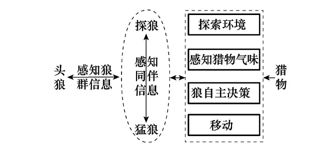
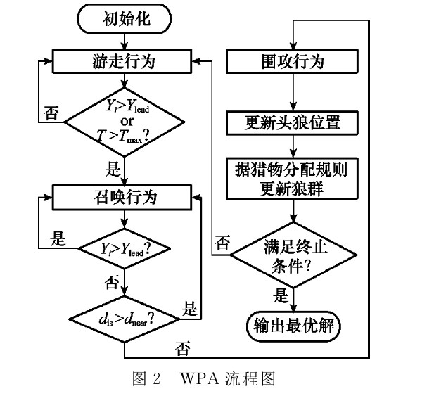

# 狼群算法(Wolf Pack Algorithm,WPA)

## 1 引言

基于狼群群体智能，模拟狼群捕食行为及其猎物分配方式，抽象出游走、召唤、围攻３种智能行为以及“胜者为王”的头狼产生规则和“强者生存”的狼群更新机制，提出一种新的群体智能算法———狼群算法(Wolf Pack Algorithm,WPA)。

狼群中有着明显的阶级，并且每一个阶级都有其明确的社会分工，它们团结协作为狼群的生存与发展承担着各自的责任。狼群中分别有：头狼、探狼、猛狼角色，各角色特点及猎物分配规则如下：

- 头狼：

    >头狼始终是狼群中最具智慧和最凶猛的，是在“弱肉强食、胜者为王”式的残酷竞争中产生的首领。它不 断地根据狼群所感知到的信息进行决策，负责整个狼群的 指挥和把关维护，既要避免狼群陷入危险境地又要指挥狼 群以期尽快地捕获猎物。
- 探狼：

  >寻找猎物时，狼群不会全体出动而是派出少数精 锐的探狼在猎物的可能活动范围内游猎，根据空气中猎物 留下的气味进行自主决策，气味越浓表明狼离猎物越近，探 狼始终就朝着气味最浓的方向搜寻。
- 猛狼：

    >一旦探狼发现猎物踪迹，就会立即向头狼报告， 头狼视情通过嚎叫召唤周围的猛狼来对猎物进行围攻。周 围的猛狼闻声则会自发地朝着该探狼的方向奔袭，向猎物 进一步逼近。
- 猎物分配规则：

  >捕获猎物后，狼群并不是平均分配猎物，而是按“论功行赏、由强到弱”的方式分配，即先将猎物 分配给最先发现、捕到猎物的强壮的狼，而后再分配给弱小 的狼。尽管这种近乎残酷的食物分配方式会使得少数弱狼 由于食物缺乏而饿死，但此规则可保证有能力捕到猎物的 狼获得充足的食物进而保持其强健的体质，在下次捕猎时 仍可顺利地捕到猎物，从而维持着狼群主体的延续和发展。

狼群捕猎模型如下：

## 2 算法介绍

### 2.1 问题定义

设狼群的猎场空间为一个$N\times D$的欧式空间，其中$N$为狼群中人工狼总数，$D$为待寻优的变量数。某一人工狼$i$的状态可表示为$X_i=(x_{i1},x_{i2},\cdots,x_{id})$，其中 $x_{id}$ 为 $i$ 匹人工狼在欲寻优的第$d(d=1,2,\cdots,D)$维变量空间中所处位置；人工狼所感知到的猎物气味浓度为$Y=f(X)$，其中 $Y$ 就是目标函数值；人工狼 $p$ 和 $q$ 之间的距离定义为其状态 向量间的曼哈顿(Manhattan)距离$L(p,q) = \sum_{d=1}^D|x_{pd}-x_{qd}|$，当然也可依据具体问题选用其他的距离度量。另外，由于实际中极大与极小值问题之间可相互转换，为论述方便以下皆以极大值问题进行讨论。

### 2.2 智能行为和规则的描述

头狼、探狼和猛狼间的默契配合成就了狼群近乎完美的捕猎行动，而“由强到弱”的猎物分配又促使狼群向最有 可能再次捕获到猎物的方向繁衍发展。将狼群的整个捕猎 活动抽象为３种智能行为（即游走行为、召唤行为、围攻行为）以及“胜者为王”的头狼产生规则和“强者生存”的狼群 更新机制。

1. **头狼产生规则**：初始解空间中，具有最优目标函数值的人工狼即为头狼；在迭代过程中，将每次迭代后最优狼的目标函数值与前一代中头狼的值进行比较，若更优则对头狼位置进行更新，若此时存在多匹的情况，则随机选一 匹成为头狼。头狼不执行３种智能行为而直接进入下次迭代，直到它被其他更强的人工狼所替代。

2. **游走行为**：将解空间中除头狼外最佳的 $S_{num}$ 匹人工狼视为探狼，在解空间中搜索猎物，$S_{num}$ 随机取 $[n/(\alpha+1),n/\alpha]$ 之间的整数，$α$为探狼比例因子。探狼 $i$ 首先感知空气中的猎物气味，即计算该探狼当前位置的猎物气味浓度 $Y_i$。若 $Y_i$ 大于头狼所感知的猎物气味浓度 $Y_{lead}$，表明猎物离探狼 $i$ 已相对较近且该探狼最有可能捕获猎物。于是 $Y_{lead}=Y_i$，探狼 $i$ 替代头狼并发起召唤行为；若 $Y_i<Y_{lead}$ ，则探狼先自主决策，即探狼向ｈ个方向分别前进一步(此时的步长称为游走步长 $step_a$) 并记录每前进一步后所感知的猎物气味浓度后退回原位置，则向第 $p(p=1,2,\cdots,h)$ 个方向前进后探狼 $i$ 在第 $d$ 维空间中所处的位置为:$$
x_{id}^p=x_{id}+sin(2\pi\times p/h)\times step_a^d\tag{1}
$$
此时，探狼所感知的猎物气味浓度为 $Y_{ip}$，选择气味最浓的且大于当前位置气味浓度 $Y_{i0}$ 的方向前进一步，更新探狼的状态 $X_i$，重复以上的游走行为直到某匹探狼感知到的猎物气味浓度 $Y_i>Y_{lead}$ 或游走次数 $Ｔ$ 达到最大游走次数 $T_{max}$.

    >需要说明的是由于每匹探狼的猎物搜寻方式存在差异，$h$ 的取值是不同的，实际中可依据情况取 $[h_{min},h_{max}]$ 间的随机整数，$h$ 越大探狼搜寻得越精细但同时速度也相对较慢。

3. **召唤行为**：头狼通过嚎叫发起召唤行为，召集周围的 $M_{num}$ 匹猛狼向头狼所在位置迅速靠拢，其中 $M_{num}=n-S_{num}-1$ ；听到嚎叫的猛狼都以相对较大的奔袭步长 $step_b$ 快速逼近头狼所在的位置。则猛狼 $i$ 第 $k+1$ 次迭代时，在第 $d$ 维变量空间中所处的位置为:$$x_{id}^{k+1}=x_{id}^k+step_b\cdot(g_d^k-x_{id}^k)/|g_d^k-x_{id}^k|\tag{2}
$$式中，$g_d^k$ 为第 $k$ 代群体头狼在第 $d$ 维空间中的位置。式（2）由２部分组成，前者为人工狼当前位置，体现狼的围猎基础；后者表示人工狼逐渐向头狼位置聚集的趋势，体现头狼对狼群的指挥。
奔袭途中，若猛狼 $i$ 感知到的猎物气味浓度 $Y_i>Y_{lead}$，则 $Y_{lead}=Y_i$，该猛狼转化为头狼并发起召唤行为；若 $Y_i<Y_{lead}
$，则猛狼 $i$ 继续奔袭直到其与头狼 $s$ 之间的距离 $d_{is}$ 小于 $d_{near}$ 时加入到对猎物的攻击行列，即转入围攻行为。设待寻优的第 $d$ 个变量的取值范围为 $[min_d,max_d]$，则判定距离 $d_{near}$ 可由式 (3) 估算得到$$d_{near}=\frac{1}{D\cdot \omega}\cdot\sum_{d=1}^{D}|max_d-min_d|\tag{3}$$其中，$\omega$为距离判定因子，其不同取值将影响算法的收敛速度，一般而言$\omega$增大会加速算法收敛，但$\omega$过大会使得人工狼很难进入围攻行为，缺乏对猎物的精细搜索。

    >召唤行为体现了狼群的信息传递与共享机制，并融入 了社会认知观点，通过狼群中其他个体对群体优秀者的“追 随”与“响应”，充分显示出算法的社会性和智能性。

4. **围攻行为**：经过奔袭的猛狼已离猎物较近，这时猛狼要联合探狼对猎物进行紧密地围攻以期将其捕获。这里将离猎物最近的狼，即头狼的位置视为猎物的移动位置。具体地，对于第 $k$ 代狼群，设猎物在第 $d$ 维空间中的位置为 $G_d^k$，则狼群的围攻行为可用方程（４）表示$$x_{id}^{k+1}=x_{id}^k+\lambda\cdot step_c^d\cdot|G_d^k-x_{id}^k|\tag{4}$$式中，$λ$ 为［－１，１］间均匀分布的随机数；$step_c$ 为人工狼 $i$ 执行围攻行为时的攻击步长。若实施围攻行为后人工狼感知到的猎物气味浓度大于其原位置状态所感知的猎物气味浓度，则更新此人工狼的位置，若不然，人工狼位置不变。

    设待寻优第ｄ个变量的取值范围为 $[min_d,max_d]$，则3种智能行为中所涉及到游走步长 $step_a$、奔袭步长 $step_b$、 攻击步长 $step_c$ 在第$d$ 维空间中的步长存在如下关系：$$step_a^d=step_b^d/2=2\cdot step_c^d=|max_d-min_d|/S\tag{5}$$式中，$S$ 为步长因子，表示人工狼在解空间中搜寻最优解的精细程度。

5. **“强者生存”的狼群更新机制**：猎物按照“由强到弱”的原则进行分配，导致弱小的狼会被饿死。即在算法中去除目标函数值最差的 $R$ 匹人工狼，同时随机产生 $R$ 匹人工狼。$R$ 越大则新产生的人工狼越多，有利于维护狼群个体的多样性，但若 $R$ 过大算法就趋近于随机搜索；若 $R$ 过小，则不利于维护狼群的个体多样性，算法开辟新的解空间的能力减弱。由于实际捕猎中捕获猎物的大小、数量是有差别的，进而导致了不等数量的弱狼饿死。因此，这里 $R$ 取 $[n/(2\times \beta),n/\beta]$ 之间的随机整数，$β$ 为群体更新比例因子。

### 2.3 算法描述

狼群算法的具体步骤如下。

>- 步骤１： 数值初始化。初始化狼群中人工狼位置 $X_i$ 及种群数目 $N$，最大迭代次数 $k_{max}$，探狼比例因子 $α$，最大游走次数 $T_{max}$，距离判定因子 $\omega$，步长因子 $S$，更新比例因子 $\beta$。
>
>---
>
>- 步骤２： 选取最优人工狼为头狼，除头狼外最佳的 $S_{num}$匹人工狼为探狼，其余狼作为猛狼。并执行游走行为，直到某只探狼 $i$ 侦察到的猎物气味浓度 $Y_i$，大于头狼所感知的猎物气味浓度 $Y_{lead}$或达到最大游走次数 $T_{max}$，则转步骤３。
>
>---
>
>- 步骤3： 人工猛狼据式（２）向猎物奔袭，若途中猛狼感知的猎物气味浓度 $Y_i>Y_{lead}$，则 $Y_{lead}=Y_i$ ，替代头狼并发起召唤行为；若 $Y_i<Y_{lead}$，则人工猛狼继续奔袭直到 $d_{is}\leq d_{near}$，转步骤4。
>
>---
>
>- 步骤4： 按式（４）对参与围攻行为的人工狼的位置进行更新，执行围攻行为。
>
>---
>
>- 步骤5： 按“胜者为王”的头狼产生规则对头狼位置进行更新；再按照“强者生存”的狼群更新机制进行群体更新。
>
>---
>
>- 步骤6： 判断是否达到优化精度要求或最大迭代次数 $k_{max}$，若达到则输出头狼的位置，即所求问题的最优解，否则转步骤２。

综上，$WPA$的流程图如图２所示。

>- 从原文的描述以及流程图来看，狼群的分类是在每一次迭代中进行的，但是在描述当中，头狼位置又是实时变换的，因此每一次头狼位置发生改变后，还是需要每一次对狼群进行评估，并重新划分探狼，猛狼。
>- 另外，流程图描述的是单只狼的行为，即该算法是单只狼一步一步轮流操作，而非并行同时搜索。

### 2.4 参数设置

>- 探狼比例因子$α＝4$
>- 最大游走次数$T_{max}＝20$
>- 距离判定因子$\omega＝500$
>- 步长因子$Ｓ＝1000$
>- 更新比例因子$β＝6$

## 3 算法实现

在算法实现过程中，有以下几点需要说明：

- 在算法描述中，探狼数目$S_{num}$、猛狼数目$M_{num}$以及最后的优胜劣汰狼的数目$R$，并未说明是在一开始计算好，还是每次迭代的时候都随机取值。

>关于这一问题，在实验过程中发现，每次迭代时随机取值效果会更好。

- 在$WPA$描述中，内部也存在迭代，但是猛狼和探狼更新上迭代计算公式(2)和(4)是根据前后迭代次数来描述的。按照流程图理解，每一代应该是通过最终终止条件来判断。

>针对这一问题，个人认为可以直接看作前后两者存在简单更新，不必太在意右上角迭代数目标识

- 在算法描述中，对于头狼的描述是全局最优位置为头狼，但是对于其他狼却没有明确说明，同时在文中作者**将解空间中除头狼外最佳的 $S_{num}$ 匹人工狼视为探狼**，因此在该文的描述中，自始自终都不需要使用另外的空间存储历史最优位置，因为全局最优位置是不需要进行移动，只需要引导其他狼移动。但同时也暴露出一个巨大问题，所有的狼并非都会受到头狼吸引，探狼只会在周围游走，只有猛狼在召唤和围攻行为时才会被头狼引导。

最后，本代码仅仅是个人在阅读文献理解编写而成，因此存在倘若存在错误也是不可避免，如果实验结果与参考文献不一致，请以作者为准！

代码详情见$code$文件夹。

>由于其他原因，我终究还是再次来到这篇文章，在进一步的阅读复现中，依旧是发现了部分本人暂时无法理解之处，主要在于**召唤行为**中的两个循环。因为如果找不到更优解，这就是死循环。但是如果将其改成判断，效果又无法达到论文中的所描述的那样。
>当然，在其他人的复现中，大部分是不再将狼群划分为猛狼，探狼等，而是按照粒子群优化方法，所有阶段的所有狼都参与搜寻。
>但是这样仿佛也是一个取巧的过程，因为这就相当于变相的给狼增加搜索次数，如果迭代内部有三个阶段，相当于搜索次数是最大迭代次数的3倍，而倘若在阶段内部又设置了移动策略，那就又要翻倍。总觉得这种方式不太恰当。
>以上仅是个人观点，仅供参考！如有不当，还请见谅。

## 4 参考文献

[1]吴虎胜, 张凤鸣, 吴庐山. 一种新的群体智能算法——狼群算法[J]. 系统工程与电子技术, 2013, 35(11):9.
