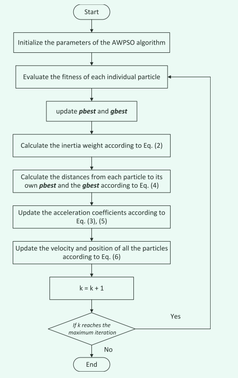

# 一种基于 Sigmoid 函数的自适应加权粒子群优化器(AWPSO)

## 1 引言

在该文中，提出了一种新的基于`Sigmoid`函数的自适应加权粒子群优化 (PSO) 算法。

- 算法主要创新：开发了一种基于 sigmoid 函数的加权策略来自适应地调整加速度系数。

>新提出的自适应加权策略同时考虑了粒子到全局最佳位置的距离和粒子到其个人最佳位置的距离，从而具有提高收敛速度的显着特点。受神经网络激活函数的启发，采用新策略通过 sigmoid 函数更新加速系数。

论文DOI:`10.1109/TCYB.2019.2925015`

## 2 算法介绍

### 2.1 改进起源

在`PSO`算法中，加速度系数被用来激励粒子移动到`pbest`和`gbest`。每个粒子的位置到它的`pbest`和`gbest`的距离在确定粒子的运动时起决定性作用。另一方面，控制参数的适应是寻求具有令人信服的效率和准确性的最佳解决方案的重要因素。因此，为了有效地控制`PSO`算法，在论文中，作者努力提出一种新的自适应加权机制，随着迭代的进行，加速度系数可以自适应地调整。

### 2.2 权重自适应策略

在经典的`PSO`算法中，单个粒子的速度会根据粒子到其`pbest`和`gbest`的距离而加速。因此，选择合适的加速度系数对于通过问题空间找到全局最优解至关重要。在这种情况下，根据上述距离自适应地更新加速系数迭代，以有效提高 PSO 算法的搜索能力，具有理论和实践意义。

在文中，作者提到，在很多的`PSO`变体仅以实时迭代次数的方式调整加速度系数(例如公式(1)所示)，而没有考虑种群演化的信息。

$$
\omega=\omega_{max}-\frac{iterate}{iterate_{max}}\omega_{min}\tag{1}
$$

作者提出，在进化过程的早期，鼓励所有个体尽可能多地探索整个搜索空间。然后，在优化过程的后期，个体被激励收敛到全局最优并尽快找到优化解决方案。从经典粒子速度更新公式中可以看出，粒子更新的速度取决于粒子到它们自己的`pbest`和`gbest`的距离。在这种情况下，根据每个粒子到其`pbest`和`gbest`的距离来调整加速度系数是合理的。

考虑到所有上述问题，作者提出了一种自适应加权策略来自适应地控制加速度系数。

- 主要作用：加快粒子搜索以尽可能快地找到最优解，从而提高收敛速度。
 
- 区别：与实时更新策略不同，加速度系数根据粒子与其`gbest`和`pbest`的距离而改变。如果粒子远离其`pbest`和`gbest`，则使用相对较大的加速系数来加速粒子。

同时，加速度系数的值被限制在一个适当的范围内，以避免过早收敛，这意味着速度应该是有界的，以保证算法的搜索能力。受前面讨论的启发，作者认为自适应加权更新函数适合描述加速度系数和距离（从粒子到它的`pbest`和`gbest`）之间的关系。换句话说，前一个加速度系数的更新应该适应后一个距离，从而充分证明粒子运动的速度朝向全局最优。从数学的角度来看，所提出的自适应加权更新规则可以描述如下：

$$
\begin{cases}
    c_{g_{pi}}(k)=F(g_{pi}(k))\\
    c_{g_{gi}}(k)=F(g_{gi}(k))
\end{cases}\tag{2}
$$

>其中，函数$F(·)$表示自适应加权更新函数，后面将会介绍；$g_{pi}(k)$和$g_{gi}(k)$定义为:
$$
\begin{cases}
    g_{pi}(k)=p_i(k)-x_i(k)\\
    g_{gi}(k)=g_i(k)-x_i(k)
\end{cases}\tag{3}
$$
>分别表示第$k$次迭代时粒子$i$到其$pbest$和$gbest$的距离。

### 2.3 自适应加权更新函数的选择

直观地说，自适应加权更新函数应该具有以下两个性质：
1) 更新函数是单调递增的；
2) 更新函数是有界的。

第一个属性主要是由于加速度系数的特性。众所周知，加速度系数是将粒子拉到`pbest`和`gbest`的加权项。远离其`pbest`和`gbest`的粒子需要快速移动到其`pbest`和`gbest`。因此，需要一个单调递增的函数。

第二个属性是由约束优化问题的搜索空间是正常有界的事实证明的。一旦一个粒子接近它的`pbest`和`gbest`，运动应该放慢，以避免错过它的`pbest`和`gbest`。因此，加速度系数应该有界以控制粒子的速度。

在寻找既单调递增又统一有界的适当更新函数时，神经网络中使用的激活函数似乎是理想的候选者。神经网络有一些流行的激活函数，例如阶跃函数和`sigmoid`函数，其中我们决定选择`sigmoid`函数作为自适应加权更新函数，原因有以下三个：
1) `sigmoid`函数是单调且有界的； 
2) `sigmoid`函数的曲线是S形的，这样可以避免控制参数发生不希望的突变； 
3) `sigmoid`函数是平滑可微的，从而反映了权重更新迭代的自适应/动态特性。

因此，该文采用`sigmoid`函数来调整加速度系数，如公式(4)所示。

$$
F(D)=\frac{b}{1+e^{-a(D-c)}}+d\tag{4}
$$

>其中`e`是自然对数，`a`表示曲线的陡度，是一个常数值，`b`表示曲线的峰值，`c`表示曲线中心点的横坐标值，`d`是一个正常数值， `D`是由(3)确定的函数的输入。具体来说，`D`是粒子与其认知加速系数的`pbest`之间的距离。对于社会加速度系数，`D`表示粒子与`gbest`之间的距离。

在上面的描述中，例如`b`表示的不是公式(4)的峰值，公式(4)的峰值为`b+d`。但是总的来说，这并不会影响我们对论文的理解和复现。

总之，所提出的基于 sigmoid 函数的自适应加权策略的三个主要优点总结如下。 
1) 加速度系数自适应控制在合理范围内，自适应加权策略保证了速度更新过程的效率。 
2) 自适应加权更新函数，选择sigmoid函数，用于反映加速度系数的单调但相对平滑的变化，其中较大的距离将导致较大的加速度系数值。 
3) 激发粒子尽可能快地寻求最优解，从而提高准确性和收敛性。

### 2.4 AWPSO 算法的框架

在该文中，速度及位置更新方式如下(5)，(6)式所示。

$$
v_i(k+1)=\omega v_i(k)+r_1 c_{g_{pi}}(k) g_{pi}(k)+r_2 c_{g_{gi}}(k) g_{gi}(k)\tag{5}
$$

$$
x_i(k+1)=x_i(k)+v_i(k+1)\tag{6}
$$

>其中$\omega$是惯性权重；$g_{pi}(k)$和$g_{gi}(k)$分别表示第$k$次迭代时粒子$i$到其$pbest$和$gbest$的距离；$c_{g_{pi}}(k)$表示由$g_{pi}(k)$确定的加速度常数；$c_{g_{gi}}(k)$表示由$g_{gi}(k)$确定的加速度常数。
>其中需要稍微指出的是，$r_1,r_2$是随机数。

流程图如下所示：

## 3 参数设置

在原文中，参数设置分别如下：

- `a=0.000035m`
- `b=0.5`
- `c=0`
- `d=1.5`

>其中`m`表示优化问题的搜索范围。

## 4 代码复现

在该文中，对于距离的计算并没有较为清晰的说明。首先我们通过分析文中的描述以及资料可知，加速系数$c_1,c_2$是一个常数，因此距离计算变成了此时最重要的问题，由于文中并未描述因此在实现时，我对以下计算公式进行计算。

>在原论文的“`IV Experimental Results and Discussion`"章节中，指出了该文使用的是欧氏距离，非常感谢`KoiLiu`的指正。

$$
\begin{cases}
    g_{pi}(k)=\sum_{d=1}^{dim} |p_i^d(k)-x_i^d(k)|\\
    g_{gi}(k)=\sum_{d=1}^{dim} |g_i^d(k)-x_i^d(k)|
\end{cases}\tag{7}
$$

$$
\begin{cases}
    g_{pi}(k)=\frac{1}{dim}\sum_{d=1}^{dim} |p_i^d(k)-x_i^d(k)|\\
    g_{gi}(k)=\frac{1}{dim}\sum_{d=1}^{dim} |g_i^d(k)-x_i^d(k)|
\end{cases}\tag{8}
$$

$$
\begin{cases}
    g_{pi}(k)=\sqrt{\sum_{d=1}^{dim} (p_i^d(k)-x_i^d(k))^2}\\
    g_{gi}(k)=\sqrt{\sum_{d=1}^{dim} (g_i^d(k)-x_i^d(k))^2}
\end{cases}\tag{9}
$$

>上面三个公式中$dim$代表问题的求解维度。

公式(7)和公式(9)可以看成是同一个计算方法，因此我们只需要验证公式(7)和公式(8)。

但是从根本上说，距离计算起始应该是公式(9)中描述的，这也是我们常用的，因此在这里我还是倾向于公式(9)的距离计算方法，当然，上面已经说了，公式(9)可以化简为公式(7)的模样，因此为了方便代码编写，可以直接使用公式(7)。

## 5 参考文献

[1]W. Liu, Z. Wang, Y. Yuan, N. Zeng, K. Hone and X. Liu, "A Novel Sigmoid-Function-Based Adaptive Weighted Particle Swarm Optimizer," in IEEE Transactions on Cybernetics, vol. 51, no. 2, pp. 1085-1093, Feb. 2021, doi: 10.1109/TCYB.2019.2925015.
