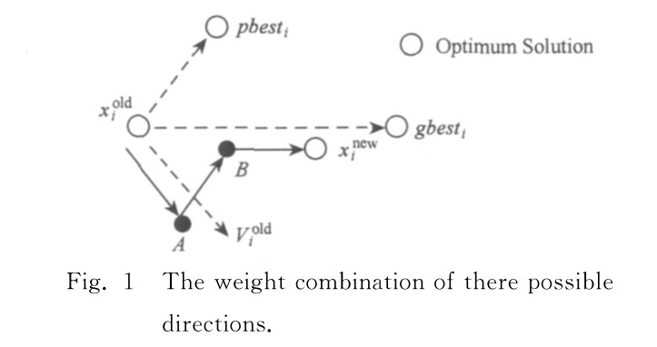

# 双中心粒子群优化

## 1 引言

粒子群优化（$PSO$）算法是一种新兴的群体智能优化技术，由于其原理简单、参数少、效果好等 优点已经广泛应用于求解各类复杂优化问题．而影响该算法收敛速度和精度的２个主要因素是粒子个 体极值与全局极值的更新方式．通过分析粒子的飞行轨迹和引入广义中心粒子和狭义中心粒子，提出 双中心粒子群优化（$double\; center\; particle\; swarm\; optimization,DCPSO$）算法，在不增加算法复杂度条 件下对粒子的个体极值和全局极值更新方式进行更新，从而改善了算法的收敛速度和精度。

在双中心粒子群优化中，主要有以下改变：

1. 改变轨迹探索方式
2. 引入广义中心粒子
3. 引入狭义中心粒子

## 2 算法精讲

首先需要明确的是，该算法基本沿用 $A\; Modified\; Particle\; Swarm\; Optimizer$（这里称之为 $OPSO$）中的算法结构，在该结构的基础上进行了三点改变：

- 飞行轨迹搜索改变
- 广义中心粒子
- 狭义中心粒子

因此，只要理解更改的部分便能理解该算法。而这三点改变分别体现在两处，分别是：

- 个体最优位置更新
- 全局最优位置更新

### 2.1 个体最优位置更新

在 $OPSO$ 中，粒子的更新方式为：

$$
v_i^d=\omega v_i^d+c1\times rand_i^d\times (pBest_i^d-x_i^d)+c2\times rand_i^d\times (gBest^d-x_i^d) \tag{1}
$$

因此，最终位置是通过上面的三项进行合成得到。在双中心粒子群优化中，个体最优位置更新是将上面三项进行拆分，在矢量合成的过程中，会经过三个位置，分别为：

$$
x_1 = x + \omega v_i^d\\
x_2 = x_1 + c1\times rand_i^d\times (pBest_i^d-x_i^d)\\
x_3 = x_2 + c2\times rand_i^d\times (gBest^d-x_i^d)\\
$$

如下图所示：

在上图中粒子飞行路径为 $x_{old}\Rightarrow A\Rightarrow B\Rightarrow x_{new}$，就单个粒子而言，折线运动经历的区域比直线方式复 杂，其捕食范围能够被最大程度地覆盖在整个搜索 空间内，体现在$PSO$算法中，每个粒子能够在更为 广阔的搜索空间内寻找最优解，这样粒子的个体极 值就能够得到显著的改善；从粒子群整体来说，每个粒子个体极值的改善将直接影响着种群全局极值的增强，这一影响使得种群能更快地收敛于最优解．

因此在更新时分别会对这三个位置进行比较更新，更新公式如下：

$$
f(pBest_i^{new})=min(f(A),f(B),f(x_i^{new},f(pBest_i^{old})))\tag{2}
$$

>注意事项：在个体最优位置更新时需要注意，在更新规则方面论文没有详细描述，通过有限测试，在这几个阶段速度不进行约束，但是位置需要约束，不能超过边界。并且最后要对速度进行归正，即执行公式（1），并且需要对最后的位置进行约束。该方式效果会更好！

- 探讨

其实如果深究，就会发现如果在算法中对速度进行约束，那么肯定就无法得到理想中的三个位置，因为在 $OPSO$ 中更新是整体更新，当速度超出范围就会被限制，但是我们无法知道在哪一处被限制。当然，倘若只对位置进行约束，那的确是不会出现上述现象。但是在参考论文中，速度是有限制的。因此我们无法获得准确的轨迹位置，而是依据上面的思想进行编写！

### 2.2 全局最优位置更新

在全局位置更新中，双中心粒子群优化引入了广义中心粒子($general center particle,GCP$)及狭义中心粒子($special center particle,SCP$)，两者计算公式为：

$$
x_d^{GCP}=\frac{1}{n-2}(\sum_{i=1}^{n-2}pBest_{id})\tag{3}
$$
$$
x_d^{SCP}=\frac{1}{n-2}(\sum_{i=1}^{n-2}x_{id})\tag{3}
$$

最终全局最优位置更新从所有的历史最优位置以及广义中心粒子、狭义中心粒子中竞选，公式如(4)式：

$$
f(gBest)=min(f(pBest_1),f(pBest_2),...,f(pBest_N),f(x^{GCP},f(x^{SCP})))\tag{4}
$$

## 3 代码编写

代码详见 $code$ 文件夹！

## 4 参考文献

[1].汤可宗,柳炳祥,杨静宇,孙廷凯.双中心粒子群优化算法[J].计算机研究与发展,2012,49(05):1086-1094.
