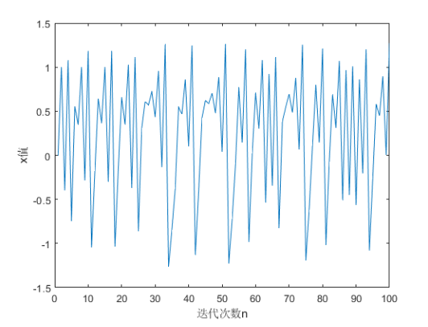
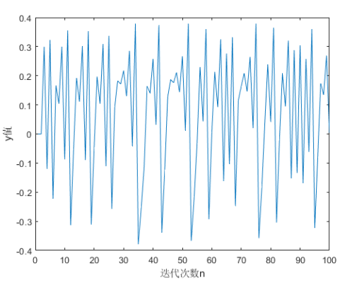
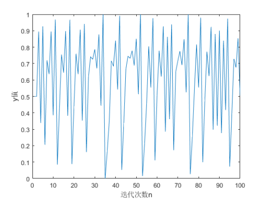

# 完全受扰的混沌粒子群优化算法

本文章以 《**Parameter optimization of multi-pass turning using chaotic PSO**》为基准，描述该文章中描述的完全受扰的混沌粒子群算法。

## 1 缘起

本文的作者为何会提出该算法，又是如何对粒子群进行改进的，现在就让我们来了解该改进算法的来由。
该算法提出的目的是为了确定一组最佳加工参数，以生产具有可观质量和最低制造成本的订购产品。 加工模型的非线性和高度约束的性质限制了基于经典梯度的技术处理此类问题的应用。 所以在该文章中的重点是在多道次车削操作中获得最佳加工条件。
>上面描述了提出该改进算法需要解决的问题，倘若你不是机械专业的，或者对多道次车削操作不了解的话，对上面的描述基本是一头雾水。
>
>但是无妨，本文主要是为了介绍算法，不需要对它的当前应用场景太过于熟知。下面才是重点！！

为了解决上面的问题，**该文章提出了一种混沌 PSO，即完全受扰粒子群优化 (TDPSO)，PSO 的增强变体用于在受到各种约束的多道次车削操作期间获得最佳加工条件。 在 TDPSO 中，混沌现象嵌入在 PSO 的不同阶段，以提高搜索过程的效率。** 将 TDPSO 获得的结果与文献中可用的结果进行比较，可以看出 TDPSO 对处理此类问题非常有效。

## 2 算法介绍

混沌 PSO 的随机性是由选择各种 PSO 参数所需的随机序列引起的。 在这里，采用混沌系统而不是均匀分布来在搜索过程的不同阶段生成随机序列。

### 2.1 混沌系统

在开始时引入混沌以生成初始种群。 这与基本 PSO 形成对比，其中初始种群是使用均匀分布的随机数生成的。 其次，为了防止局部优化器上的“粒子停滞”，当算法接近平衡状态时，在以后的迭代中嵌入混沌。 为此，根据“速度指数标准”从群中选择一些粒子进行扰动。 通过这种方式，将混沌嵌入 PSO 以增强全局搜索能力并避免停滞现象。 混沌是使用 Henon 混沌系统产生的，以扰乱搜索过程。

#### 2.1.1 混沌现象

**混沌**一词原指宇宙未形成之前的混乱状态，中国及古希腊哲学家对于宇宙之源起即持混沌论，主张宇宙是由混沌之初逐渐形成现今有条不紊的世界。在井然有序的宇宙中，西方自然科学家经过长期的探讨，逐一发现众多自然界中的规律，如大家耳熟能详的地心引力、杠杆原理、相对论等。这些自然规律都能用单一的数学公式加以描述，并可以依据此公式准确预测物体的行径。
混沌现象起因于物体不断以某种规则复制前一阶段的运动状态，而产生无法预测的随机效果。所谓“差之毫厘，失之千里”正是此一现象的最佳批注。**具体而言，混沌现象发生于易变动的物体或系统，该物体在行动之初极为单纯，但经过一定规则的连续变动之后，却产生始料所未及的后果，也就是混沌状态**。但是此种混沌状态不同于一般杂乱无章的的混乱状况，此一混沌现象经过长期及完整分析之后，可以从中理出某种规则出来。混沌现象虽然最先用于解释自然界，但是在人文及社会领域中因为事物之间相互牵引，混沌现象尤为多见。如股票市场的起伏、人生的平坦曲折、教育的复杂过程。

>- 混沌系统：简单来讲就是指一种系统呈现出一种杂乱无章且无法预测结果的系统。

#### 2.1.2 Henon Map

**Henon Map**（也称 Henon 映射）是一个二维离散时间动力系统，表现出混沌行为。 1976年由法国天文学家米歇尔·海农提出，作为洛伦兹模型的庞加莱图的简化模型。 它是一个耗散二次映射，它将平面中的点 $(x_n, y_n)$ 映射到一个新点，映射规则如下所示：
$$
\begin{align}
    x_{n+1} = y_n+1-ax_n^2\\
    y_{n+1} = bx_n
\end{align}
$$
这里以$x_0=0,y_0=0$为起始值，迭代一百次，其对应的y和x值的分布如下所示：

从上图中可以看出x和y都是呈现一种无序的状态，现在关键是用混沌时间序列取代伪随机序列值，所以需要将x或者y值映射到[0,1]范围内。这里使用如下公式进行映射：
$$
\begin{align}
    z=z-min(z)\\
    z=\frac{z}{max(z)}
\end{align}
$$
>z的取值范围为数组x，y

这样就将$z$约束在[0,1]范围内，这里以约束y为例，可得下图的时间序列：

如此就将 Henon Map 映射值约束在[0,1]之间，完成了归一化的操作。这就完成了在算法中使用混沌随机数取代 rand 函数产生的伪随机数的第一步。

#### 2.1.3 chaos函数原理

在2.1.2节我们已经拿到了归一化的基于 Henon Map 映射的混沌时间序列，现在就是分析如何编写chaos函数，函数是如何运行的。在原期刊中并未有详细的介绍，以下是基于个人推测：

- 迭代一百次，拿到完成归一化操作的 Henon Map 混沌时间序列，该序列相当于一个数组，内含有100个基于 Henon Map 映射的元素。
- 在chaos函数中随机生成一个[1-100]范围内的随机整数，以该整数获取对应下标的混沌时间序列。
- 将该下标对应的混沌随机数返回。

完成以上操作，其实质和所用的rand函数基本一致。在接下来的操作中，就可以直接调用 chaos 函数。

### 2.2 算法核心公式

在本小节，只会描述与标准粒子群优化算法所不一样的算法公式，所以没有提及的，则说明和标准粒子群优化算法是一样的。

#### 2.2.1 位置和速度的初始化

混沌粒子群优化算法的位置初始化和原始的标准粒子群优化算法一样，虽然表达公式不一样，但其核心是一样的，只不过该文中使用的是混沌随机数，标准粒子群优化中使用的是rand普通随机数。详见公式(5)。但是其速度更新公式却是有点不一样，不过根据公式来看的话，刚好是在-1和1的附近,详见公式(6)。
$$
\begin{align}
    x_{i,d} = x_{i,min}+(x_{i,max}-x_{i,min})\times chaos()\\
    v_{i,d} = \begin{cases}
        \frac{x_{i,min}-chaos()}{x_{i,max}-chaos()} &\text{if rand<0.5}\\
        \vert\frac{x_{i,min}-chaos()}{x_{i,max}-chaos()}\vert &\text{if rand>= 0.5}
    \end{cases}
\end{align}
$$

#### 2.2.2 扰动指标(Perturbation index)

扰动现象首先需要了解扰动指数，也称为每个粒子的“相对速度系数”。

##### 2.2.2.1 扰动指数-相对速度系数(Relative velocity coefficient)

在该文中，使用 Henon 映射生成初始种群后，评估和更新粒子的过程与标准 PSO 中的过程保持一致。 但是，经过指定次数的迭代后，会为每个维度中的每个粒子计算一个相对速度指数。相对速度指数计算方法如下：

- 1. 相对速度指标
  首先需要计算相对速度指标，相对速度指标的计算方法为：第$i$个粒子的第$d$维解空间相对速度指标等于该粒子第$d$维的值除以所有粒子第$d$维中的最大值。如下公式(7)所示：
  $$
  \begin{align}
      RCV_{i,d}=\frac{v_{i,d}}{V_{max,d}}
  \end{align}
  $$
- 2. 最大相对速度系数
  通过公式(7)能够得到每个粒子每维的相对速度指标，之后从每个粒子的各维中获取最大的一维的数值，将其作为该粒子的最大相对速度系数。公式如式(8):
  $$
    \begin{align}
        (Max_RVC)_i=max\{RVC_{i,1},RVC_{i,2},RVC_{i,3},\dotsb,RVC_{i,d} \}
    \end{align}
  $$
  计算所得到的最大相对速度系数决定了群中的一个粒子是否应该受到干扰。 选择具有最大相对速度系数在 [0,0.5] 范围内的粒子进行扰动。 Max_RVC 的较小值意味着粒子具有较低的速度，并且很可能被困在局部最优中，表明需要外力将其从这些区域中拉出来。

#### 2.2.3 粒子扰动(Disturbing particles)

粒子扰动是根据最大相对速度系数，选择粒子通过混沌时间序列扰乱其当前状态。

在该文中，通过一系列实验表明，并不需要对最大相对粒子速度在[0,0.5]之间的粒子的所有维度都进行扰动，当问题解的维度大于等于10的时候，只需要对其维度空间的一般进行扰动，当问题解的维度小于10的时候，可以对其所有的维度进行扰动。（当然，这只是在该文中的建议，比较不一定刚好以10为界限，但是可能在作者的实验中，当大于10时候进行全维度扰动效果会比较不理想。）

##### 2.2.3.1 扰动启动条件

对粒子的扰动并不是一开始就进行的，首先要了解目的。扰动的目的是为了使粒子跳出局部最优，所以一般是在粒子陷入局部最优，一直在某个范围内跳动无法进一步搜索的时候进行扰动的。

在该文中，作者提出，当迭代进行到70%之后，开始对粒子进行扰动。扰动方法如下：

1. 首先选择最大相对速度系数在[0,0.5]之间的粒子。
2. 对粒子其中的一半的维度进行随机扰动(当维度大于等于10时)，扰动方法如公式(9)所示。
   $$
    \begin{align}
        x_{i,d}(t+1) = chaos()\pm x_{i,d}(t)
    \end{align}
   $$
    >其中t为迭代次数，chaos() 是一个使用 Henon 映射产生混沌随机数的函数。

### 2.3 算法流程及相关变量值

#### 2.3.1 相关变量取值

在该文中，对以下参数进行了设置：

- 1. 惯性权重 $\omega$：从0.9以指数方式下降至0.4.
- 2. 种群大小：种群大小应为待求解问题空间的五倍(个人认为倘若是需要求解特定问题的最佳方案，可以采取该建议。倘若只是想测算该算法是否具有更好的寻求解能力，那么只需将需要对比的算法种群初始为同样大小)
- 3. 学习因子：学习因子$c_1,c_2$分别设置为2.8和1.3.
- 4. $v_{max,d}$初始时设置为$0.5\times (x_{max}-x_{min})$,其中$x_{max},x_{min}$为解的取值范围的上限和下限。(在python或者matlab这类语言中，无需对其初始化，直接可以后面的运行过程中直接拿到对应维度的最大值，当然倘若是强类型语言，那么就需要在一开始进行声明)

#### 2.3.2 算法流程

- Step 1: 初始化相关函数以及参数
  - Step 1.1: 通过 Henon 映射得到混沌时间序列，再将该序列归一化，使得取值在[0,1]内，保存到S中。
  - Step 1.2: 编写chaos()函数，随机从混沌序列S中取值。
  - Step 1.3: 分别按照公式(5)以及公式(6)进行粒子群位置和速度的初始化。
  - Step 1.4: 初始化 $pBest_i=x_i$,并通过适应值函数获取最优适应值位置$x_{best}$并将其赋值给$gBest$。
  - Step 1.5: 初始化起始迭代次数iterate以及最大迭代次数。
- Step 2: 进入循环，开使循环内的代码
  - Step 2.1: 按照标准粒子群优化算法更新粒子速度以及位置。
  - Step 2.2: 判断迭代次数是否超过总迭代次数的70%，若超过，则执行下面语句。
    - Step 2.2.1: 获取粒子每一维中速度的最大值$v_{max,d}$。
    - Step 2.2.2: 通过$v_{max,d}$来求解每个粒子对应维度的相对速度指标，求解公式如(7)所示。
    - Step 2.2.3: 通过每个粒子的相对速度指标来求取每个粒子的最大相对速度系数。公式如(8)所示。
    - Step 2.2.4: 筛选出最大相对速度系数在[0,0.5]之间的粒子按照下列方式进行扰动。
      - Step 2.2.4.1: 选择需要扰动的粒子维度的一半进行扰动，扰动公式如(9)所示，在这里，可生成一个随机数r，当r>0.5时选择执行$x_{i,d}(t+1)=chaos()+x_{i,d}(t)$，否则执行$x_{i,d}(t+1)=chaos()-x_{i,d}(t)$
  - Step 2.3: 对当前的粒子历史最优位置以及全局最优位置进行更新。
  - Step 2.4: 迭代次数加一，并判断是否超出最大迭代次数倘若超出，则跳出循环，否则，继续循环。
- Step 3: 执行结束，输出最优解。

### 2.4 代码

代码在code文件中，命名为 TDPSO,请自行获取。

## 参考文献

[1]Chauhan P, Pant M, Deep K. Parameter optimization of multi-pass turning using chaotic PSO[J]. International Journal of Machine Learning and Cybernetics, 2015, 6(2): 319-337.
