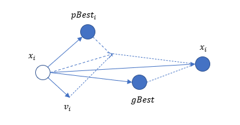
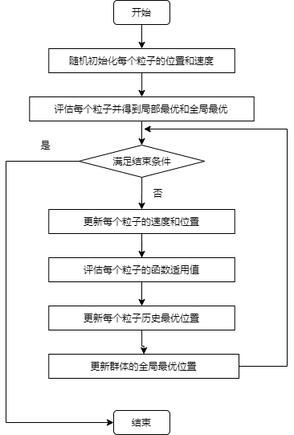

# 粒子群优化 一

## 1 思想来源

**粒子群优化(Particle Swarm Optimization,PSO)** 作为进化计算的一个分支，是由 Eberhart 和 Kennedy 于 1995 提出的一种搜索算法。该算法在提出时是为了优化非线性函数，亦即求解非线性函数在某个求解范围内的最优解。

粒子群优化是一种模拟自然界生物的活动以及群体智能的随机搜索算法，该算法吸取了**人工生命(Artificial Life)**、**鸟群觅食(Birds Flocking)**、**鱼群学习(Fish Schooling)** 和 **群理论(Swarm Theory)** 的思想，通过对以上群体智能行为的抽象模仿，从而缔造出**粒子群优化** 。从这我们也可以看出，粒子群优化，其本质就是一种 **群体智能优化** ，该优化算法就是通过模拟生物群体在觅食或者躲避天敌时展现的群体智能行为而产生的。

## 2 基本原理

### 2.1 群体智能(Swarm Intelligence)

在自然界中，鸟类是通过什么养的机制发现猎物的呢？或许，我们很少见到鸟群协同寻找食物，但是在动物世界中，我们经常可以看到庞大的鱼群聚集在一起躲避被猎杀。以及狼群和猎狗等等，它们是如何发现猎物的呢？

当我们不断剖析其中原因，会发现，狼群以及猎狗在发现猎物之后会通过声音向同伴传递信息，使得同伴不断向猎物所在地不断聚集。而对于其他的亦是如此，虽然我们无法理解鸟群以及鱼群是如何进行协同配合来躲避天敌或是寻找食物，但是在它们之间一定是存在某种可供交流的机制，使得各个个体之间的信息、经验能够互享，随着群体中经验的累加，就会展现出一种超越个体的 **群体智能** ，这也是我们为什么说人多力量大，其实人类也是具有群体智能的，并且我们老祖宗很早之前就已经得出这个结论。

### 2.2 算法原理

在上文我们已经分析了群体智能的基本原理，现在最关键的，便是如何将其要素进行抽象，最后变成能够进行编程的规则要求。

在之前的场景中已经提出，一群分散寻找食物的狼或者猎狗，我们以狼群为例，一开始并不知道猎物的所在，但是会有一个间接的机制会让狼群知道猎物的所在，比如猎物留下的足迹以及气味等。于是狼就会随着这些痕迹不断分散搜索，寻找气味最浓的位置方向，并通过声音或其他信息交流的方式通知其他狼，以此不断调整整个群体的位置，保证不断向猎物逼近，以至于最后发现猎物并捕食。这样，狼群中的每个个体都有了一个指导方向，总体的方向是猎物的方向，在这个过程中，所有个体不断地配合，根据自身的经验以及整个群体的经验调整自己的速度以及跟踪方向。

>在很多的文献当中，更多的是以鸟群为例，但是在我个人理解看来，对于鸟群觅食，我们见的少之又少，对于理解这些概念或许有些不太适合。而对于狼群或者猎狗，却是再合适不过。此外，在上面的小标题中，我写的是 **群体智能** ，而不是粒子群智能，这也是我对于该算法的考虑。在我看来，它的重心，亦即算法核心在于群体协同所产生超乎个体的智能，所以我更愿意将它称之为 **群体智能** ，至于该优化算法的名字中的 **粒子** 一词，其实是将群体中的个体抽象为一个点，一个带有位置速度等性质的点，我们称之为 **粒子**。

- 下面通过一个表格以狼群捕食和粒子群优化算法的基本定义进行对照

| 狼群捕食 | 粒子群优化算法                                  |
| -------- | ----------------------------------------------- |
| 狼群     | 在搜索空间进行搜索的所有有效解(也就是种群规模N) |
| 捕食空间 | 问题搜索空间(即解的维数，也就是未知数个数)      |
| 捕食范围 | 求解问题的范围(即解的取值范围)                  |
| 追赶速度 | 解的速度向量$v_i=[v_i^1,v_i^2,\dotsb,v_i^D]$    |
| 自身位置 | 有效解的位置$x_i=[x_i^1,x_i^2,\dotsb,x_i^D]$    |
| 个体认知 | 粒子根据自身历史最优位置更新自身速度和位置      |
| 群体认知 | 粒子根据全局最优位置更新自身速度和位置          |
| 捕获猎物 | 算法结束，输出当前全局最优解                    |

>在智能算法领域，却有人提出了狼群算法，所以有必要进行解释，在该文只是以狼群的行为帮助大家更好的理解粒子群优化算法，所以在这里进行注明。

## 3 粒子群优化算法基本流程

### 3.1 基本流程

粒子群优化(PSO)要求每个个体(粒子)在进化的过程中维护两个向量，分别是速度向量$v_i=[v_i^1,v_i^2,\dotsb,v_i^D]$和位置向量$x_i=[x_i^1,x_i^2,\dotsb,x_i^D]$，其中$i$是指粒子的编号，$D$是求解问题空间的维数(通俗一点就是未知数的个数)。粒子的速度决定了自身运动的方向和速率，而其所处的位置则是解空间中的一个可行解，然后通过特定的评价方式以及评价函数评价该解的优劣。

#### 3.1.1 两个主要变量

- 自身历史最优($pBest$)
在该算法中，每个粒子还需要维护自身的历史最优位置 $pBest$。也就是每次粒子到达一个位置，都会通过指定的评价函数以及评价方式对该位置的解进行评价，如若此时得到的解的质量要优于之前的历史最优解，则更新该粒子的历史最优位置。所以在该算法不断优化的过程中，该粒子的最优位置也就在不断地改变，$pBest$ 向量也就在不断地更新

- 全局最优($gBest$)
  除了需要进行局部最优的维护，另一个就是全局最优位置的维护，使用$gBest$来表示。有了局部最优就相当于狼群中的每只狼都有自己搜索得到最好的结果，然后传递给同伴，也就是整个狼群。狼群通过分析所有的局部最优结果，得到一个全局的最优结果。所以全局最优就是在局部最优内再挑选出其内最优的结果。这个全局最优将会对所有粒子都会有引导作用，使得整个种群往全局最优位置收敛。

- PSO 的算法步骤如下：
  1. 种群初始化：初始化种群中各粒子的速度和位置，分别按照公式(1)和公式(2)。并将个体历史最优$pBest$设为当前值，将种群最优的个体作为当前$gBest$值。
  2. 迭代搜索，计算每次迭代后的粒子位置的适应度函数值(也就是评判粒子的质量)。
  3. 判断当前粒子的质量是否优于历史最优，如是，则将历史最优值设置为当前值；如不是，则不进行操作。
  4. 判断当前全局最优值是否优于历史的全局最优值，如是，则更新全局最优值；否则，不进行操作。
  5. 对粒子进行速度和位置的更新,更新方式如公式$(3)$，公式$(4)$。
  6. 如果没有达到结束条件，转到步骤(2)，否则输出 $gBest$并结束。

$$
  x_i^d = x_{min} + (x_{max}-x_{min})\times rand_i^d\tag{1}
$$
$$
  v_i^d = v_{min} + (v_{max}-v_{min})\times rand_i^d\tag{2}
$$
>一般在开始时，就会需要确定求解函数解的范围，所以$x_{min}以及x_{max}$就能在此时进行确定。而$v_{min}以及v_{max}$则一般取解的范围的10%~20%。

$$
v_i^d=v_i^d+c_1\times rand_i^d\times (pBest_i^d-x_i^d)+c_2\times rand_i^d\times(gBest^d-x_i^d) \tag{3}
$$
$$
x_i^d=x_i^d+v_i^d \tag{4}
$$

PSO 粒子依靠速度和位置在二维空间中更新示意图如下所示:

在公式(3)中，$c_1,c_2$是加速系数(Acceleration Coefficients,也称 **学习因子**)，在原论文中建议取固定值2.0。$rand_1^d和rand_2^d$是两个在区间[0,1]上的随机数。在更新过程中，需要对速度进行限制，速度一般限制在解的取值范围的10%~20%内。对于公式(4)，位置更新必须是合法的，所以在每次进行更新之后都要检查更新后的位置是否在问题空间中，如不在，则需要进行必要的修正，修正的方法可以是重新随机设定或者限定在边界。

- PSO流程图如下：

## 参考文献

[1]Kennedy, J. and R. Eberhart (1995). Particle Swarm Optimization. Icnn95-international Conference on Neural Networks. IEEE, 1995, 4: 1942-1948.
[2]张军,詹志辉等.计算智能[M].北京:清华大学出版社,2009.
