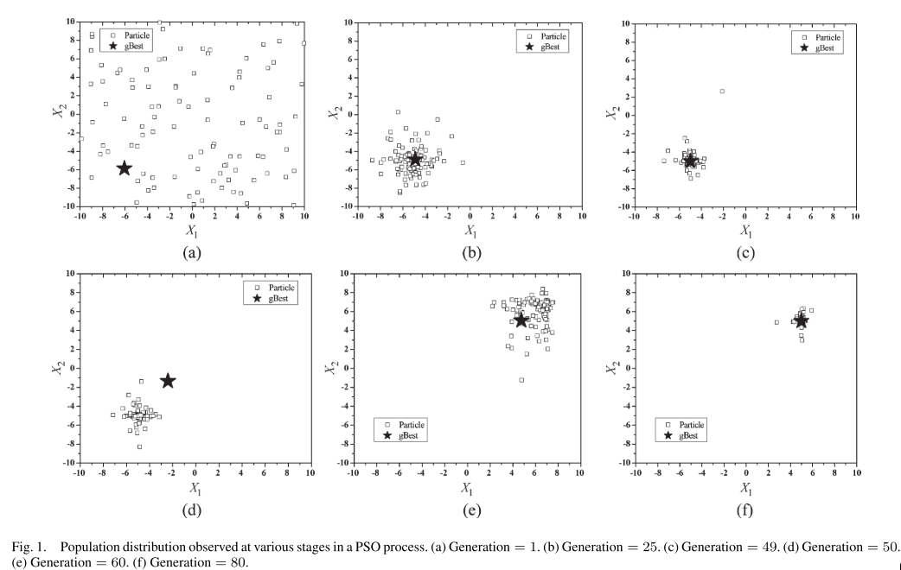
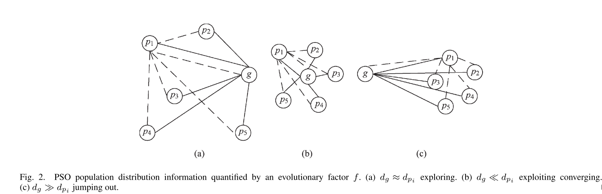
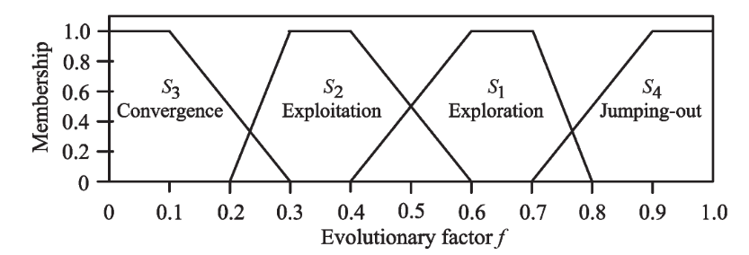
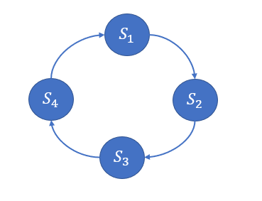
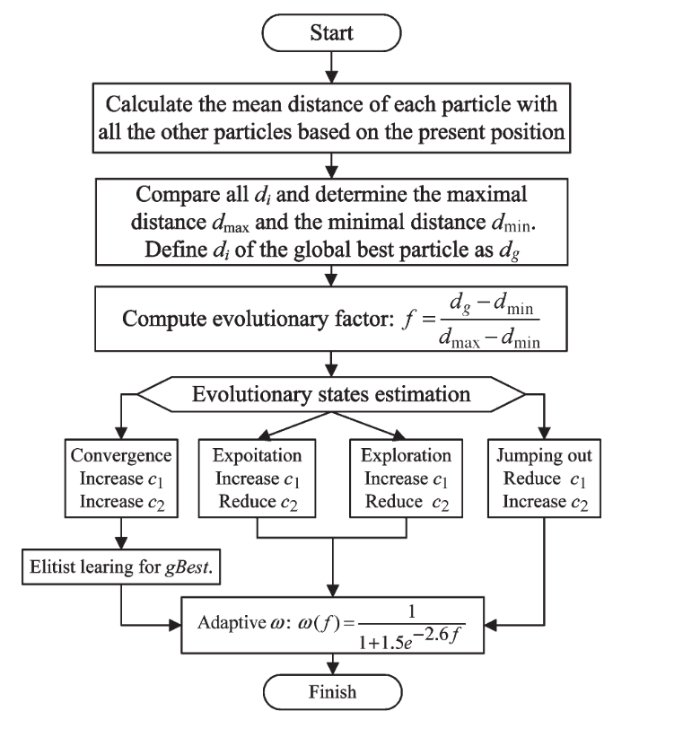
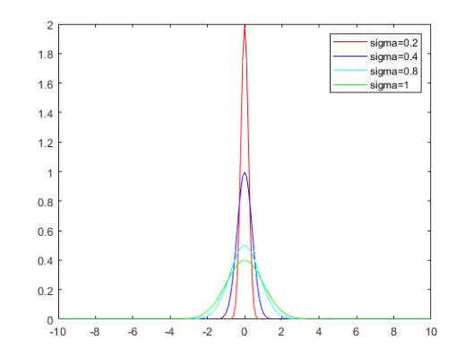
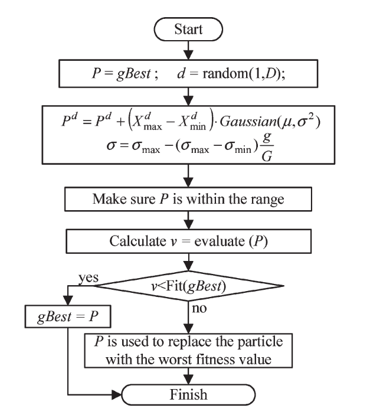
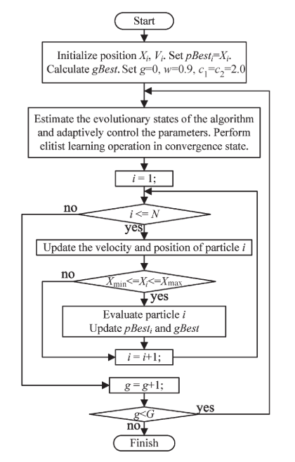

# 自适应粒子群优化算法

本文基于《**Adaptive particle swarm optimization**》一文，描述了一种自适应粒子群优化算法。在本文中我会对该文所提出的算法进行介绍并实现，但是对于该文中与其提出的算法无很大关联的知识(例如粒子群优化的发展之类)不进行介绍，本文会将工作重点放在对所提出的算法上。

---

## 1 摘要

自适应粒子群优化（**adaptive particle swarm optimization**,APSO）是一种具有比经典粒子群优化（**particle swarm optimization**,PSO）更好的搜索效率的粒子群优化算法。它可以以更快的收敛速度对整个搜索空间进行全局搜索。

APSO 包括两个主要步骤:

- 1. 通过评估种群分布和粒子适应度，执行实时进化状态估计程序以识别以下四种定义的进化状态之一，包括每一代的探索、开发、收敛和跳出。可以在运行时自动控制惯性权重、加速度系数等算法参数，提高搜索效率和收敛速度。
- 2. 当进化状态被归类为收敛状态时，执行精英学习策略。该策略将作用于全局最佳粒子以跳出可能的局部最优。

APSO 已经在 12 个单峰和多峰基准函数上进行了全面评估。将研究参数适应和精英学习的影响。结果表明，APSO 在收敛速度、全局最优性、求解精度和算法可靠性方面大大提高了 PSO 范式的性能。由于 APSO 仅向 PSO 范式引入了两个新参数，因此不会引入额外的设计或实现复杂性。

---

## 2 算法介绍

为了实现以下两个目标：**加快收敛速度**、**避免局部最优** 制定了自适应 PSO(APSO)。在本文中，通过开发系统的参数适应方案和精英学习策略（ELS）。 为了实现适应，首先设计了进化状态估计 (ESE) 技术。

### 2.1 PSO 的进化状态估计 (Evolutionary State Estimation,ESE)

在 PSO 算法执行的整个过程中，种群分布特征不仅随世代数而变化，还随进化状态而变化。例如，在早期，粒子可能分散在解的各个区域，因此种群分布是分散的。但是随着进化过程的进行，粒子会聚集在一起并收敛到局部或全局最优区域。因此，为了更加客观且更好的控制粒子群优化算法，作者提出了一种**进化状态估计**方法，并将该方法扩展到具有模糊分类选项的系统。

#### 2.1.1 PSO算法中粒子种群的分布

为了了解在PSO算法中，粒子种群在不同的阶段的分布情况，作者通过一个两维的球体函数来展示，函数如下：
$$
f(x) = \sum_{i=1}^2(x_i-r)^2, \qquad x_i\in[-10,10] \tag{1}
$$
使用PSO求解该函数的最小值。

在随着函数迭代过程中，将公式(1)中的 $r$ 作为变量，在前五十次迭代的过程中，初始化 $r=-5$，此时最优解应为 $(-5,-5)$, 我们可以看到种群一开始处于无序混乱分布的状态，但随着迭代的不断进行，粒子群会不断收敛到一个局部最优点，最终停止在该点。在第五十次迭代时，再使 $r=5$ ，这样该函数的最小值变化为 $(5,5)$ ,所以此时全局最优解开始不断变化，直至找到最优点，随机吸引整个种群全部向该点移动，效果如下图所示：

从上图我们可以看出，**初始PSO算法是没有明显的控制中心**，随着迭代次数不断地增加，**PSO 的学习机制将许多粒子聚集到最佳区域**。而且从五十次迭代修改 $r$ 的值之后，该优化算法也能够找到全局最优解可以看出，**PSO 具有适应时变环境的能力**。

#### 2.1.2 进化状态估计 (Evolutionary State Estimation,ESE)方法

基于PSO的搜索行为和种群分布特征，文章提出了一种ESE方法。 通过计算每个粒子到所有其他粒子的平均距离，可以将粒子群各个阶段的分布信息表述为下图所示：

通过上面图片所展示的信息以及分析可以合理地预期全局最佳粒子到其他粒子的平均距离在收敛状态下将是最小的，因为全局最佳粒子在收敛状态下往往被种群包围。 相比之下，这个平均距离在跳出状态下是最大的，因为在此时全局最优粒子可能不断的在远离拥挤的群体。 因此，进化状态评估方法会考虑每一代的种群分布信息。

ESE方法的具体步骤如下：

> - Step 1:在当前的位置，计算粒子 $i$ 与其他粒子的平均距离，距离的计算使用欧拉距离，公式如下：
$$
d_i = \frac{1}{N-1}\sum_{j=1,j\neq i}^{N}\sqrt{\sum_{k=1}^D(x_i^k-x_j^k)^2} \tag{2}
$$
注记：$i$为粒子标号，$N$为种群大小，$D$为问题解的维度，$k$指当前维度
>
---
>
> - Step 2:选取全局最优粒子的 $d_i$ 作为 $d_g$ ，再通过比较所有粒子，找出最大和最小粒子，分别作为 $d_{max}$ 和 $d_{min}$，接着使用公式(3)计算进化因子，通过进化因子以及对应的规则库判断算法处于 **“探索”、“开发”、“汇聚”、“逃离”** 中的哪个阶段。
$$
f = \frac{d_g-d_{min}}{d_{max}-d_{min}}\in[0,1]\tag{3}
$$

---

> - Step 3:根据 $f$ 的值，也就是进化状态评估值对应到四类集合，而这四类集合分别代表着：探索、开发、汇聚以及逃离。制定状态转换规则，由于转台转换是不确定的、模糊的，并且不同的算法或应用程序可能表现出不同的转换特征。 因此，在本文采用模糊分类。规则如下：
>   - 第一阶段：勘探(Exploration)，当 $f\in (0.4,0.8]$
>   - 第二阶段：开发(Exploitation)，当 $f\in (0.2,0.6]$
>   - 第三阶段：汇聚(Convergence)，当 $f\in [0,0.3]$
>   - 第四阶段：跳出当前最优位置(Jumping Out)，当 $f\in (0.7,1]$
> 其示意图如下所示：
> 
>
> - 从上图可以看出，在两个阶段之间都存在重叠区域，那么是如何处理重叠区域呢？作者提出两种观点：
>   1. 单例方法
>   2. 建立规则库
> - **为了分类的稳定性，也就是不要过度切换状态指标，作者使用的是规则库，两种方法将在下面进一步描述。**

#### 2.1.3 单例方法与规则库的建立

##### 2.1.3.1 单例方法

在该文中，作者提出了一种单例方法，根据隶属函数来判断当前程序处于四个阶段中的哪个阶段。

- Case(a)——Exploration:当 $f\in (0.4,0.8]$ 属于 $S_1$ 阶段，其隶属函数定义为：
$$
\mu S_1(f)=\begin{cases}
    0&0\leq f\leq 0.4\\
    5\times f-2&0.4<f\leq 0.6\\
    1&0.6<f\leq 0.7\\
    -10\times f+8&0.7<f\leq 0.8\\
    0&0.8<f\leq 1
\end{cases}\tag{4a}
$$

- Case(b)——Exploitation:当 $f\in (0.2,0.6]$ 属于 $S_2$ 阶段，其隶属函数定义为：
$$
\mu S_2(f)=\begin{cases}
    0&0\leq f\leq 0.2\\
    10\times f-2&0.2<f\leq 0.3\\
    1&0.3<f\leq 0.4\\
    -5\times f+3&0.4<f\leq 0.6\\
    0&0.6<f\leq 1
\end{cases}\tag{4b}
$$

- Case(c)——Convergence:当 $f\in [0,0.3]$ 属于 $S_3$ 阶段，其隶属函数定义为：
$$
\mu S_3(f)=\begin{cases}
    1&0\leq f\leq 0.1\\
    -5\times f+1.5&0.1<f\leq 0.3\\
    0&0.3<f\leq 1
\end{cases}\tag{4c}
$$

- Case(c)——Jumping Out:当 $f\in (0.7,1]$ 属于 $S_4$ 阶段，其隶属函数定义为：
$$
\mu S_4(f)=\begin{cases}
    0&0\leq f\leq 0.7\\
    5\times f-3.5&0.7<f\leq 0.9\\
    1&0.9<f\leq 1
\end{cases}\tag{4d}
$$

从上一小节可以看出其中的隶属度有重叠区域，如何判断属于哪个阶段，就需要通过隶属度函数。下面举个例子：
>例如：当 $f=x$ 时，它既属于 $S_1$ 阶段，也属于 $S_2$ 阶段，但是我们需要具体判断归属。所以需要分别使用 $S_1$ 与 $S_2$ 的隶属度函数进行计算，即计算 $\mu S_1(x)$ 与 $\mu S_2(x)$，倘若 $\mu S_1(x) > \mu S_2(x)$，则属于 $S_1$ 阶段，当 $\mu S_1(x) < \mu S_2(x)$，则属于 $S_2$ 阶段。
>
> - 注意：使用这种方法会造成过度切换，该分类不具有稳定性。其实使用隶属函数还是存在问题，因为在重叠区域使用隶属函数还存在交叉点，在交叉点又该如何去判断归属哪个阶段，这又是个问题。

##### 2.1.3.2 规则库

为了避免上面单例方法所出现的问题，作者后面在文中提出使用规则库的方法，也就是按照规则库来实现算法中的来判断隶属于哪个阶段。在该文中，作者定义的规则库为一个执行序列，如下图所示：

按照上图所显示的，倘若 $f$ 的值既属于 $S_1$ 又属于 $S_2$ 那么就根据上面的近邻顺序，来判定归属于那个阶段。

>以 $f=x,x\in (0.4,0.6]$，在这个范围，是 $S_1$ 与 $S_2$ 的重叠区域，当该算法上一个阶段是 $S_1,S_4$，则它的近邻阶段为 $S_1$，当上一阶段是 $S_2,S_3$ 时，则其对应的近邻阶段为 $S_2$.

根据上面分析，在 $f\in [0,1]$ 的范围内，分别有三个重叠区域，并且模糊规则如下：
$$
f\in (0.4,0.6]=\begin{cases}
    S_1&当上一阶段为 S_1 或 S_4\\
    S_2&当上一阶段为 S_2 或 S_3
\end{cases}\tag{5a}
$$

$$
f\in (0.2,0.3]=\begin{cases}
    S_2&当上一阶段为 S_1 或 S_2\\
    S_3&当上一阶段为 S_3 或 S_4
\end{cases}\tag{5b}
$$

$$
f\in (0.2,0.3]=\begin{cases}
    S_1&当上一阶段为 S_1 或 S_4\\
    S_4&当上一阶段为 S_3 或 S_4
\end{cases}\tag{5c}
$$

### 2.2 PSO 参数的自适应控制(Adaptive Control of PSO Parameters)

#### 2.2.1 惯性权重的自适应(Adaptation of the Inertia Weight)

PSO 中的惯性权重 ω 是用于平衡全局和局部搜索能力。在研究的过程中，大多数学者主张 ω 的值在探索状态应该大，在开发状态应该小。

进化因子 f 与惯性权重 ω 有一些共同点，即 f 在探索状态下也比较大，在收敛状态下变得比较小。 因此，使用 sigmoid 映射 ω(f) 允许 ω 遵循进化状态。进化公式如下：
$$
\omega(f)=\frac{1}{1+1.5e^{-2.6f}}\in[0.4,0.9]\qquad\qquad\forall f\in[0,1]\tag{6}
$$

在该文中，由于 ω 不一定随时间单调，但与 f 单调，因此 ω 将适应以 f 为特征的搜索环境。 在跳出或探索状态下，较大的 f 和 ω 将有利于全局搜索，如前所述。 相反，当 f 较小时，检测到开发或收敛状态，因此，ω 减小以有利于局部搜索。

#### 2.2.2 加速系数的控制(Control of the Acceleration Coefficients)

在粒子群优化算法中，参数 $c_1$ 代表将粒子拉到自己历史最佳位置的“自我认知”，有助于探索局部生态位，保持群体的多样性。 参数 $c_2$ 代表推动群体收敛到当前全局最佳区域的“社会影响”，有助于快速收敛。

在该文中，作者提出了四种策略，在这四种策略中，分别使用不同的方法调整 $c_1、c_2$：

> - 策略一：在探索状态中增加 $c_1$ 、减少 $c_2$：在探索状态中探索尽可能多的最优值很重要。 因此，增加 $c_1$ 和减少 $c_2$ 可以帮助粒子单独探索并获得它们自己的历史最佳位置，而不是挤在可能与局部最优相关的当前最佳粒子周围。
>
---
>
> - 策略二：在开发状态下，$c_1$ 略微增加，$c_2$ 略微减少：在这种状态下，粒子利用局部信息并朝着每个粒子的历史最佳位置指示的可能的局部最佳生态位进行分组。 因此，缓慢增加 $c_1$ 并保持相对较大的值可以强调 $pBest_i$ 周围的搜索和利用。 同时，在这个阶段，全局最优粒子并不总能定位到全局最优区域。 因此，缓慢减小 $c_2$ 并保持较小的值可以避免局部最优的欺骗。 此外，开发状态更可能发生在探索状态之后和收敛状态之前。 因此，$c_1$ 和 $c_2$ 的变化方向应该从探索状态到收敛状态稍微改变。

---

> - 策略三：收敛状态下 $c_1$ 小幅增加 $c_2$ 小幅增加：在收敛状态下，粒子群找到了一个可能是全局最优的区域，因此，应该强调 $c_2$ 的影响，将其他粒子引导到可能的全局最优区域。因此，应该增加 $c_2$ 的值。另一方面，应该减小 $c_1$ 的值以使群快速收敛。
> 减少 $c_1$ 增加 $c_2$ 的这种策略会过早地分别使两个参数饱和到它们的下限和上限。结果是群体会被当前最佳区域强烈吸引，导致过早收敛，如果当前最佳区域是局部最优，这是有害的。为了避免这种情况，$c_1$ 和 $c_2$ 都略有增加。

---

> - 策略四：当全局最好的粒子从局部最优向更好的最优跳出时，它很可能远离拥挤簇。 一旦这个新区域被一个粒子发现，它成为（可能是新的）领导者，其他人应该跟随它并尽快飞到这个新区域。 较大的 $c_2$ 和相对较小的 $c_1$ 有助于实现这一目标。

#### 2.2.3 加速系数的设定以及边界

在 **加速系数的控制** 一节中了解到该文中的四个策略，但是作者对于该策略的具体值并未给出，接下来这一小节，将按照作者所给的代码来介绍具体取值以及相应公式。

##### 2.2.3.1 加速系数的边界

在文中作者提出了以下边界：

1. 加速系数的增加应该小于某个数，公式描述如下：
$$
|c_{i}(g+1)-c_{i}(g)|\leq \delta \qquad i=1,2 \tag{7}
$$
    > 其中 $g$ 为迭代次数，$\delta$ 是一个加速比率

2. $\delta$ 应满足 $\delta\in[0.05,0.1]$。
3. 加速系数 $c_i$ 应满足 $c_i\in[1.5,2.5]$,同时 $c_1+c_2$ 之和，即 $\sum_{i=1}^2c_i\in[3,4]$

##### 2.2.3.2 加速系数的计算公式

根据 $\delta\in[0.05,0.1]$ 随机取值可以推断出加速系数 $c_i$ 对应的加速比率 $\delta_i$ 的计算公式，公式如下：
$$
\delta_i=0.05+0.05\times rand_i \tag{8}
$$

根据公式(7)可知加速系数与 $\delta$ 之间存在一个倍数关系，因此就可以间接得出加速系数计算公式：
$$
c_i(g+1) = c_i(g) + h_i\times\delta_i\qquad h_i\in[-1,1]\tag{9}
$$
> 为何 $h_i\in[-1,1]$，这是根据公式(7)推断出来的，由于加速系数增量的绝对值小于等于 $\delta$ ，也就是增量的绝对值小于等于 $\delta$ 本身。 所以就可以断定 $h_i\in[-1,1]$。

根据第三点约束，需要使 $c_i\in[1.5,2.5]$ 之间，所以每次通过公式(9)计算完之后，需要根据公式(10)进行判断:
$$
c_i=\begin{cases}
    1.5;&if\quad c_i<1.5\\
    2.5;&if\quad c_i>2.5\\
\end{cases}\tag{10}
$$
这样就满足了 $c_i\in[1.5,2.5]$ 的约束。接下来就是 $\sum_{i=1}^2c_i\in[3,4]$ 的约束如何满足，具体如下公式：
$$
c_i=\begin{cases}
    \frac{c_i}{c_1+c_2}\times 3;&if\quad (c_1+c_2)<3\\
    \frac{c_i}{c_1+c_2}\times 4;&if\quad (c_1+c_2)>4
\end{cases}\tag{11}
$$

##### 2.2.3.3 增量因子的设定

> 在上面提到 $h_i$ ，在这里我称之为增量因子，它与 $\delta_i、c_i$ 相对应，即 $h_1$ 将会控制 $c_1$ 的增加量，$h_2$ 对应控制加速系数 $c_2$ 的变化量。

在论文中，作者只是使用程度副词来修饰 $h_i$ 的取值，从已知的分析可以得出 $h_i\in[-1,1]$ 结论，那么作者是如何设置其具体值呢？下面的参数设定是以作者代码为准：

1. 加速系数增量因子 $h_i$ 在各阶段的设置如下：
   > 策略一阶段(勘探)：在探索状态中探索尽可能多的最优值很重要。 因此，增加 $c_1$和减少 $c_2$可以帮助粒子单独探索并获得它们自己的历史最佳位置，而不是挤在可能与局部最优相关的当前最佳粒子周围。
   $$
    \begin{cases}
        h_1 = 1\\
        h_2 = -1
    \end{cases}
   $$
   ---
   >策略二阶段(开发)：在这种状态下，粒子利用局部信息并朝着每个粒子的历史最佳位置指示的可能的局部最佳生态位进行分组。 因此，缓慢增加 $c_1$ 并保持相对较大的值可以强调 $pBest_i$ 周围的搜索和利用。 同时，在这个阶段，全局最优粒子并不总能定位到全局最优区域。 因此，缓慢减小 $c_2$ 并保持较小的值可以避免局部最优的欺骗。 此外，开发状态更可能发生在探索状态之后和收敛状态之前。 因此，$c_1$ 和 $c_2$ 的变化方向应该从探索状态到收敛状态稍微改变。
   $$
    \begin{cases}
        h_1 = 0.5\\
        h_2 = -0.5
    \end{cases}
   $$
   ---
   > 策略三阶段(收敛)：收敛状态下 $c_1$ 小幅增加 $c_2$ 小幅增加：在收敛状态下，粒子群找到了一个可能是全局最优的区域，因此，应该强调 $c_2$ 的影响，将其他粒子引导到可能的全局最优区域。因此，应该增加 $c_2$ 的值。另一方面，为避免群体会被当前最佳区域强烈吸引，导致过早收敛，$c_1$ 和 $c_2$ 都略有增加。
   $$
    \begin{cases}
        h_1 = 0.5\\
        h_2 = 0.5
    \end{cases}
   $$
   ---
   > 策略四阶段(逃离)：当全局最好的粒子从局部最优向更好的最优跳出时，它很可能远离拥挤簇。 一旦这个新区域被一个粒子发现，它成为（可能是新的）领导者，其他人应该跟随它并尽快飞到这个新区域。 较大的 $c_2$ 和相对较小的 $c_1$ 有助于实现这一目标。
   $$
    \begin{cases}
        h_1 = -1\\
        h_2 = 1
    \end{cases}
   $$

#### 2.2.4 进化状态评估以及参数自适应执行流程图

### 2.3 精英学习策略(Elitist Learning Strategy,ELS)

#### 2.3.1 精英学习策略的执行方法

作者在 Schwefel 函数上单独对 GPSO 和 VPSO 使用参数自适应的失败表明，跳出机制对于增强这些搜索算法的全局性是必要的。 因此，作者设计了**精英学习策略**并将其应用于全局最佳粒子，以便在搜索被识别为处于收敛状态时帮助跳出局部最优区域。

 与其他粒子不同，全局领导者没有可效仿的榜样。 它需要新的动力来改善自己。 因此，开发了一种基于扰动的 ELS，以帮助 gBest 将自己推向一个可能更好的区域。 如果找到另一个更好的区域，那么其余的群体将跟随领导者跳出并收敛到新的区域。

 精英学习策略如下：

 > 1. 随机从解的维度中选出一维进行扰动。假设是第 $d$ 维。
 > 2. 定义一个**学习规模**因子 $\sigma$，它的取值范围为 $\sigma\in[0.1,1.0]$，同时它的值得变化是随迭代次数的增加而增加的，公式如下：
 $$
    \sigma = \sigma_{max}-(\sigma_{max}-\sigma_{min})\times\frac{g}{G}\tag{12}
 $$
 其中，$g$ 是指当前迭代次数，$G$ 是指总迭代次数。
 > 3. 使用高斯(Gaussian)方法进行扰动，扰动函数如下：
 $$
    P^d = P^d + (x_{max}-x_{min})\times Gaussian(\mu,\sigma^2)\tag{13}
 $$
其中 $P$ 指的是 $gBest$ ，$d$ 指 $P$ 的第 $d$ 维。$x_{max}、x_{min}$ 分别指 $x$ 取值范围的最大值以及最小值，$Gaussian(\mu,\sigma^2)$ 指随机生成一个 $\mu = 0$，标准差为 $\sigma$ 呈现高斯分布概率的随机数。
> 4. 在通过扰动得到一个新的 $P$ ，之后需要对 $P$ 进行质量评价，当 $P$ 的质量优于 $gBest$ 时，则使 $gBest = P$，否则，将种群中历史最差的粒子替换为当前解，即 $x(worst) = P$。其中 $worst$ 为当前历史最差解的粒子下标。

最后需要稍微解释一下为何将 $\sigma$ 称为**学习规模因子**，这需要了解高斯函数，如下图：

高斯函数如下：
$$
Gaussan = \frac{1}{\sqrt{2\pi}\sigma}e^{-\frac{(x-\mu)^2}{2\mu^2}}\tag{14}
$$

> 首先需要知道 $\sigma$ 不能为 0，因为它做了分母。

从上面图可以看出， $\sigma$ 越大，图像就变得越扁平，且 $y>0$ 的范围内 $x$ 的取值范围也越来越大。

此外，高斯随机生成数就是取 $y>0$ 时所对应的 $x$，而 $y$ 越大，则意味着取到相对应的 $x$ 的概率越大，所以当 $\sigma$ 越大时，能得到更大的随机生成数，即 $x$，当所得到的随机生成数越大，根据公式(13)，可知 $P^d$ 受到扰动的幅度越大。即能跨越更大的规模。所以称 $\sigma$ 为：**学习规模因子**。

#### 2.3.2 精英学习策略流程图

## 3 算法整体流程图

## 4 参考文献

[1]Zhan, Z.-H., et al. (2009). "Adaptive particle swarm optimization." IEEE Transactions on Systems, Man, and Cybernetics, Part B (Cybernetics) 39(6): 1362-1381.
[2]Shi Y ,  Eberhart R C . Fuzzy adaptive particle swarm optimization[C]// Congress on Evolutionary Computation. IEEE Xplore, 2001.
