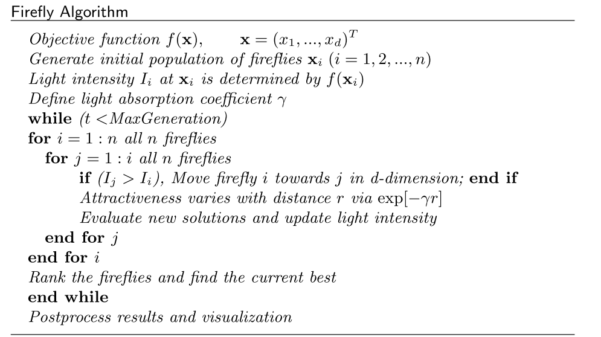

# 萤火虫算法(Firefly Algorithm,FA)

## 1 引言

在热带和温带地区的夏日天空中，萤火虫闪烁的光芒是令人惊叹的景象。大约有两千种萤火虫，大多数萤火虫会产生短暂而有节奏的闪光。对于特定物种，闪光的模式通常是独一无二的。闪光是由生物发光过程产生的，这种信号系统的真正功能仍在争论中。然而，这种闪光的两个基本功能是吸引交配伙伴（交流）和吸引潜在的猎物。此外，闪烁也可以作为一种保护警告机制。有节奏的闪光、闪光的速度和时间量构成了将两性结合在一起的信号系统的一部分。雌性萤火虫会对同一物种中雄性独特的闪光模式作出反应，而在某些物种中，例如萤火虫，雌性萤火虫可以模仿其他物种的交配闪光模式，以引诱和吃掉可能将闪光误认为潜在的雄性萤火虫合适的伴侣。

在距光源特定距离 $r$ 处的光强服从平方反比定律。 也就是说，根据 $I ∝ 1/r_2$ ，光强度 $I$ 随着距离 $r$ 的增加而减小。 此外，空气吸收的光随着距离的增加而变得越来越弱。 这两个综合因素使大多数萤火虫只能在有限的距离内可见，通常在夜间数百米，这通常足以让萤火虫进行交流。 闪光灯可以与要优化的目标函数相关联的方式来制定，这使得制定新的优化算法成为可能。

>$∝$符号表示两者成正比例关系

## 2 算法介绍

论文将萤火虫的一些闪烁特性理想化，从而开发出萤火虫启发的算法。 为了简单描述我们的新萤火虫算法（$FA$），现使用以下三个理想化规则：

- 1. 所有萤火虫都是雌雄皆宜的，因此无论性别如何，一只萤火虫都会被其他萤火虫吸引；
- 2. 吸引力与它们的亮度成正比，因此对于任何两只闪烁的萤火虫，较不亮的一只会向较亮的一只移动。 吸引力与亮度成正比，并且它们都随着距离的增加而减小。 如果没有比特定萤火虫更亮的萤火虫，它会随机移动；
- 3. 萤火虫的亮度受目标函数的模型影响或决定。 对于最大化问题，亮度可以简单地与目标函数的值成正比。 其他形式的亮度可以以类似于遗传算法中的适应度函数的方式定义。

基于这三个规则，萤火虫算法（FA）的基本步骤可以概括为图1所示的伪代码。

在 $FA$ 中，吸引力与它们的目标函数和吸引力随距离的单调衰减有关。 然而，$FA$ 中的智能体具有可调节的可见性和更多的吸引力变化，这通常会导致更高的移动性，因此可以更有效地探索搜索空间。

### 2.1 吸引力

在萤火虫算法中，有两个重要的问题：

- 光强的变化
- 吸引力的制定

为简单起见，文中假设萤火虫的吸引力取决于它的亮度，而亮度又与编码的目标函数相关联。在最大优化问题的最简单情况下，亮度 $I$
特定位置 $x$ 的萤火虫可以选择 $I(x) ∝ f(x)$。但是，吸引力$β$是相对的，应该在旁观者眼中看到或由其他萤火虫判断。因此，它会随着萤火虫 $i$ 和萤火虫 $j$ 之间的距离 $r_{ij}$ 而变化。另外，光强度随着离光源的距离而减小，光也在介质中被吸收，所以我们应该允许吸引力随着吸收的程度而变化。在最简单的形式中，光强度 $I(r)$ 根据平方反比定律 $I(r)= I_s/r^2$ 变化，其中 $I_s$ 是光源处的强度。对于给定光吸收系数$γ$固定的介质，光强$I$随着距离$r$的变化而变化。即$I=I_0e^{-γr}$，其中$I_0$为原始光强。为了避免表达式 $I_s/r^2$ 中 $r = 0$ 处的奇异性，平方反比定律和吸收的组合效应可以使用以下高斯形式来近似:

$$
I(r)=I_0e^{-γr^2}\tag{1}
$$

有时，可能需要一个以较慢速率单调递减的函数。 在这种情况下，可以使用以下近似:

$$
I(r)=\frac{I_0}{1+γr^2}\tag{2}
$$

在较短的距离上，上述两种形式基本相同。 这是因为关于 $r = 0$ 的级数展开在 $O(r^3)$ 的数量级上彼此等价。

$$
\begin{cases}
    e^{-γr^2}=1--γr^2+\frac{1}{2}γ^2r^4\\
    \frac{1}{1+γr^2}=1--γr^2+\frac{1}{2}γ^2r^4\\
\end{cases}\tag{3}
$$

由于萤火虫的吸引力与相邻萤火虫看到的光强度成正比，我们现在可以定义萤火虫的吸引力$β$为:

$$
β(r)=β_0e^{-γr^2}\tag{4}
$$

>其中 $β_0$ 是 $r = 0$ 时的吸引力。由于计算 $1/(1+r^2)$ 通常比指数函数更快，因此如果需要，上述函数可以方便地替换为 $β=\frac{β_0}{1+γr^2}$。等式 (4) 定义了一个特征吸引力从 $β_0$ 到 $β_0e^{-1}$ 显著变化的距离 $\Gamma=1/\sqrt{γ}$。

在实现中，吸引力函数$β(r)$的实际形式可以是任何单调递减函数，例如以下广义形式:

$$
β(r)=β_0e^{-γr^m},\;(m\geq1) \tag{5}
$$

对于固定的 $γ$，当$m →∞$特征长度变为 $Γ = γ^{−1/m} → 1$。 相反，对于优化问题中给定的长度尺度$Γ$，参数$γ$可以用作典型的初始值。 即$γ=\frac{1}{Γ^m}$。

### 2.2 距离和运动

任意两个萤火虫 $i$ 和 $j$ 分别在 $x_i$ 和 $x_j$ 处的距离是笛卡尔距离:

$$
r_{ij}=||X_i-X_j||=\sqrt{\sum_{k=1}^d(x_{i,k}-x_{j,k})^2}\tag{6}
$$

>其中 $x_{i,k}$ 是第 $i$ 个萤火虫的空间坐标 $x_i$ 的第 $k$ 个分量。 在二维情况下，我们有 $r_{ij}=\sqrt{(x_i-x_j)^2+(y_i-y_j)^2}$。

萤火虫 $i$ 的运动被另一个更有吸引力（更亮）的萤火虫 $j$ 吸引，由下式决定:

$$
X_i=X_i+β_0e^{-γr_{ij}^2}(X_j-X_i)+\alpha(rand-\frac{1}{2})\tag{7}
$$

>其中第二项是由于吸引力，而第三项是随机化，α是随机化参数。 rand 是均匀分布在 [0, 1] 中的随机数生成器。

对于作者实现中的大多数情况，可以取 $β_0 =1$ 和 $α ∈ [0, 1]$。此外，随机化项可以很容易地扩展到正态分布 $N(0, 1)$ 或其他分布。此外，如果尺度在不同维度上变化很大，例如一个维度为 -105 到 105，而另一个维度为 -0.001 到 0.01，则将 $α$ 替换为 $αS_k$ 是一个好主意，其中缩放参数 $S_k(k = 1, ..., d)$中的$d$维应由感兴趣问题的实际尺度确定。参数 $γ$ 现在表征了吸引力的变化，它的值对于确定收敛速度和 $FA$ 算法的行为至关重要。理论上，$γ ∈ [0,∞)$，但在实践中，$γ = O(1)$ 由待优化系统的特征长度 $Γ$ 决定。因此，在大多数应用中，它通常在 0.01 到 100 之间变化。

## 3 算法实现

**参数设置：**

- $α=0.2$
- $γ=1$
- $β0=1$

算法实现中有以下要点注意：

- 要点一

文献中给出了灯光吸引系数$\gamma$具体计算，该值与优化模型的特征长度有关，即问题求解维度$d$。

但是在测试中，给定的是一个具体值$γ=1$

此外，作者给出：$γ=\frac{1}{Γ^m}$，即灯光吸引系数$\gamma$与特征长度的关系，特征长度肯定是大于1的，因此根据该公式，$\gamma$的取值范围应该在$[1,0)$之间，而非$[0.01,100]$。

最后，对于$\gamma$中给出求解公式中的$m$作者并未给出具体值。

>在本人的代码实现过程中，取值为2。

- 要点二

在论文中，作者给出的位置更新公式(7)中使用的是$\beta_0$，即一个常数，但是在算法框架中，又说吸引力要随着粒子距离$r_{ij}$不断更新。

>在这里可能会进入误区，在后面的公式(7)位置更新中，作者是显式的将吸引力$beta$写进去了，因为吸引力$beta$求解公式(4)即为位置更新公式(7)中的一部分。

- 要点三

在参考文献的算法伪代码框架中，在更新位置之后要更新对应位置的适应度值，，并将萤火虫按照适应度进行排序。
因此，在算法中，每只适应度好于当前适应度的萤火虫都会对后面的萤火虫进行引导。

> 1. 按照这种方式，在一开始初始化位置并计算对应位置的适应度值之后也应该对其进行排序，在文献算法伪代码中没有明确说明。
> 2. 如果是这样的话，那么在前面的萤火虫适应度应该就肯定优于当前萤火虫，那$if$条件判断能否去除呢？这个个人觉得对于结果的影响不会很大，但是该语句的存在可以避免适应度相同的萤火虫相互吸引。(当然，适应度相同的萤火虫相互吸引也不一定是一件坏事。)

## 4 参考文献

[1]Yang X S. Firefly algorithms for multimodal optimization[C]//International symposium on stochastic algorithms. Springer, Berlin, Heidelberg, 2009: 169-178.
