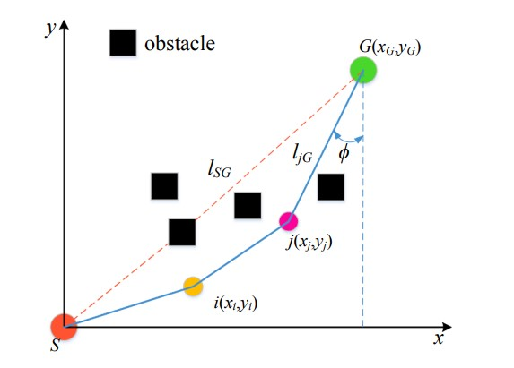

# 一种改进的自适应蚁群算法

## 1 引言

针对传统蚁群算法(ACO)在室内移动机器人路径规划中路径规划时间长、收敛速度慢、非最优路径、ACO局部最优解等缺点，提出一种改进的自适应算法。本文提出了蚁群算法（IAACO）。在IAACO中，首先为了加快机器人路径规划的实时性和安全性，在ACO的转移概率中引入了角度引导因子和障碍物排除因子；其次，在ACO的信息素更新规则中引入启发式信息自适应调整因子和自适应信息素挥发因子，平衡ACO的收敛性和全局搜索能力；最后，引入多目标性能指标，将路径规划问题转化为多目标优化问题，实现机器人路径规划的全面全局优化。主要参数选择、不同环境下路径规划性能、最优解多样性的实验结果表明，IAACO可以使机器人获得全局优化路径，路径规划具有较高的实时性和稳定性。

## 2 主要内容

1. 改进了传统蚁群算法（ACO）中的启发式信息、状态转移概率、信息素更新规则，平衡了算法的全局搜索能力和收敛速度，使机器人更好地达到路径回避能力和路径搜索效率。
2. 综合考虑路径长度、安全性和能耗指标，将路径规划问题转化为多目标优化问题，使机器人获得综合全局最优路径。
3. 基于改进的主要参数、改进的ACO更新规则和多目标路径规划优化，提出了基于IAACO的路径规划过程并通过实验验证。

本文主要着重于算法的实现，因此对于网格环境建模、 ACO 的路径规划等问题不进行详细描述。

## 3 一种改进的自适应蚁群算法（IAACO）

### 3.1 改进启发式信息

在 $ACO$ 中，由于启发式信息只考虑当前网格与待选择网格的距离，会导致算法早期全局性能不佳。 为了提高搜索的启发性，还考虑了所选网格与目标网格之间的距离。此外，在算法后期，为了削弱启发式信息的作用，平衡算法的全局搜索能力和收敛速度，引入了自适应调整因子。

因此，改进启发式信息为：

$$
\eta_{ij}(t)=\varepsilon(\frac{1}{\sigma_1d_{ij}+\sigma_2d_{jG}})\tag{1}
$$

>其中 $d_{ij}$ 是第 $i$ 个网格与第 $j$ 个网格之间的距离； $d_{jG}$ 为待选第 $j$ 个网格与目标网格 $G$ 的距离；$σ_1$ 和 $σ_2$ 为距离权重系数，$σ_1+σ_2=1$； 自适应调整因子 $ε$ 是变形的正态分布函数。 在算法前期，由于 $ε$ 接近 1，可以加强启发式信息的作用，从而加快算法的收敛速度； 后期由于 $ε$ 远小于 1，可以削弱启发式信息的作用，从而增强算法的全局搜索能力。 $ε$ 的计算如公式(2)所示。

$$
\varepsilon=e^{-2(\frac{N_c}{N_{max}})^2}\tag{2}
$$

>其中 $N_C$ 是当前迭代次数，$N_{max}$ 是最大迭代次数。

### 3.2 改进状态转移概率

针对移动机器人的路径规划，为了获得安全高效的无障碍路径，提高路径搜索效率，文中在 $ACO$ 的传递概率中引入障碍排除因子和角度引导因子，从而增加路径搜索的多样性，提高路径规避能力和搜索效率。

改进转移概率如等式(3)所示:

$$
P_{ij}^k(t)=\begin{cases}
    \frac{[\tau_{ij}(t)]^\alpha [\eta_{ij}(t)]^\beta[\mu_{ij}(t)]^\lambda[\xi_{ib}(t)]}{\sum_{s\in allowed_k}[\tau_{is}(t)]^\alpha [\eta_{is}(t)]^\beta[\mu_{is}(t)]^\lambda[\xi_{is}(t)]}&j\in allowed_k\\
    0&otherwise
\end{cases}\tag{3}
$$

>其中 $μ_{ij}(t)$ 是角度引导因子，计算如公式(4)所示； $λ$ 为角度引导因子的权重系数； $ξ_{ib}(t)$ 为自适应障碍物剔除因子，取值范围为 $[0,1]$，计算如式(5)所示;

$$
\mu_{ij}(t)=\frac{1}{cos\phi}=\frac{|y_j-y_G|}{d_{jG}}\tag{4}
$$

>角度引导因子 $μ_{ij}$ 主要考虑线段 $l_{jG}$ 和 $l_{SG}$ 之间的夹角对路径搜索的影响。 如上图所示，角度 $φ$ 越大，$l_{jG}$ 越接近理想路径 $l_{SG}$，从而增强了引导效果，加快了算法的收敛速度。其中 $ϕ$ 为线段 $l_{jG}$ 与 $l_{SG}$ 夹角的共角；$(x_j,y_j)$ 为待选第 $j$ 个网格的纵坐标，$(x_G,y_G)$ 为目标纵坐标 网格 $G$。

$$
\xi_{ib}(t)=\begin{cases}
    0&d_{ib}<R_s\\
    \frac{R_s}{d_{ib}}&R_s\leq d_{ib}\leq 2R_s\\
    1&d_{ib}>2R_s
\end{cases}\tag{5}
$$

>$d_{ib}$ 是第 $i$ 个网格到最近的第 $b$ 个障碍网格的最小距离； $R_s$ 为机器人避障的最小安全半径阈值，其值与机器人本身的尺寸有关；

同时，为了提高ACO的搜索质量，避免陷入局部最优解，本文采用参数自适应伪随机传递策略，如式 (6) 所示。

$$
j=\begin{cases}
    argmax\{[\tau_{ij}(t)]^\alpha [\eta_{ij}(t)]^\beta[\mu_{ij}(t)]^\lambda[\xi_{ib}(t)]\}&q\leq q_0\\
    P_{ij}^k(t)&otherwise
\end{cases}\tag{6}
$$

>其中 $q_0$ 是自适应转移概率的阈值，求解方式如公式 (7) 所示； $q$ 是在 $[0,1]$ 中均匀分布的随机变量。

$$
q_0=δ_0e^{-\frac{1}{2}(\frac{N_c}{N_{max}})^2}\tag{7}
$$

> 其中 $δ_0$ 为比例系数，取值范围为 $[0.1,0.5]$；从公式 (7) 可以看出前期 $q_0$ 值较大，有利于加入蚂蚁根据全局路径信息选择有利路径，提高收敛速度； 后期 $q_0$ 的值较小，有利于蚂蚁通过转移概率的随机搜索提高全局搜索能力。

### 3.3 改进信息素更新规则

针对 $ACO$ 的全局信息素更新不能引导蚂蚁及时寻找最优解的问题，提出了一种高质量的蚂蚁更新规则，即每次迭代后，只有蚂蚁路径的信息素到达目标点根据方程更新。使用原始更新公式并且被困在死锁中的蚂蚁会被丢弃，该操作可以避免全局信息素的盲目更新。然后根据全局引导规则更新路径的信息素。每次迭代后，根据方程 (8) 增强最优遍历路径的信息素，同时根据方程 (9) 削弱最坏蚂蚁遍历路径的信息素。通过高质量的全局信息素更新策略，蚂蚁的搜索范围更加集中在最优路径方向的邻域，最终实现全局优化，可以有效提高算法的收敛速度和搜索质量。改进的全局信息素浓度显示在方程中:

$$
\tau_{ij}(t+1)=(1-\rho)\tau_{ij}(t)+\rho(\frac{Q}{J_{best}}\times\frac{J_{best}+J_{worst}}{2})\qquad ij\in p_{bs} \tag{8}
$$
$$
\tau_{ij}(t+1)=(1-\rho)\tau_{ij}(t)+\rho(-\frac{Q}{J_{worst}})\qquad ij\in p_{ws} \tag{9}
$$
>其中 $J_{best}$ 是本次迭代最优路径的多目标值； $J_{worst}$ 是本次迭代的最坏路径的多目标值； $p_{bs}$ 是本次迭代的最优路径； $p_{ws}$ 是本次迭代的最差路径。

在 $ACO$ 寻找最优解的过程中，除了信息素浓度的更新规律外，信息素挥发因子也会影响算法的性能。 本文采用自适应信息素挥发因子 $ρ$ 来调整算法的全局性和收敛速度，如式 (10) 所示:
$$
\rho=k(\frac{L_{SG}}{J_{best}})\tag{10}
$$

>其中 $κ$ 为调整系数，取值为小于 1 的正数； $L_{SG}$ 是路径的起始网格 $S$ 到目标网格 $G$ 的线性欧几里德距离。 算法前期，由于 $J_{best}$ 较大，挥发因子 $ρ$ 较小，因此各路径的信息素浓度差异较小，蚁群的引导功能减弱，增强了蚂蚁的全局搜索范围， 算法的准确性。 由于 $J_{best}$ 越来越小，使得波动因子 $ρ$ 迅速增大，各路信息素浓度差增大，增强了蚁群的引导功能，可以提高蚁群的搜索速度，使算法收敛迅速。

### 3.4 参数设置

- $\sigma_1=0.1$
- $\sigma_2=0.9$
- $R_s=0.5$
- $\delta_0=0.15$
- $Q=2.5$
- $k_L=0.7$
- $k_S=0.1$
- $k_E=0.2$
- $m=50$
- $N_{max}=100$

## 代码编写

由于该算法是专用于机器人路径规划当中，因此有些参数是在该问题中特有的，比如 $d_{ib}、R_s$ 等。本人并未进行路径规划类研究，暂时无精力去专门编写该文代码，因此如果是有同志需要代码，可以自己按照以上讲解进行代码编写。

若有出入，以参考文献为主。

## 参考文献

[1] Miao C ,  Chen G ,  Yan C , et al. Path planning optimization of indoor mobile robot based on adaptive ant colony algorithm[J]. Computers & Industrial Engineering, 2021:107230.
