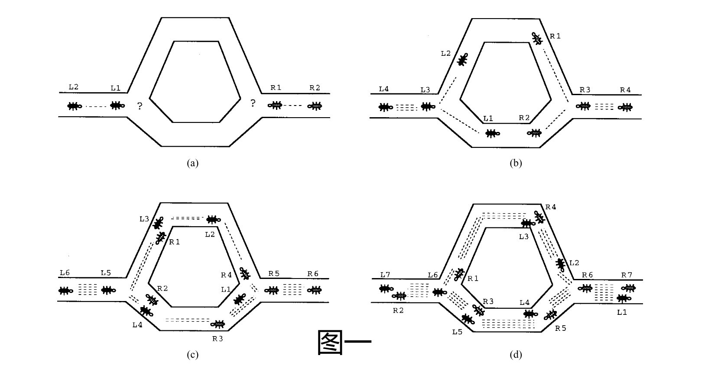

# 蚁群系统(Ant Colony System,ACS)

## 1 引言

蚂蚁算法所基于的自然隐喻是蚁群的隐喻。 真正的蚂蚁能够通过利用信息素信息，在不使用视觉线索的情况下找到从食物来源到它们的巢穴的最短路径。 行走时，蚂蚁会在地面上沉积信息素，并且可能会跟随其他蚂蚁先前沉积的信息素。 在图一中，我们展示了一种蚂蚁利用信息素找到两点之间最短路径的方法。

考虑图 1($a$)：蚂蚁到达一个决定点，在这个点上它们必须决定是向左转还是向右转。由于他们不知道哪个是最佳选择，他们随机选择。可以预期，平均而言，一半的蚂蚁决定向左转，另一半决定向右转。从左向右移动的蚂蚁（名字以 $L$ 开头的蚂蚁）和从右向左移动的蚂蚁（名字以 $R$ 开头）都会发生这种情况。图 1($b$) 和 ($c$) 显示了接下来的瞬间发生的情况，假设所有蚂蚁以大致相同的速度行走。虚线的数量大致与蚂蚁沉积在地面上的信息素数量成正比。由于下部路径比上部路径短，因此平均有更多蚂蚁会访问它，因此信息素积累得更快。经过短暂的过渡期后，两条路径上的信息素数量差异足够大，以影响新蚂蚁进入系统的决定[如图 1($d$) 所示]。从现在开始，新蚂蚁在概率上会更倾向于选择较低的路径，因为在决策点，它们会在较低的路径上感知到更多的信息素。这反过来又增加了，具有正反馈效应，选择较低和较短路径的蚂蚁数量。很快所有蚂蚁都将使用较短的路径。

真实蚂蚁的上述行为启发了蚂蚁系统，一种由一组人工蚂蚁通过沉积在图边上的信息素交换信息来协作解决问题的算法。蚂蚁系统已应用于如下组合优化问题：

- 旅行商问题 ($TSP$)
- 二次分配问题

本文中介绍的算法蚁群系统 ($ACS$) 建立在先前的蚂蚁系统 ($AS$) 的基础上，旨在提高应用于对称和非对称 $TSP$ 时的效率。主要思想是让一组称为蚂蚁的代理并行搜索 $TSP$ 的良好解决方案，并通过信息素介导的间接和全局通信进行合作。非正式地，每只蚂蚁以迭代的方式构建一个 $TSP$ 解决方案：它通过利用从过去的经验中获得的信息和贪婪的启发式方法，将新城市添加到部分解决方案中。记忆采用蚂蚁在 $TSP$ 边上沉积的信息素的形式，而启发式信息仅由边的长度给出。

## 2 蚁群系统(Ant Colony System,ACS)

$ACS$ 与以前的蚂蚁系统不同，主要有以下三个方面：

- i 状态转换规则提供了一种直接的方法来平衡新边的探索和先验知识的利用，以及关于问题的累积知识
- ii 全局更新规则是仅适用于属于最佳蚂蚁旅行的边
- iii 在蚂蚁构建解决方案时，应用了局部信息素更新规则（简称局部更新规则）

非正式地，$ACS$ 的工作方式如下：蚂蚁最初定位在根据一些初始化规则（例如，随机）选择的城市上。每只蚂蚁通过重复应用随机贪婪规则（状态转换规则）来构建一个游览路线（即 $TSP$ 的可行解）。在构建它的旅程时，蚂蚁还通过应用本地更新规则来修改访问边缘上的信息素数量。一旦所有蚂蚁都终止了它们的旅行，边缘上的信息素数量将再次修改（通过应用全局更新规则）。就像在蚂蚁系统中的情况一样，蚂蚁在构建它们的旅行时受到启发式信息（它们更喜欢选择短边）和信息素信息的指导。具有大量信息素的边缘是非常理想的选择。信息素更新规则的设计使得它们倾向于向蚂蚁应该访问的边缘提供更多的信息素。

下面通过以下三方面来介绍 $ACS$ 算法：

- 状态转换规则
- 全局更新规则
- 局部更新规则

### 2.1 ACS 状态转换规则

在 $ACS$ 中，状态转换规则如下：位于节点上的蚂蚁通过公式（1）给出的规则选择要移动的城市：

$$
s=\begin{cases}
    arg\;max_{u\in allowed_r^k}\{[τ(r,u)]\cdot[\eta(r,u)]^\beta\}&if \;q\leq q_0(开发)\\
    S&otherwise(有偏探索)
\end{cases}\tag{1}
$$

>其中 $q$ 是均匀分布在的 $[0,1]$ 之间随机数，$q_0$ 是一个在 $[0,1]$ 之间取值的参数，$S$ 是根据公式（2）中给出的概率分布选择的随机变量，在选择时选择概率最大的城市。

$$
p_k(r,s)=\begin{cases}
  \frac{[τ(r,s)]\cdot[\eta(r,s)]^\beta}{\sum_{i\in allowed_r^k}[τ(r,i)]\cdot[\eta(r,i)]^\beta}&if\; s\in allowed_r^k\\
  0&otherwise
\end{cases}\tag{2}
$$

> 1. 其中称 $η(i,j)$ 为能见度，其值取 $1/d(i,j)$，即两座城市之间路径长度的倒数，且该值在算法运行期间不会被修改。
>
> 2. 其中$allowed_i^k = {N - tabu_i^k}$，指除去第 $k$ 只蚂蚁已经走过的城市，即第 $k$ 只蚂蚁的禁忌表中含有的城市，更简单的记法，可以记作第 $k$ 只蚂蚁所在城市 $i$ 还能访问的城市集合。 $β$ 是控制轨迹与可见性的相对重要性的参数。 因此，转移概率是可见性（表示应该以高概率选择附近城镇，从而实施贪婪的建设性启发式）和时间 $t$ 的路径强度（表示直到时间 $t$ 如果在路径 $(i,j)$ 上有了更多的信息素累积，那么它是非常可取的，因此实现了自催化过程）。

由（1）和（2）产生的状态转换规则称为**伪随机比例规则**。 与之前的随机比例规则一样，此状态转换规则有利于向由短边连接并具有大量信息素的节点转换。

参数 $q_0$ 决定了开发与探索的相对重要性：每次城市 $r$ 中的蚂蚁必须选择城市 $s$ 移动时，它会采样一个随机数 $q(q\in[0,1])$。如果 $q\leq q_0$ 则是最佳边缘，根据公式 (1) 的规则，该蚂蚁将会被选择（开发），否则根据公式（2）（有偏探索）选择一条边。

### 2.2 ACS 全局更新规则

在 ACS 中，仅允许全局最好的蚂蚁（即从试验开始构建最短路径的蚂蚁）沉积信息素。 这种选择与伪随机比例规则的使用一起，旨在使搜索更加定向：蚂蚁在算法当前迭代中找到的最佳游览的邻域中进行搜索。 全局更新是在所有蚂蚁完成它们的旅行后进行的。 通过公式（3）的全局更新规则更新信息素：

$$
τ(r,s)=(1-\alpha)\cdot τ(r,s)+\alpha\cdot \Delta τ(r,s)\tag{3}
$$

>其中 $\Delta τ(r,s)$ 为对应路径 $(r,s)$ 上的信息素增量，计算公式如公式(4)所示。

$$
\Delta τ(r,s)=\begin{cases}
    (L_{gb})^{-1}&if\;(r,s)\in global-best-tour\\
    0&otherwise
\end{cases}\tag{4}
$$

>其中 $\alpha(\alpha \in (0,1))$ 是信息素衰减参数，$L_{gb}$ 是从试验开始的全局最佳游览的长度。 与蚂蚁系统的情况一样，全局更新旨在为较短的旅行提供更多的信息素。 等式 (3) 规定只有那些属于全局最佳旅行的边才会得到强化。 我们还测试了另一种称为迭代最佳的全局更新规则，与上面称为全局最佳的规则相反，后者在（3）中使用 $L_{ib}$（试验当前迭代中的最佳游览的长度）。 此外，对于迭代最佳，接受强化的边是属于当前迭代的最佳路径的边。 实验表明，两种方案的差异很小，略偏向于 $global-best$，因此在以下实验中使用。
>
> - 从上面应该找到关键点，作者通过大量实验更加倾向于使用全局最优游览长度进行更新，而非当前最优游览长度。
> - 需要特别注意，全局最优是从一开始到后续迭代最优秀的路径(有可能不止一条)

### 2.3 ACS 本地更新规则

在构建 TSP 的解决方案（即游览）时，蚂蚁通过公式（5）的局部更新规则访问边缘并改变其信息素：

$$
τ(r,s)=(1-\rho)\cdot τ(r,s)+\rho\cdot \Delta τ(r,s)\tag{5}
$$

>其中 $\rho$ 是一个参数，取值范围为 $\rho\in(0,1)$。

在文章中，作者对 $\Delta τ(r,s)$ 的取值做了三个实验，分别是得到三类实验结果及相应算法。使用公式 $\Delta τ(r,s)=r\cdot max_{z\in allowed_r^k}τ(s,z)$ 进行局部信息素更新的蚁群算法被称之为 $Ant-Q$(其中 $r$ 为一个参数，取值区间为 $[0,1)$)；使用公式 $\Delta τ(r,s)=τ_0$ 进行局部信息素更新的被称为 $ACS$，即本文所描述的算法（$τ_0$的取值将在下一小节给出）；最后一种则是使 $\Delta τ(r,s)=0$，即不进行本地信息素更新。

>经过作者的测试，结果为：$Ant-Q$ 与 $ACS$ 的效果差异并不显著，此外 $ACS$ 本地更新规则比 $Ant-Q$ 需要更少的计算。

$ACS$ 本地更新规则的作用是对旅行过程中的可选路径进行洗牌，以便一个蚂蚁旅行中的早期城市可能会在其他蚂蚁旅行中被探索。 换句话说，局部更新的效果是使边缘的可取性动态变化：每次蚂蚁使用边缘时，它都会变得不太可取（因为它失去了一些信息素）。 通过这种方式，蚂蚁将更好地利用信息素信息：如果没有本地更新，所有蚂蚁都会在最好的先前旅行的狭窄邻域中进行搜索。

### 2.4 ACS 参数设置

- $\beta=2$
- $q_0=0.9$
- $\alpha=\rho=0.1$
- $τ_0=(n\cdot L_{nn})^{-1}$

>其中 $L_{nn}$ 是最近邻启发式产生的旅行长度，通俗来讲，就是按照贪婪的方式，每次都选择对应城市距离最短的那个城市相连接的路径长度。
>
>当你思考的时候会发现，通过该方式得到的路径长度并不唯一，它一定程度取决于一开始放置的起点城市。

## 3 代码实现

## 4 参考文献

[1]Dorigo M, Gambardella L M. Ant colony system: a cooperative learning approach to the traveling salesman problem[J]. IEEE Transactions on evolutionary computation, 1997, 1(1): 53-66.
