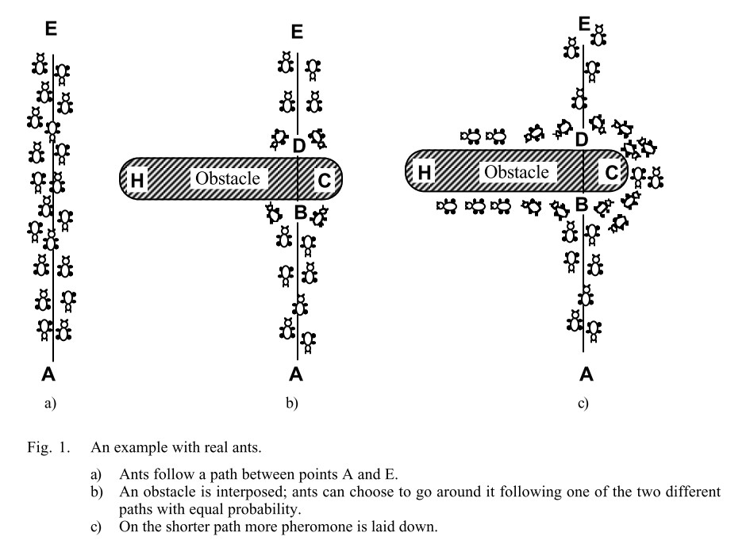
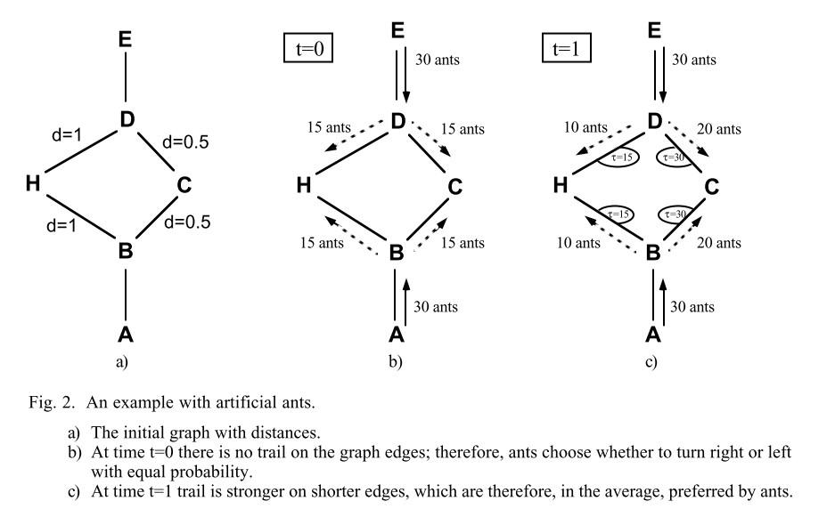

# 蚂蚁系统(Ant System,AS)

## 1. 摘要

通过对蚁群运作方式的类比 $Dorigo$ 等人提出了一种新的计算范式的定义，并将其称之为蚂蚁系统($AS$)。该优化算法可作为一种可行的随机组合优化新方法。

该模型的主要特征：

- 正反馈
- 分布式计算
- 使用建设性贪婪启发式算法

在该算法中，正反馈有助于快速发现好的解决方案，分布式计算避免过早收敛，贪婪启发式有助于在搜索过程的早期阶段找到可接受的解决方案。

应用场景：

1. 非对称式旅行商问题
2. 二次分配问题
3. 车间作业调度问题

## 2. 算法描述

### 2.1 算法起源

在本文描述的蚂蚁系统，是指将要解决问题的搜索活动分配给所谓的“蚂蚁”，即具有非常简单的基本能力的代理，在某种程度上模仿真实蚂蚁的行为。

动物行为学家研究蚂蚁这类几乎失明的动物如何设法建立从它们的殖民地到觅食来源并返回的最短路线。从中发现用于在个人之间传达有关路径的信息并用于决定去哪里的媒体由信息素轨迹组成。一只移动的蚂蚁在地面上放置一些信息素（数量不同），从而通过这种物质的踪迹标记路径。虽然孤立的蚂蚁基本上是随机移动的，但遇到先前铺设的踪迹的蚂蚁可以检测到它并决定跟随它的可能性很高，从而用自己的信息素加强踪迹。出现的集体行为是自催化行为的一种形式，其中蚂蚁跟随的越多，跟踪的吸引力就越大。因此，该过程以正反馈循环为特征，其中蚂蚁选择路径的概率随着先前选择相同路径的蚂蚁数量而增加。

例如，考虑图 1 中所示的实验设置。有一条蚂蚁觅食行走的路径（例如，从食物源 A 到巢穴 E，反之亦然，见图 1a）。

当路径被一个障碍物切断时，蚂蚁在位置 B必须做出一个选择，是选择路线 $B\Rightarrow C \Rightarrow D \Rightarrow E$，还是选择路线 $B\Rightarrow H \Rightarrow D \Rightarrow E$（从 $E \Rightarrow A $亦是如此）（图 1b）。同时蚂蚁做选择也会受前面蚂蚁留下的信息素踪迹强度的影响。正确路径上更高水平的信息素会给蚂蚁带来更强的刺激，因此向右转的可能性更高。第一个到达点 B（或 D）的蚂蚁向右或向左转的概率相同（因为在两条替代路径上没有先前的信息素）。因为路径 BCD 比 BHD 短，跟随它的第一只蚂蚁将在跟随路径 BHD 的第一只蚂蚁之前到达 D（图 1c）。结果是一只从 E 返回到 D 的蚂蚁将在路径 DCB 上找到一条更强的踪迹，这是由于所有蚂蚁中有一半偶然决定通过 DCBA 接近障碍物，而已经到达的蚂蚁通过 BCD 到达：它们将因此（在概率上）更喜欢路径 DCB 到路径 DHB。因此，单位时间内跟随路径 BCD 的蚂蚁数量将高于跟随 BHD 的蚂蚁数量。这导致较短路径上的信息素数量比较长路径上的增长速度更快，因此任何一只蚂蚁选择要遵循的路径的概率很快就会偏向较短的路径。最终的结果是很快所有蚂蚁都会选择较短的路径。

>- 为了进一步解释，作者还通过使用控制变量的方式举例，如下所述：

在不考虑其他条件情形下，由$B\Rightarrow H\Rightarrow D$(反之亦然)的距离 $d = 2$，而$B\Rightarrow C\Rightarrow D$的距离为 $d = 1$，即 $B\Rightarrow H\Rightarrow D$（接下来称为路线1） 路线的长度是 $B\Rightarrow C\Rightarrow D$（接下来称为路线2） 的两倍，因此在控制时间变量的情况下，蚂蚁走一遍路线1的时间内可以使蚂蚁走两遍路线2。假设所有蚂蚁信息素释放速率一样，则路线2在相同时间内的信息素的量会是路线1的两倍，同时，蚂蚁选择路线会受信息素的影响，按照朴素的方法进行计算，则下次选择路线2的蚂蚁会是选择路线1的蚂蚁的两倍，按照此种方式，最后所有蚂蚁将会全部选择路线2.

当然，为了方便理解与描述，上述过程并未加入信息素蒸发的操作。同时也将 $A\Rightarrow B$ 与 $D\Rightarrow E$ 的距离忽略不计，但是上述描述会非常简单，个人感觉这样会更加便于理解。

另外一个需要注意的是，在上述描述中，每次蚂蚁去与回都会走相同路径。

### 2.2 与真实蚁群的区别

- 人造蚂蚁将具有一定的记忆力
- 它们不会完全失明
- 它们将生活在时间离散的环境中

### 2.3 主要特征

- **通用性：** 它可以应用于同一问题的类似版本； 例如，旅行商问题 (TSP) 可以直接扩展到非对称旅行商问题 (ATSP)。
- **鲁棒性：** 它可以应用于其他组合优化问题，例如二次分配问题 (QAP) 和作业车间调度问题 (JSP)，只需进行最小的更改。
- **基于种群的组合优化方法：** 它允许利用正反馈作为搜索机制，它还使系统适合并行实现。

## 3 算法实现

在算法实现中，本文以经典的旅行商问题为例，在该问题中，我们对蚂蚁有约定：

1. 它选择要去的城镇的概率是城镇距离和连接边上存在的路径数量的函数；
2. 两城市之间的路径长度取两城市之间的欧式距离；
3. 强制蚂蚁进行合法的旅行，在旅行完成之前不允许转换到已经访问过的城镇（这由禁忌列表控制）；
4. 当它完成一次巡视时，它会在每条被访问的边 $(i,j)$ 上放置一个叫做 $trail$（可被称为 信息素） 的物质。

### 3.1 信息素更新

令 $τ_{ij}(t)$ 为 $t$ 时刻边缘 $(i,j)$ 上的信息素强度。 每只蚂蚁在时间 $t$ 选择下一个城镇，它在时间 $t+1$ 时到达城镇。 因此，如果我们将 $AS$ 算法的一次迭代称为 $m$ 只蚂蚁在区间 $(t, t+1)$ 中进行的 $m$ 次移动，那么算法的每 $n$ 次迭代（我们称之为循环）每只蚂蚁都完成了一次 旅游。 此时轨迹强度根据以下公式更新:

$$
τ_{ij}(t+n) = \rho \cdot τ_{ij}(t)+\Delta τ_{ij}\tag{1}
$$

> 其中 $\rho$ 指代信息素在 $t$ 到 $t+n$ 时间内剩余比例，即信息素在 $t$ 到 $t+n$ 时间内蒸发率为 $(1-\rho)$。

$$
\Delta τ_{ij} = \sum_{k=1}^m\Delta τ_{ij}^k\tag{2}
$$

> 其中 $\Delta τ_{ij}$ 是指所有在 $t$ 到 $t+n$ 时间内经过路径 $(i,j)$ 蚂蚁释放信息素的总和。

$$
\Delta τ_{ij}^k = \begin{cases}
    \frac{Q}{L_k}&当第 k 只蚂蚁在时间t到t+n之间经过路径(i,j)\\
    0&当蚂蚁没走过路径(i,j)
\end{cases}\tag{3}
$$

> 其中 $Q$ 是一个常数，$L_k$ 为第 $k$ 只蚂蚁的旅行路径长度。

- 在上面的内容中，需要特别注意以下几点：
  1. $\rho$ 的值需要小于 1，否则信息素会不断累加，即信息素一定会有蒸发。
  2. 在实验开始时，即蚂蚁还未开始旅行时，通常会将路径$(i,j)$信息素浓度设置为一个足够小的常数 $c$。

>注意：在这里有一个问题需要进行说明，那就是信息素更新。本文作者认为，当解决的问题是非对称问题时，信息素更新时路径 $(i,j)$ 与 $(j,i)$ 是不一样的，只需要单独更新蚂蚁所走的路线；当问题为对称时，由于路径 $(i,j)$ 与 $(j,i)$ 两者是一致的，因此更新其中一个位置的信息素时，另一个位置的信息素也同时更新。
此外，当是非对称问题时，那么相应的非对称距离也是提前准备好的。

### 3.2 路径唯一性约束

为了满足在路途路线上不会重复到达某个城市，在蚂蚁旅行时使用了禁忌表，该表负责记录对应蚂蚁已经经过的路线，并且确保蚂蚁在接下来的搜索时不会再次经过该路径。

- 禁忌表执行以下操作
    1. 保存在时间 $t$ 之前已经访问过的城镇，并禁止蚂蚁在 $n$ 次迭代之前再次访问它们 （游览）已完成。
    2. 当游览完成时，禁忌列表用于计算蚂蚁的当前解决方案（即蚂蚁所遵循的路径的距离）。 然后禁忌列表被清空，蚂蚁可以再次自由选择。
    3. 我们定义 $tabu_k$ 是动态增长的向量，它包含第 $k$ 只蚂蚁的禁忌列表，$tabu_k$ 是从 $tabu_k$ 的元素获得的集合，$tabu_k(s)$ 是列表的第 $s$ 个元素（即被访问过的第 $s$ 个城镇） 当前巡演中的第 $k$ 只蚂蚁）。
   > 禁忌表 $tabu_k$ 不一定是动态增长的向量，一般动态增长增长的向量在运行时需要耗费更多的时间给它分配空间，并且在该算法中，是可以提前了解到禁忌表的大小，因此可以在一开始就分配好禁忌表的空间。

在禁忌表的控制下，第 $k$ 只蚂蚁的从城市 $i$ 转移到 $j$ 的概率为：
$$
p_{ij}^k(t)=\begin{cases}
  \frac{[τ_{ij}(t)]^\alpha\cdot[\eta_{ij}]^\beta}{\sum_{s\in allowed_i^k}[τ_{is}(t)]^\alpha\cdot[\eta_{is}]^\beta}&if\; j\in allowed_i^k\\
  0&otherwise
\end{cases}\tag{4}
$$
>
> 1. 其中称 $η_{ij}$ 为能见度，其值取 $1/d_{ij}$，且该值在算法运行期间不会被修改。
>
> 2. 其中$allowed_i^k = {N - tabu_i^k}$，指除去第 $k$ 只蚂蚁已经走过的城市，即第 $k$ 只蚂蚁的禁忌表中含有的城市，更简单的记法，可以记作第 $k$ 只蚂蚁所在城市 $i$ 还能访问的城市集合。其中 α 和 β 是控制轨迹与可见性的相对重要性的参数。 因此，转移概率是可见性（表示应该以高概率选择附近城镇，从而实施贪婪的建设性启发式）和时间 $t$ 的路径强度（表示直到时间 $t$ 如果在路径 $(i,j)$ 上有了更多的信息素累积，那么它是非常可取的，因此实现了自催化过程）。

### 3.3 蚁群算法执行定义

1. 在时间 0 处执行算法初始化，在此时将各蚂蚁置于不同的起点城市，并将各路径上的信息素设置为初始值 $τij(0)$。
2. 每只蚂蚁的禁忌表中第一个元素设置为它的起始城镇。
3. 此后每次移动到下一城镇，都需要根据公式 (4) 进行概率度量，选择概率最大的城镇移动，再执行移动操作后需要将该城市加入禁忌表。
4. 按照3.1中的信息素更新方式进行路径上的信息素更新。
5. 当遍历完所有城市，将禁忌表清空，执行下一次循环(只是将禁忌表清空)。

> 1. $τ_{ij}(t)$ 给出了过去有多少蚂蚁选择了同一条边 $(i,j)$ 的信息；
> 2. 能见度 $η_{ij}$，表示一个城镇越近，它就越受欢迎。 显然，设置 $α=0$，不再考虑信息素的影响，就会得到一个多起点的随机贪心算法。

- 算法停止搜索条件：
1.算法的迭代次数达到了我们设定的最大迭代次数
2.算法中的蚂蚁全部都选择同一路径，也就是陷入停滞

>一般来说会采取第一种，设置一个最大迭代次数。当然，也或许可以有第三种算法停止搜索的条件，当达到求解的精度，比如设定一个最短路径可接受的范围，当达到该标准就停止迭代，算法终止。

### 3.4 蚂蚁系统流程

**1. 初始化**
$
  1.1\quad Set\;t:=0\qquad t 是时间计数器\\
  1.2\quad Set\;NC:=0\qquad NC 是迭代次数计数器\\
  1.3\quad 对每一条路径(i,j)设置一个信息素初始值τ_{ij}(0)=c并且设置对应路径信息素增量为0：\Delta τ_{ij}^k=0\\
  1.4\quad 将所有蚂蚁分配到不同的起始城市
$
**2. 禁忌表初始化**
$
2.1\quad Set\;s:=1\qquad s是禁忌表的索引\\
2.2\quad 将各蚂蚁的起点城市放置到对应蚂蚁的禁忌表中。
$
**3. 蚂蚁巡游操作**
$
3.1\quad 使用对应的公式进行蚂蚁巡游操作，直至禁忌表空间满，即所有蚂蚁全部走完所有城市。在每次走到一座城市时都需要及时的将该城市加入禁忌表中。
$
**4. 最短路径更新及信息素增量计算**
$
4.1\quad 将各蚂蚁的出发点与终点相连，形成一个闭环，并计算所有蚂蚁线路的长度，并更新最短的路线。\\
4.2\quad 对每只蚂蚁巡游过的路线进行信息素增量计算，计算公式如下：\\
\Delta τ_{ij}^k = \begin{cases}
    \frac{Q}{L_k}&当路径(i,j)在巡游路线中\\
    0&当蚂蚁没走过路径(i,j)
\end{cases}\\
\Delta τ_{ij}:=\Delta τ_{ij}+\Delta τ_{ij}^k
$
**5. 对路径进行信息素更新**
$
5.1\quad 对路径(i,j)计算当前信息素τ_{ij}(t+n)，按照公式：τ_{ij}(t+n)=\rho \cdot τ_{ij}(t)+\Delta τ_{ij}\\
5.2\quad Set\;t:=t+n\\
5.3\quad Set\;NC:=NC+1\\
5.4\quad 将路径(i,j)的信息素增量设置为0，\Delta τ_{ij}=0
$
**6. 迭代条件判断**
$
6.1\quad 判断迭代次数NC是否小于最大允许迭代次数NC_{max}，如果是，则清空禁忌表，返回第二步，否则输出最短路径，算法终止。
$

- 原文算法流程如下所示：

## 4 参数设置及基本含义

• α：路径的相对重要性，α≥0；
• β：能见度的相对重要性，β≥0；
• ρ：信息素持久性，0≤ρ<1（1-ρ 可以解释为信息素蒸发率）；
• Q：与蚂蚁铺设的足迹数量相关的常数。

在经过作者的大量测试后，提供了以下相关参数设置

1. 蚂蚁的数量 m 一般被设置为等于城市的数量 n。
2. 参数的默认值为α=1、β=1、ρ=0.5、Q=100。

>蚂蚁循环中的最优值 ρ = 0.5 可以解释为，该算法在计算的早期阶段使用贪婪启发式引导搜索后，开始利用包含在 trail 值 τij 中的全局信息。 因此，Ant-cycle 需要有可能忘记过去获得的部分经验，以便更好地利用新传入的全球信息。

## 5 代码编写

## 6 参考文献

[1] Dorigo M ,  Maniezzo V . Ant system: optimization by a colony of cooperating agents[J]. IEEE Trans. on SMC-Part B, 1996, 26(1):29.
