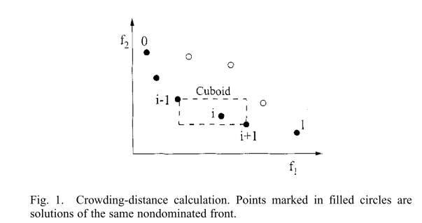
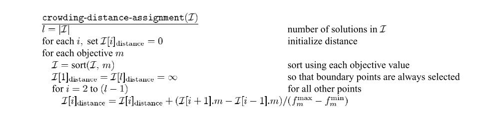
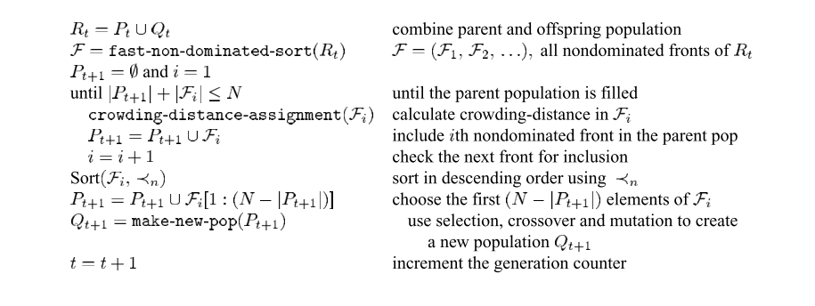
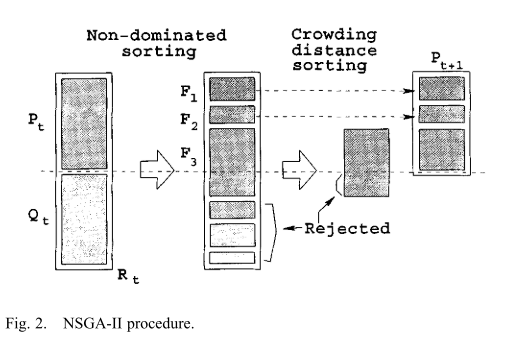

# 精英非支配排序遗传算法(ELITIST NONDOMINATED SORTING GENETIC ALGORITHM,NSGA-Ⅱ)

## 1 引言

在文献[1]中，作者提出了一种基于非支配排序的多目标进化算法(MOEA)，称为非支配排序遗传算法 II (NSGA-II)，它缓解了进化算法以下三个困难：

1. 时间复杂度为$O(MN^3)$，其中$M$为求解目标数，$N$为种群数目
2. 非精英主义方法
3. 需要指定共享参数

具体来说，提出了一种计算复杂度为$O(MN^2)$的快速非支配排序方法。此外，还提出了一个选择算子，它通过结合父母和后代种群并选择最佳（关于适应度和传播）解决方案来创建交配池。对困难测试问题的仿真结果表明，与 Pareto 归档进化策略和强度 Pareto EA 相比，在大多数问题中，所提出的 NSGA-II 能够在真正的 Pareto 最优前沿附近找到更好的解分布和更好的收敛性——另外两个精英 MOEAs 特别关注创造一个多样化的帕累托最优前沿。

原则上，一个问题中存在多个目标会产生一组最优解（主要是称为帕累托最优解），而不是单个最优解。 在没有任何进一步信息的情况下，不能说这些帕累托最优解中的一个比另一个更好。 这要求用户找到尽可能多的帕累托最优解。 经典优化方法（包括多准则决策方法）建议通过一次强调一个特定的帕累托最优解将多目标优化问题转换为单目标优化问题。 当这种方法用于寻找多个解决方案时，必须多次应用，希望在每次模拟运行时找到不同的解决方案。

在过去几十年中，已经提出了许多多目标进化算法 (MOEA)。由于进化算法 (EA) 与大量解决方案一起工作，因此可以扩展一个简单的 EA 以维护一组不同的解决方案。 强调向真正的帕累托最优区域移动，EA 可用于在一次模拟运行中找到多个帕累托最优解。

 N. Srinivas，Kalyanmoy Deb提出的非支配排序遗传算法 (NSGA) 是最早的此类 EA 之一。 多年来，对 NSGA 方法的主要批评如下：

1. 非支配排序计算复杂度高：NSGA非支配排序算法的计算复杂度为$O(MN^3)$（其中$M$为目标数，$N$为种群规模）。 这使得NSGA 对于大种群规模的计算成本很高。 之所以会出现这种大的复杂性，是因为每一代的非支配排序过程都涉及到复杂性。
2. 缺乏精英主义：最近的研究结果表明，精英主义可以显着加快 GA 的性能，这也有助于防止一旦找到好的解决方案就丢失。
3. 需要指定共享参数$\delta_{share}$：确保种群多样性以得到多种等效解决方案的传统机制主要依赖于共享的概念。 共享的主要问题是它需要指定共享参数($\delta_{share}$)。

本文的NSGA-Ⅱ解决了所有这些问题。 从对许多困难测试问题的模拟结果来看，我们发现 NSGA-II 在寻找多样化集合方面优于其他两个当代 MOEA：帕累托存档进化策略 (PAES)和强度帕累托 EA (SPEA)的解决方案，并在真正的帕累托最优集附近收敛。

## 2 算法介绍

### 2.1 快速非支配排序方法

为了清楚起见，作者首先描述了一个简单而缓慢的过程，将搜索代理分类为不同的非支配级别。 此后，作者描述了一种快速方法。

在一种朴素的方法中，为了识别大小为 $N$ 的种群中第一个非支配前沿的解，可以将每个解与种群中的所有其他解进行比较，以确定它是否被支配。这需要对每个解决方案进行 $O(MN)$ 比较，其中 $M$ 是目标的数量。当这个过程继续寻找种群中第一非支配层的所有成员时，总复杂度为$O(MN^2)$。在这个阶段，第一非支配前沿的所有个体都被找到。为了找到下一个非支配前沿的个体，将第一个前沿的解暂时忽略，重复上述过程。在最坏的情况下，找到第二前沿的任务也需要 $O(MN^2)$ 计算，特别是当 $O(N)$ 数量的解决方案属于第二和更高的非支配水平时。这个论点适用于寻找第三和更高层次的非支配。因此，最坏的情况是当有 $N$ 个前沿并且每个前沿仅存在一个解决方案时。这需要总体 $O(MN^3)$ 计算。请注意，此过程需要 $O(N)$ 存储。在下面的段落和方程式中，作者描述了一种需要 $O(MN^2)$ 计算的快速非支配排序方法。

首先，对于每个解决方案，需要计算两个实体：

- 支配计数$n_p$，支配解决方案 $p$ 的数量
- $S_p$，解决方案 $p$ 支配的一组解决方案。 

这需要 $O(mn^2)$ 比较。

第一个非支配前沿中的所有解决方案都将其支配计数设为零。现在，对于 $n_p=0$ 的每个解 $p$，我们访问其集合 $S_p$ 的每个成员($q$)，并将其支配计数减一。 这样做时，如果任何成员 $q$ 的支配计数变为零，我们将其放在单独的列表 $Q$ 中。这些成员属于第二非支配前沿。现在，对 $Q$ 的每个成员继续上述过程，并确定第三条前沿。 这个过程一直持续到所有前沿都被确定为止。

对于第二或更高非支配级别的每个解决方案，支配计数 $n_p$ 最多可以是 $N-1$。因此，每个解决方案 $p$ 在其支配计数变为零之前将被访问最多 $N-1$ 次。此时，该解决方案被分配一个非支配级别，并且永远不会再被访问。由于最多有 $N-1$ 个这样的解，总复杂度为 $O(N^2)$。因此，整个过程的复杂度为 $O(MN^2)$。计算这个复杂度的另一种方法是实现第一个内循环的主体(其中$p\in F_i$)精确执行 $N$ 次，因为每个个体最多可以是一个边沿的成员，并且第二个内部循环（对于$S_p$中的每个 $q$）可以对每个个体执行最多 $(N-1)$ 次[每个个体最多支配 $(N-1)$ 个个体，并且每个支配检查最多需要 $M$ 次比较] 导致总体 $O(MN^2)$ 计算。需要注意的是，虽然时间复杂度降低到了$O(MN^2)$，但是存储需求却增加到了$O(N^2)$。

快速非支配排序伪代码如下图所示：

### 2.2 多样性保护

我们之前提到，随着收敛到帕累托最优集，还希望 EA 在获得的解决方案集中保持良好的解决方案传播。 最初的 NSGA 使用众所周知的共享函数方法，该方法已被发现通过适当设置其相关参数来维持种群的可持续多样性。 共享函数方法涉及共享参数 $\delta_{share}$，它设置问题中所需的共享程度。 此参数与选择用于计算两个总体成员之间的邻近度度量的距离度量有关。 参数 $\delta_{share}$ 表示任何两个解决方案共享彼此适应度的距离度量的最大值。 此参数通常由用户设置，尽管存在一些指导原则。 

这种共享函数方法以下两个困难：

- 共享函数方法在维持解的传播方面的性能在很大程度上取决于所选的 $\delta_{share}$ 值。
- 由于每个解决方案都必须与总体中的所有其他解决方案进行比较，因此共享函数方法的总体复杂度为$O(n^2)$。

在提出的 NSGA-II 中，我们将共享函数方法替换为拥挤比较方法，在一定程度上消除了上述两个困难。 新方法不需要任何用户定义的参数来维持种群成员之间的多样性。 此外，建议的方法具有更好的计算复杂度。 为了描述这种方法，我们首先定义一个密度估计度量，然后提出拥挤比较算子。

---
- 1. 密度估计：为了估计总体中特定解决方案周围的解决方案密度，我们计算沿每个目标的该点两侧的两个点的平均距离。 这个量$i_{distance}$用作对使用最近邻居作为顶点形成的长方体周长的估计（称为拥挤距离）。 在图 1 中，第 $i$ 个解在其前面的拥挤距离（用实心圆圈标记）是长方体的平均边长（用虚线框表示）。

拥挤距离计算需要根据每个目标函数值按数量级升序对总体进行排序。 此后，对于每个目标函数，边界解（具有最小和最大函数值的解）被分配一个无限距离值。 所有其他中间解都分配了一个距离值，该距离值等于两个相邻解的函数值的绝对归一化差。 使用其他目标函数继续该计算。 总体拥挤距离值计算为每个目标对应的各个距离值的总和。 在计算拥挤距离之前，对每个目标函数进行归一化。 页面底部显示的算法概述了非支配集 $I$ 中所有解的拥挤距离计算过程。
这里 $I[i]\cdot m$ 是指集合 $I$ 中第 $i$ 个个体的第 $m$ 个目标函数值，参数 $f_m^{max}$ 和 $f_m^{min}$ 是第 $m$ 个目标函数的最大值和最小值。 该过程的复杂性由排序算法控制。 由于涉及到最多 $n$ 个解的 $m$ 个独立排序（当所有种群成员都在一个前面 $I$ 时），所以上述算法具有 $O(mn\log{n})$ 计算复杂度。
在为集合 $I$ 中的所有人口成员分配了距离度量之后，我们可以比较两个解决方案与其他解决方案的接近程度。 在某种意义上，这个距离度量值较小的解决方案被其他解决方案更拥挤。 这正是我们在提议的拥挤比较算子中比较的，如下所述。 尽管图 1 说明了两个目标的拥挤距离计算，但该过程也适用于两个以上的目标。
---
- 2. 拥挤比较算子：拥挤比较算子 ($\prec_n$) 将算法各个阶段的选择过程引导到均匀展开的帕累托最优前沿。 假设代理中的每个个体都有两个属性：
  - 非支配等级($i_{rank}$)
  - 拥挤距离($i_{distance}$)
我们现在将偏序$\prec_n$定义为:
$$
i\prec_n j\quad if(i_{rank}<j_{rank})\\
or\quad((i_{rank}=j_{rank})and(i_{distance}>j_{distance}))
$$
也就是说，在具有不同非支配等级的两个解决方案之间，我们更喜欢具有较低（更好）等级的解决方案。 否则，如果两个解决方案属于同一前沿，那么我们更喜欢位于不太拥挤区域的解决方案。 

拥挤距离计算伪代码如下：

有了这三个新的创新——一个快速的非支配排序过程、一个快速的拥挤距离估计过程和一个简单的拥挤比较算子，我们现在可以描述 NSGA-II 算法了。

### 2.3 算法主体

最初，创建一个随机父群体 $P_0$。 代理是根据非支配性排序的。 每个解决方案都被分配一个与其非支配级别相等的适应度（或等级）（1 是最佳级别，2 是次佳级别，依此类推）。 因此，假设适应度最小化。 首先，使用通常的二元锦标赛选择、重组和变异算子来创建大小为 $n$ 的后代种群 $Q_0$。由于通过将当前种群与先前找到的最佳非支配解进行比较来引入精英主义，因此在初始生成之后过程会有所不同。 我们首先描述所提出算法的第 $t$ 代，伪代码如下图所示：

一步一步的过程表明 NSGA-II 算法简单明了。首先，形成一个组合种群 $R_t=P_t∪Q_t$。种群 $R_t$ 的大小为 $2N$。然后，根据非支配对种群 $R_t$ 进行排序。由于所有以前和当前的人口成员都包含在 $R_t$ 中，因此确保了精英主义。现在，属于最佳非支配集 $F_1$ 的解在组合种群中是最佳解，并且必须比组合种群中的任何其他解更加强调。如果 $F_1$ 的大小小于 $N$，我们肯定会选择集合 $F_1$ 的所有成员作为新种群 $P_{t+1}$。种群 $P_{t+1}$ 的其余成员按其排名顺序从后续的非支配前沿中选择。因此，接下来选择集合 $F_2$ 中的解，然后选择集合 $F_3$ 中的解，依此类推。继续此过程，直到无法容纳更多集合。假设集合 $F_1$ 是最后一个非支配集合，超出该集合不能容纳其他集合。一般来说，从 $F_1$ 到 $F_l$ 的所有集合中的解决方案的数量都会大于人口规模。为了精确选择 $N$ 个人口成员，我们使用拥挤比较算子 $\prec_n$ 对最后一个前 $F_l$ 的解决方案进行降序排序并选择填补所有人口空缺所需的最佳解决方案。 NSGA-II 程序也如图 2 所示。大小为 $N$ 的新种群 $P_{t+1}$ 现在用于选择、交叉和突变以创建大小为 $N$ 的新种群 $Q_{t+1}$。重要的是要注意，我们使用二元锦标赛选择算子，但选择标准现在基于拥挤比较算子 $\prec_n$。由于该算子需要总体中每个解决方案的秩和拥挤距离，我们在形成总体 $P_{t+1}$ 时计算这些数量，如上述算法所示。

考虑整个算法的一次迭代的复杂性。 基本操作及其最坏情况的复杂性如下：

- 非支配排序复杂度为：$O(M(2N)^2))$
- 拥挤距离分配复杂度：$O(M(2N)\log(2N))$
- $\prec_n$排序复杂度为：$O(2N\log(2N))$

该算法的总体复杂度为$O(MN^2)$，由算法的非支配排序部分控制。 如果仔细执行，大小为 $2N$ 的完整种群不需要根据非支配排序。 一旦排序过程找到足够数量的前沿以在 $P_{t+1}$ 中有 $N$ 个成员，就没有理由继续排序过程。

通过使用拥挤比较程序引入非支配解决方案之间的多样性，该程序用于锦标赛选择和人口减少阶段。 由于解决方案与其拥挤距离（邻域中解决方案的密度度量）竞争，因此不需要额外的利基参数（例如 NSGA 中需要的 $\delta_{share}$）。 虽然拥挤距离是在目标函数空间中计算的，但如果需要的话，它也可以在参数空间中实现。 然而，在本研究中进行的所有模拟中，我们都使用了目标函数空间细分。

## 3 算法实现

## 4 参考文献

[1] Deb K ,  Pratap A ,  Agarwal S , et al. A fast and elitist multiobjective genetic algorithm: NSGA-II[J]. IEEE Transactions on Evolutionary Computation, 2002, 6(2):182-197.
