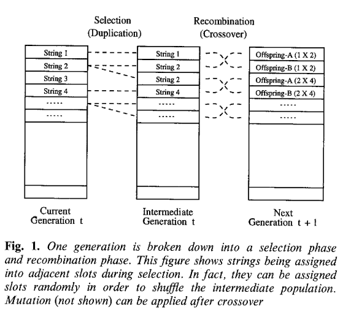

# 经典遗传算法(Genetic algorithms,GA)

## 1 引言

遗传算法是一系列受进化启发的计算模型。 这些算法在简单的类似染色体的数据结构上对特定问题的潜在解决方案进行编码，并将重组算子应用于这些结构以保留关键信息。 遗传算法通常被视为函数优化器，尽管遗传算法所应用的问题范围相当广泛。

遗传算法的实现始于一群（通常是随机的）染色体。然后评估这些结构并以这样一种方式分配繁殖机会，即那些代表目标问题的更好解决方案的染色体比那些解决方案较差的染色体有更多的“繁殖”机会。解决方案的“优点”通常是根据当前染色体来定义的。遗传算法的这种特殊描述是有意抽象的，因为在某种意义上，遗传算法一词有两个含义。在严格的解释中，遗传算法是指由 John Holland (1975) 和他的学生 (例如 DeJong, 1975) 引入和研究的模型。大多数现有的遗传算法理论仍然是单独或主要适用于 Holland 引入的模型，以及本文将称为规范遗传算法的变体。遗传算法建模的最新理论进展也主要适用于规范遗传算法（Vose，1993）。

在该术语的更广泛用法中，遗传算法是任何基于群体的模型，它使用选择和重组算子在搜索空间中生成新的样本点。研究人员主要从实验的角度引入了许多遗传算法模型。这些研究人员中有许多是面向应用的，并且通常对将遗传算法作为优化工具感兴趣。本教程的目标是介绍遗传算法，使刚接触该领域的学生在学习本教程时能够掌握遗传算法背后的基本概念。它应该允许更老练的读者相对容易地吸收这些材料。本教程还涵盖了一些主题，例如反演，这些主题有时会被该领域的新研究人员误解和误用。本教程首先对优化进行了非常低级的讨论，以介绍优化的基本思想以及与优化相关的基本概念遗传算法。在第 2 节中回顾了典型的遗传算法。第 3 节探讨了超平面采样的原理，并介绍了一些基本的交叉算子。在第 4 节中，以逐步的方式开发了模式定理的各种版本，并讨论了其他交叉算子。在第 5 节中，考虑了二进制字母及其对超平面采样的影响。在第 6 节中考虑了对模式定理的简要批评，并在第 7 节中开发了遗传算法的精确模型。本教程的最后三个部分涵盖了遗传算法和进化计算模型的替代形式，包括专门的并行实现。

## 2 算法介绍

### 2.1 编码和优化问题

通常，大多数遗传算法只有两个与问题相关的主要组成部分：**问题编码**和**评估函数**。

以参数优化问题为例，我们必须优化一组变量以最大化某些目标（例如利润），或者最小化成本或某种误差度量。我们可以把这样的问题看作是一个黑匣子，里面有一系列代表不同参数的控制盘；黑匣子的唯一输出是评估函数返回的值，该值指示参数设置的特定组合解决优化问题的程度。目标是设置各种参数以优化某些输出。用更传统的术语来说，我们希望最小化（或最大化）某个函数 $F(x_1, x_2, . . . , x_m)$。
大多数遗传算法的用户通常关心非线性问题。这通常也意味着不可能将每个参数视为可以与其他变量隔离解决的独立变量。存在相互作用，因此必须考虑参数的组合效应，以最大化或最小化黑盒的输出。在遗传算法中，变量之间的相互作用有时被称为上位性。

通常做出的第一个假设是表示参数的变量可以由位串表示。这意味着变量以先验方式离散化，并且离散化的范围对应于 2 的某个幂。例如，每个参数有 10 位，我们得到一个具有 1024 个离散值的范围。如果参数实际上是连续的，那么这种离散化不是一个特别的问题。当然，这假设离散化提供了足够的分辨率，从而可以以所需的精度水平调整输出。它还假设离散化在某种意义上代表了基础函数。

如果某些参数只能采用精确的有限值集，那么编码问题就会变得更加困难。例如，如果恰好有 1200 个离散值可以分配给某个变量 $x_i$。我们需要至少 11 位来覆盖这个范围，但是这个编码总共有 2048 个离散值。 848 个不必要的位模式可能会导致不评估、默认的最差评估，或者某些参数设置可能会被表示两次，以便所有二进制字符串都产生一组合法的参数值。解决此类编码问题通常被认为是评估函数设计的一部分。
除了编码问题，评估函数通常作为问题描述的一部分给出。另一方面，开发评估功能有时可能涉及开发模拟。在其他情况下，评估可能是基于性能的，并且可能仅代表近似或部分评估。例如，考虑一个控制应用程序，其中系统可以处于指数级大量可能状态中的任何一种状态。假设使用遗传算法来优化某种形式的控制策略。在这种情况下，必须以有限的方式对状态空间进行采样，并且对控制策略的评估结果是近似的和嘈杂的（例如，参见 Fitzpatrick 和 Grefenstette，1988 年）。
评估函数的计算速度也必须相对较快。这通常适用于任何优化方法，但它可能特别对遗传算法造成问题。由于遗传算法与一组潜在算法一起工作，因此会产生评估该群体的成本。此外，人口在代际基础上被替换（全部或部分）。人口中的成员繁殖，然后必须评估他们的后代。如果做一个评估需要 1 个小时，那么做 10000 次评估需要 1 年以上。对于只有 200 个字符串的人口，这将是大约 50 代。

### 2.2 典型遗传算法

将遗传算法的执行视为一个两阶段的过程是有帮助的。 它从当前的代理开始。 选择应用于当前种群以创建中间种群。 然后将重组和突变应用于中间种群以创建下一个种群。 从当前种群到下一个种群的过程构成了遗传算法执行的一代。 Goldberg (1989) 将这种基本实现称为简单遗传算法 (SGA)。

在典型遗传算法中，适应度定义为：$f_i/\overline{f}$ ，其中 $f_i$ 是与字符串 $i$ 相关的评估，$\overline{f}$ 是总体中所有字符串的平均评估。 也可以根据字符串在总体中的排名（Baker，1985；Whitley，1989）或通过诸如锦标赛选择（Goldberg，1990）之类的抽样方法来分配适应度。

#### 2.2.1 种群初始化

执行任何遗传算法的第一步是生成初始种群。 在规范遗传算法中，该种群的每个成员都是长度为 $L$ 的二进制字符串，对应于问题编码。 每个字符串有时被称为基因型（Holland，1975）或染色体（Schaffer，1987）。 在大多数情况下，初始种群是随机生成的。 创建初始种群后，每个字符串都会被评估并分配一个适应度值。

评估和适应度的概念有时可以互换使用。 但是，区分遗传算法使用的评估函数和适应度函数是有用的。 在本教程中，评估函数或目标函数提供了关于一组特定参数的性能度量。 适应度函数将绩效衡量转化为繁殖机会的分配。 表示一组参数的字符串的评估独立于任何其他字符串的评估。 但是，该字符串的适应度始终是相对于当前染色体集合的其他成员定义的。

#### 2.2.2 构建中间种群

#### 2.2.2.1 选择

我们将首先考虑从当前染色体种群中构建中间种群。 在第一代中，当前种群也是初始种群。 对当前种群中的所有字符串计算$f_i/\overline{f}$后，进行选择。 在规范遗传算法中，当前种群中的字符串被复制（即复制）并放置在中间代中的概率与它们的适应度成正比。

有很多方法可以进行选择。我们可以将染色体视为轮盘赌上的映射，其中每个个体都由与其适应度成比例的空间表示。通过反复旋转轮盘赌，使用带有替换的随机抽样来选择个体以填充中间群体。与预期适应度值更接近的选择过程是剩余随机抽样。对于$f_i/\overline{f}$大于 1.0 的每个字符串$i$，此数字的整数部分表示该字符串的多少副本直接放置在中间群体中。然后，所有字符串（包括$f_i/\overline{f}$小于 1.0 的字符串）以对应于$f_i/\overline{f}$小数部分的概率在中间群体中放置额外的副本。例如，$f_i/\overline{f}$ = 1.36 的字符串在中间群体中放置 1 个副本，然后有 0.36 的机会放置第二个副本。适应度 $f_i/\overline{f}$ = 0.54 的字符串有 0.54 的机会将一根字符串放入中间群体。

>在上面的中间群体生成过程中，轮盘赌是直接根据适应度对应染色体种群优势概率生成中间群体，染色体适应度越好，则被选中保留在中间群体概率越高。
而剩余随机抽样却需要稍微分析，由于通过$f_i/\overline{f}$计算得到的，按照文中所描述，需要把计算得来的整数部分保留，按照整数部分搜先选择对应染色体进入中间群体，之后就留下小数部分，但是并非直接就可以按照小数就可以按照概率选择，还应该将小数部分归一化，化成一个整体中的百分比，再按照轮盘赌填充中间群体剩余部分。
在上面问题中，还有一个问题，那便是在上面的公式中，适应度$f_i$越大则概率越大，当问题要求的是适应度越小越优秀的话，则将适应度写成倒数便可以。

使用称为随机通用采样的方法最有效地实现剩余随机采样。假设种群按饼图中的随机顺序排列，其中每个个体在饼图上按适应度分配空间。接下来，在饼图周围放置一个外部轮盘赌，带有 $N$ 个等距指针。轮盘的单次旋转现在将同时选择中间种群的所有 $N$ 个成员。由此产生的选择也是无偏见的（Baker，1987）。

#### 2.2.2.2 重组

在进行选择之后，中间群体的构建完成并且可以发生重组。这可以看作是从中间种群中创建下一个种群。交叉应用于随机配对的字符串，概率表示为 $P_c$。 （染色体应该已经被随机选择过程充分打乱了。）选择一对字符串，以概率 $P_c$ 将这些字符串“重新组合”以形成两个新字符串，这些字符串将插入到下一个种群中。

考虑以下二进制字符串：1101001100101101。该字符串将代表某些参数优化问题的可能解决方案。 空间中的新样本点是通过重新组合两个父字符串生成的。 考虑字符串 1101001100101101 和另一个二进制字符串 yxyyxyxxyyyxyxxy，其中值 0 和 1 由 x 和 y 表示。 使用单个随机选择的重组点，1 点交叉发生如下：

在两个父母之间交换片段会产生以下后代：
$$
11010yxxyyyxyxxy\quad and\quad yxyyx01100101101
$$

遗传算法示意图如下所示：

上面只展示了选择操作和重组操作，还未展示变异操作。

>这里需要注意：
重组是依概率$P_c$从染色体种群中随机挑选一对染色体进行交叉，后在所有的可交换位随机选取一个交换位进行交叉操作。而这与图1所示稍有不一样。

#### 2.2.2.3 变异

重组后，我们可以应用一个变异算子。对于种群中的每个位，以一些低概率的 $P_m$ 进行变异。 通常，突变率的应用概率小于 1%。 在某些情况下，突变被解释为随机生成一个新位，在这种情况下，只有 50% 的时间“突变”会实际更改位值。 在其他情况下，突变被解释为实际翻转位。

>变异操作描述可能会有点让人难以理解，其实这是由于问题模型的原因，在该文中，使用的是二进制模型，因此在进行突变是，也只有两种选择，0或者1，因此还有一般的概率和以前一样，所以说只有 50% 的时间“突变”会实际更改位值。突变被解释位实际翻转也是这个原因，在二进制中0的翻转为1，1的翻转为0.

在选择、重组和突变过程完成后，可以评估下一个种群。 在遗传算法的执行中，评估、选择、重组和变异的过程形成了一代。

### 2.2.3 遗传算法应用在普通数学模型

上文描述的是遗传算法应用在二进制模型中的描述，对于普通函数模型的求解，其实只需要将字符串改成数组，将二进制染色体上的每一个零一替换成普通数值，便能直接应用在普通的数学模型中。

## 参考文献

[1] Whitley D . Genetic algorithm tutorial[J].Statistics & Computing, 1994, 4(2):65-85.
