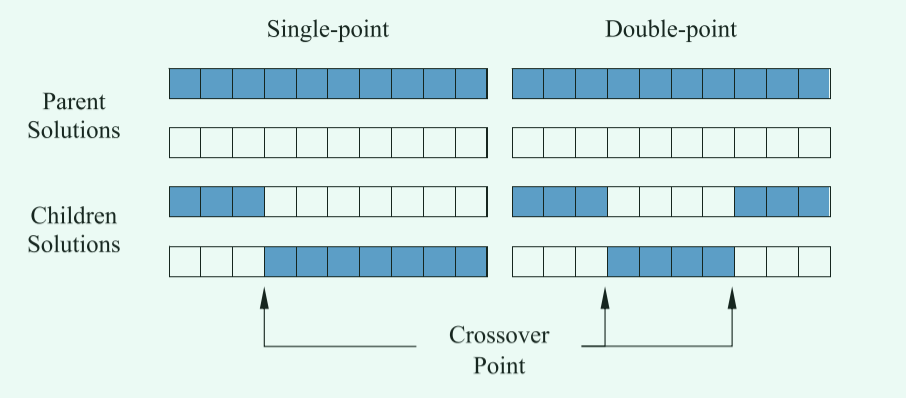
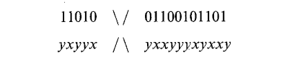
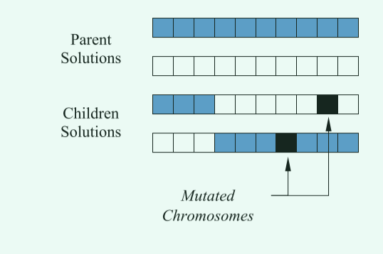

# 经典遗传算法(Genetic algorithms,GA)

## 1 引言

遗传算法是一系列受进化启发的计算模型。 这些算法在简单的类似染色体的数据结构上对特定问题的潜在解决方案进行编码，并将重组算子应用于这些结构以保留关键信息。

遗传算法的实现始于一群（通常是随机的）染色体。然后评估这些结构并以这样一种方式分配繁殖机会，即那些代表目标问题的更好解决方案的染色体比那些解决方案较差的染色体有更多的“繁殖”机会。解决方案的“优点”通常是根据当前染色体来定义的。

遗传算法（`GA`）是历史上最早提出的基于种群的随机算法之一。与其他进化算法类似，`GA`的主要操作有：
- 选择
- 交叉
- 变异

在参考文献中，主要讨论如下内容：
- 回顾了典型的遗传算法;
- 探讨了超平面采样的原理，并介绍了一些基本的交叉算子;
- 以逐步的方式开发了模式定理的各种版本，并讨论了其他交叉算子;
- 考虑了二进制字母及其对超平面采样的影响;
- 开发了遗传算法的精确模型.

## 2 算法介绍

### 2.1 编码和优化问题

通常，大多数遗传算法只有两个与问题相关的主要组成部分：**问题编码**和**评估函数**。

以参数优化问题为例，我们必须优化一组变量以最大化某些目标（例如利润），或者最小化成本或某种误差度量。我们可以把这样的问题看作是一个黑匣子，里面有一系列代表不同参数的控制盘；黑匣子的唯一输出是评估函数返回的值，该值指示参数设置的特定组合解决优化问题的程度。目标是设置各种参数以优化某些输出。用更传统的术语来说，我们希望最小化（或最大化）某个函数 $F(x_1, x_2, . . . , x_m)$。

>当你在看这篇文章时，我假设你已经有相关智能优化基础。因此上面的也就不难解释。与其他类型的优化算法类似，以粒子群为例，其中遗传算法中染色体即为粒子群中的粒子，从生物学角度而言，染色体总不可能进行位移等操作，但是学过生物的我们应该知道，染色体有选择、交叉、变异等操作，而遗传算法正是借助以上操作来完成优化的。

和其他智能算法一样，`GA`是一种基于种群的算法。每个解对应一个染色体，每个参数代表一个基因。 `GA`使用适应度（目标）函数评估群体中每个个体的适应度。为了改进较差的解决方案，通过选择（例如轮盘赌）机制随机选择最佳解决方案。该算子更有可能选择最佳解决方案，因为概率与适应度（目标值）成正比。增加避免局部最优的原因是选择不良解决方案的可能性。这意味着，如果好的解决方案被困在本地解决方案中，它们可以与其他解决方案一起被提取出来。

`GA`是随机的，在经过选择、交叉、变异等操作后，如何确保最终的染色体是可靠的，优秀的？

使该算法可靠并能够估计给定问题的全局最优值的原因是在每一代中保持最佳解决方案并使用它们来改进其他解决方案的过程。因此，整个种群一代一代地变得更好。个体之间的交叉导致利用给定的两个父解决方案之间的“区域”。该算法也受益于变异，通过变异随机改变染色体中的基因，保持种群中个体的多样性，增加遗传算法的探索行为。变异可能会产生一个更好的解决方案，并引导其他解决方案走向全局最优。

>如上面所说，变异可能导致解决方案更优，但是同样的，也可能导致解决方案变差，但是由于有评估标准函数在对变异后的染色体进行评估，因此变异差的染色体将会被淘汰。

大多数遗传算法的用户通常关心非线性问题。这通常也意味着不可能将每个参数视为可以与其他变量隔离解决的独立变量。存在相互作用，因此必须考虑参数的组合效应，以最大化或最小化黑盒的输出。在遗传算法中，变量之间的相互作用有时被称为上位性。

通常做出的第一个假设是表示参数的变量可以由位串表示。这意味着变量以先验方式离散化，并且离散化的范围对应于 2 的某个幂。例如，每个参数有 10 位，我们得到一个具有 1024 个离散值的范围。如果参数实际上是连续的，那么这种离散化不是一个特别的问题。当然，这假设离散化提供了足够的分辨率，从而可以以所需的精度水平调整输出。它还假设离散化在某种意义上代表了基础函数。

如果某些参数只能采用精确的有限值集，那么编码问题就会变得更加困难。例如，如果恰好有 1200 个离散值可以分配给某个变量 $x_i$。我们需要至少 11 位来覆盖这个范围，但是这个编码总共有 2048 个离散值。 848 个不必要的位模式可能会导致不评估、默认的最差评估，或者某些参数设置可能会被表示两次，以便所有二进制字符串都产生一组合法的参数值。解决此类编码问题通常被认为是评估函数设计的一部分。

除了编码问题，评估函数通常作为问题描述的一部分给出。另一方面，开发评估功能有时可能涉及开发模拟。在其他情况下，评估可能是基于性能的，并且可能仅代表近似或部分评估。例如，考虑一个控制应用程序，其中系统可以处于指数级大量可能状态中的任何一种状态。假设使用遗传算法来优化某种形式的控制策略。在这种情况下，必须以有限的方式对状态空间进行采样，并且对控制策略的评估结果是近似的和嘈杂的。

评估函数的计算速度也必须相对较快。这通常适用于任何优化方法，但它可能特别对遗传算法造成问题。由于遗传算法与一组潜在算法一起工作，因此会产生评估该群体的成本。此外，人口在代际基础上被替换（全部或部分）。人口中的成员繁殖，然后必须评估他们的后代。如果做一个评估需要 1 个小时，那么做 10000 次评估需要 1 年以上。对于只有 200 个字符串的人口，这将是大约 50 代。

### 2.2 典型遗传算法

将遗传算法的执行视为一个两阶段的过程是有帮助的。 它从当前的代理开始。 选择应用于当前种群以创建中间种群。 然后将重组和突变应用于中间种群以创建下一个种群。 从当前种群到下一个种群的过程构成了遗传算法执行的一代。 Goldberg (1989) 将这种基本实现称为简单遗传算法 (SGA)。

#### 2.2.1 种群初始化

执行任何遗传算法的第一步是生成初始种群。 在规范遗传算法中，该种群的每个成员都是长度为 $L$ 的二进制字符串，对应于问题编码。 每个字符串有时被称为基因型（Holland，1975）或染色体（Schaffer，1987）。 在大多数情况下，初始种群是随机生成的。 创建初始种群后，每个字符串都会被评估并分配一个适应度值。

评估和适应度的概念有时可以互换使用。 但是，区分遗传算法使用的评估函数和适应度函数是有用的。 在本教程中，评估函数或目标函数提供了关于一组特定参数的性能度量。 适应度函数将绩效衡量转化为繁殖机会的分配。 表示一组参数的字符串的评估独立于任何其他字符串的评估。 但是，该字符串的适应度始终是相对于当前染色体集合的其他成员定义的。

`GA`算法从随机种群开始。该种群可以从高斯随机分布中生成，以增加多样性。这个群体包括多个解决方案，它们代表个体的染色体。每条染色体都有一组变量，用于模拟基因。初始化步骤的主要目标是尽可能均匀地将解决方案分布在搜索空间中，以增加种群的多样性并更好地找到有希望的区域。

#### 2.2.2 构建中间种群

#### 2.2.2.1 选择

自然选择是该组件对 GA 算法的主要启发。在自然界中，最适合的个体获得食物和交配的机会更高。这导致它们的基因在同一物种的下一代生产中做出更多贡献。受这个简单想法的启发，`GA`算法使用轮盘赌来为个体分配概率，并选择它们来创建与其适应度（目标）值成比例的下一代。

>轮盘赌这种机制模拟了自然界中最适者的自然选择。由于轮盘赌是随机算子，适应度差的染色体参与下一代创造的概率很小。如果一个糟糕的解决方案是“幸运的”，它的基因就会转移到下一代。直接放弃这样的解决方案将减少种群的多样性，一般我们会尽量的避免。

>对于轮盘赌机制，看了**蚁群算法**文章的应该会有所了解，因为在蚁群算法中也用到了轮盘赌进行路径的选择。另外对于维持种群多样性这一行为，大部分是在算法直线的前中期，因为种群的多样性能够给算法带来更加广泛的搜索，以避免落入局部最优。当然，在后期算法的收敛以及较差种群不断被抛弃是毫无疑问的。

除了上面所讲的轮盘赌方法进行选择，还有以下方法：

- 玻尔兹曼选择[3] 
- 锦标赛选择 [4]
- 排名选择 [5]
- 稳态选择 [6]
- 截断选择 [7]
- 局部选择 [8]
- 模糊选择 [9]
- 健身均匀选择 [10]
- 比例选择 [11]
- 线性秩选择 [11]
- 稳态再现 [12]

轮盘赌是最流行的方法之一。

#### 2.2.2.2 重组(交叉)

在使用选择操作选择个体之后，必须使用它们来创建新一代。在自然界中，男性和女性基因中的染色体结合在一起产生新的染色体。在遗传算法中则是通过组合轮盘赌选择的两个解（父解）在 GA 算法中产生两个新解（子解）来模拟的。

>在进行重组操作时，一般有两种方式，分别是**单点交叉**和**两点交叉**。如下图所示！

在单点交叉中，两个父解的染色体在单点前后交换。然而，在双点交叉中，有两个交叉点，并且只交换点之间的染色体。

其他交叉技术分别有：
- 统一交叉(`Uniform crossover`) [13]
- 半统一交叉(`Half uniform crossover`) [14]
- 三父交叉(`Three parents crossover`) [15]
- 部分匹配交叉(`Partially matched crossover`) [16]
- 循环交叉(`Cycle crossover`) [17]
- 顺序交叉(`Order crossover`) [18]
- 基于位置的交叉(`Position-based crossover`) [19]
- 启发式交叉(`Heuristic crossover`) [20]
- 掩蔽交叉(`Masked crossover`) [21]
- 多点交叉(`Multi-point crossover`) [22]

在进行选择之后，中间群体的构建完成并且可以发生重组。这可以看作是从中间种群中创建下一个种群。(染色体应该已经被随机选择过程充分打乱了)选择一对字符串，以概率$P_c$将这些字符串“重新组合”以形成两个新字符串，这些字符串将插入到下一个种群中。
>交叉应用于随机配对的字符串，概率表示为$P_c$。

假设以下二进制字符串：1101001100101101。该字符串将代表某些参数优化问题的可能解决方案。 空间中的新样本点是通过重新组合两个父字符串生成的。 考虑字符串 1101001100101101 和另一个二进制字符串 yxyyxyxxyyyxyxxy，其中值 0 和 1 由 x 和 y 表示。 使用单个随机选择的重组点，单点交叉发生如下：

在两个父母之间交换片段会产生以下后代：
$$
11010yxxyyyxyxxy\quad and\quad yxyyx01100101101
$$

>上面的例子是一个字符串的示例，但当把算法应用到模型求解函数中，每个维度也可以使用数组进行存储，因此不必太过于纠结其表示形式。

高交叉率可以创造更多不同的子遗传基因。交叉操作作为主要的搜索机制，结合了产生子遗传基因的最佳解决方案。交叉次数越高越频繁，找到更好基因序列的概率就越高。

>在文献[2]中，作者通过实验发现，当改变交叉概率时，算法的性能并没有较大的影响，但是当交叉概率为0.9时，算法的效果最好。

**什么是交叉率？**

在进行交叉操作编写代码编写时，发现定义交叉时存在相对模糊的概念，即高交叉率是指交叉发生的概率，还是所有染色体参与的概率。

- 倘若是交叉发生的概率，那么就说明在交叉操作时，有0.9的概率一对随机染色体发生交叉，有0.1的概率可能种群不发生交叉。
- 倘若是染色体种群交叉操作参与率，那么就需要直接计算参与交叉的染色体数目以及在种群中占有的概率。但这时存在一个问题，一个染色体多次和不同染色体发生交叉重组操作，那么该染色体是记一次还是记多次。(个人主管意见是不针对染色体，只针对具体次数)

>从选择角度看，由于是使用了轮盘赌方式进行染色体选择，因此此时中间种群势必会有重复染色体，因此从该角度分析，更有可能是第二种交叉方式。

#### 2.2.2.3 突变(变异)

重组后，我们可以应用一个变异操作。对于种群中的每个位，以一些低概率的$P_m$进行变异。 通常，突变率的应用概率小于1%(当然，在后续的一些研究中，研究者们发现，可能突变概率高一点也会有意想不到的惊喜)。 

从二进制编码角度而言，在某些情况下，突变被解释为随机生成一个新位，在这种情况下，只有50%的“突变”会更改实际位值。 在其他情况下，突变被解释为实际翻转位。

>变异操作描述可能会有点让人难以理解，其实这是由于问题模型的原因，当使用的是二进制模型时，变异操作只有两种选择，0或者1，因此还有一般的概率和以前一样，所以说只有50%的概率使“突变”会更改实际位值。突变被解释位实际翻转也是这个原因，在二进制中0的翻转为1，1的翻转为0.

突变操作示意图如下：

目前一些流行的变异技术如下： 
- 幂变异(`Power mutation`) [23] 
- 均匀变异(`Uniform mutation`) [24] 
- 非均匀变异(`Non-uniform mutation`) [25] 
- 高斯变异(`Gaussian mutation`) [26] 
- 收缩变异(`Shrink mutation`) [27] 
- 监督变异(`Supervised mutation`) [28] 
- 唯一性变异(`Uniqueness mutation`) [29]
- 不同的突变概率(`Varying probability of mutation`) [30]

如上所述，大多数`GA`使用三种进化操作：选择、交叉和变异。这些操作应用于每一代，以提高下一代基因的质量。

另一种流行的进化操作是精英主义，其中一个或多个最佳解决方案被维护并在不修改的情况下转移到下一代。主要目标是防止此类解决方案（精英）在应用交叉或变异算子时被降级。

`GA`算法从随机的个体群体开始。直到结束标准结束，该算法使用上述三个算子改进种群。最后一个种群中的最佳解决方案作为给定问题的全局最优值的最佳近似值返回。在优化过程中，选择、交叉和变异的速率可以更改或设置为固定数字。

>在文献[2]中，作者对突变率进行测试时发现，当突变率保持在[0.4,0.6]之间，算法效果能够得到较好的发挥。

### 2.2.3 遗传算法应用在普通数学模型

**如何进行编码？**

遗传算法作为最经典的算法之一，毫无疑问在各领域都具有较好的应用。但是在编写的时候，问题编码毫无疑问成为一个问题。在经典的论述中，一般使用二进制编码，并且在本文中上面的相关论述，都是基于二进制编码进行讨论。从算法总体的理解来看，二进制编码相对易于理解，进行交叉变异等操作时也更加方便。难点在于：
1. 在进行函数评估时，则需要进行解码，转化成十进制；
2. 倘若搜索区间有负值，则需要符号位；
3. 当求解问题维度较高时，则二进制表达较为困难，且计算起来较为繁琐。

浮点型编码：在其他的大多数群智能优化中，采用的都是十进制数值直接编码。相对于二进制编码，浮点型编码具有以下优势：
1. 不需要对数值进行解码；
2. 可以很好的进行初始化，不需要考虑所谓的符号位；
3. 在高维问题优化时，相对计算维度只是线性增加，且计算较为简单；
4. 编写简单易懂。

**二进制编码与浮点型编码的区别**

二进制编码的相关操作就如上述描述，但是倘若使用的时浮点编码，那么可能就会稍微不同，不同在于浮点编码是直接对各维度数值进行描述，因此二进制的交叉等操作要想达到二进制的效果，就需要对规则进行相适应的调整。下面，将着重描述浮点型遗传算法的各操作的对应实现。

**浮点型编码各操作实现**

- 首先需要明白的是，在二进制的变异时，随机一个位置的变换，造成的是整体的变化，因此，在浮点型编码的计算中，染色体按照如下方式进行更新。

1. 选择操作不便，按照原有方式进行选择
2. 在进行交叉时选择公式(1)进行交叉操作：
   $$
   \begin{cases}
    X_A^{t+1}=Pa\times X_B^t+(1-Pa)\times X_A^t\\
    X_B^{t+1}=Pa\times X_A^t+(1-Pa)\times X_B^t
   \end{cases}\tag{1}
   $$
   >其中Pa为交叉因子,t为迭代次数。
3. 变异操作则根据二进制变异，分为两种情况，按照公式(2)进行：
   $$
    \begin{cases}
        X^{t+1}=X^t+k(x_{max}-X^t)r\\
        X^{t+1}=X^t-k(X^t-x_{min})r
    \end{cases}\tag{2}
   $$
   >其中$x_{max},x_{min}$代表问题求解的上下限，$r$是一个在[0,1)之间的随机数
浮点型编码各参数如下：
>Pa=0.01;
Pc=0.8;
Pm=0.18;
k=0.8

>具体代码详见code文件夹

实现中需要注意的地方有如下：
1. 轮盘赌的实现(倘若你使用它)。如果最优化问题是求解最大值的话，那其实很好实现，但是当最优化问题求解的是最小值，则无法直接用，因为适应度越好，值越小，因此需要做对应的改变。

## 参考文献

[1] Whitley D . Genetic algorithm tutorial[J].Statistics & Computing, 1994, 4(2):65-85.
[2] Mirjalili S. Genetic algorithm[M]//Evolutionary algorithms and neural networks. Springer, Cham, 2019: 43-55.
[3] Goldberg, D. E. (1990). A note on Boltzmann tournament selection for genetic algorithms and population-oriented simulated annealing. Complex Systems, 4(4), 445–460.
[4] Miller, B. L., & Goldberg, D. E. (1995). Genetic algorithms, tournament selection, and the effects of noise.Complex Systems, 9(3), 193–212.
[5] Kumar, R. (2012). Blending roulette wheel selection & rank selection in genetic algorithms.International Journal ofMachine Learning and Computing, 2(4), 365.
[6] Syswerda, G. (1991). A study of reproduction in generational and steady-state genetic algo-rithms. In Foundations ofgenetic algorithms (Vol. 1, pp. 94–101). Elsevier.
[7] Blickle, T., & Thiele, L. (1996). A comparison of selection schemes used in evolutionary algorithms. Evolutionary Computation, 4(4), 361–394.
[8] Collins, R. J., & Jefferson, D. R. (1991). Selection in massively parallel genetic algorithms (pp. 249–256).University of California (Los Angeles), Computer Science Department.
[9] Ishibuchi, H., & Yamamoto, T. (2004). Fuzzy rule selection by multi-objective genetic local search algorithms and rule evaluation measures in data mining. Fuzzy Sets and Systems, 141(1),59–88.
[10] Hutter, M. (2002). Fitness uniform selection to preserve genetic diversity. In Proceedings of the 2002 Congress on Evolutionary Computation, CEC’02 (Vol. 1, pp. 783–788). IEEE.
[11] Grefenstette, J. J. (1989). How genetic algorithms work: A critical look at implicit parallelism.In Proceedings ofthe 3rd International Joint Conference on Genetic Algorithms(ICGA89).
[12] Syswerda, G. (1989). Uniform crossover in genetic algorithms. In Proceedings of the Third International Conference on Genetic Algorithms (pp. 2–9). Morgan Kaufmann Publishers.
[13] Semenkin, E., & Semenkina, M. (2012).Self-configuring genetic algorithm with modified
uniform crossover operator. In International Conference in Swarm Intelligence (pp. 414–421).
Heidelberg: Springer.
[14] Hu, X. B., & Di Paolo, E. (2007). An efficient genetic algorithm with uniform crossover
for the multi-objective airport gate assignment problem. In IEEE Congress on Evolutionary
Computation, 2007 (CEC 2007) (pp. 55–62). IEEE.
[15] Tsutsui, S., Yamamura, M., & Higuchi, T. (1999). Multi-parent recombination with simplex
crossover in real coded genetic algorithms. In Proceedings of the 1st Annual Conference on
Genetic andEvolutionaryComputation-Volume1 (pp. 657–664).MorganKaufmannPublishers
Inc.
[16] Bck, T., Fogel, D. B., & Michalewicz, Z. (Eds.). (2000). Evolutionary computation 1: Basic
algorithms and operators (Vol. 1). CRC press.
[17] Oliver, I. M., Smith, D., & Holland, J. R. (1987). Study of permutation crossover operators onthe travelling salesman problem. In Proceedings of the Second International Conference on
Genetic Algorithms and their Applications, July 28–31, 1987 at the Massachusetts Institute of
Technology, Cambridge, MA. Hillsdale, NJ: L. Erlhaum Associates.
[18] Davis, L. (1985). Applying adaptive algorithms to epistatic domains. In IJCAI (Vol. 85, pp.
162–164).
[19] Whitley, D., Timothy, S., & Daniel, S. Schedule optimization using genetic algorithms. In D.Lawrence (Ed.) 351–357.
[20] Grefenstette, J., Gopal, R., Rosmaita, B., & Van Gucht, D. (1985). Genetic algorithms for the
traveling salesman problem. In Proceedings of the first International Conference on Genetic Algorithms and their Applications (pp. 160–168).
[21] Louis, S. J., & Rawlins, G. J. (1991). Designer genetic algorithms: Genetic algorithms in
structure design. In ICGA (pp. 53–60).
[22] Eshelman, L. J., Caruana, R. A., & Schaffer, J. D. (1989). Biases in the crossover landscape. In Proceedings ofthe Third International Conference on Genetic Algorithms (pp. 10–19). Morgan Kaufmann Publishers Inc.
[23] Deep, K., & Thakur, M. (2007). A new mutation operator for real coded genetic algorithms.Applied Mathematics and Computation, 193(1), 211–230.
[24] Srinivas, M., & Patnaik, L. M. (1994). Adaptive probabilities of crossover and mutation in genetic algorithms. IEEE Transactions on Systems, Man, and Cybernetics, 24(4), 656–667.
[25] Neubauer, A. (1997). A theoretical analysis of the non-uniform mutation operator for the
modified genetic algorithm. In IEEE International Conference on Evolutionary Computation
(pp. 93–96). IEEE.
[26] Hinterding, R. (1995). Gaussian mutation and self-adaption for numeric genetic algorithms. In
IEEE International Conference on Evolutionary Computation (Vol. 1, p. 384). IEEE.
[27] Tsutsui, S., & Fujimoto, Y. (1993). Forking genetic algorithm with blocking and shrinking
modes (fGA). In ICGA (pp. 206–215).
[28] Oosthuizen, G. D. (1987). Supergran: A connectionist approach to learning, integrating genetic algorithms and graph induction. In Proceedings of the second International Conference on Genetic Algorithms and their Applications, July 28–31, 1987 at the Massachusetts Institute of Technology, Cambridge, MA. Hillsdale, NJ: L. Erlhaum Associates.
[29] Mauldin, M. L. (1984). Maintaining diversity in genetic search. In AAAI (pp. 247–250).
[30] Ankenbrandt, C. A. (1991). An extension to the theory of convergence and a proof of the time
complexity of genetic algorithms. In Foundations of genetic algorithms (Vol. 1, pp. 53–68).
Elsevier.
[31] Mathew T V. Genetic algorithm[J]. Report submitted at IIT Bombay, 2012.
