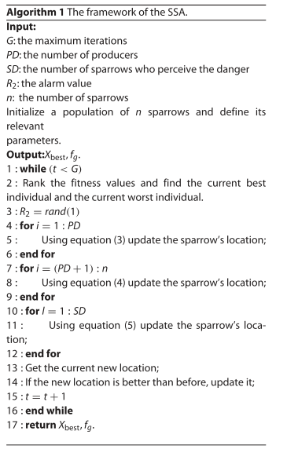

# 麻雀搜索算法(sparrow search algorithm,SSA)

## 1 引言

文献[1]旨在提出一种新的群体智能优化技术，称为麻雀搜索算法(SSA)。 该文的主要内容如下：

  1. 一种新的SI技术，即SSA是受麻雀觅食和反捕食行为的启发而提出的；
  2. 通过使用所提出的SSA，在一定程度上改进了优化搜索空间的探索和开发；
  3. 所提出的 SSA 成功地应用于两个实际工程问题。

## 2 算法介绍

### 2.1 生物学特性

麻雀是常见的常驻鸟类。与许多其他小型鸟类相比，麻雀非常聪明，记忆力也很强。请注意，有两种不同类型的圈养麻雀，生产者和拾取者。生产者积极寻找食物来源，而拾荒者则通过生产者获取食物。此外，有证据表明，鸟类通常灵活地使用行为策略，并在生产和觅食之间切换。也可以说，为了寻找食物，麻雀通常使用**生产者**和**拾取者**的策略。

研究表明，个体会监控群体中其他麻雀的行为。同时，鸟群中的攻击者为了提高自身的捕食率，被用来竞争高摄入量同伴的食物资源。此外，个体的能量储备可能在麻雀选择不同的觅食策略时发挥重要作用，能量储备低的麻雀觅食更多。值得一提的是，位于种群边缘的鸟类更容易受到捕食者的攻击，并不断试图获得更好的位置。请注意，位于中心的动物可能会靠近它们的邻居，以尽量减少它们的危险区域。我们也知道，所有的麻雀都表现出对一切事物的好奇本能，同时它们也时刻保持警惕。例如，当一只鸟确实发现了捕食者时，一个或多个个体发出唧唧声，整个群体飞走。

### 2.2 数学模型与算法

为简单起见，作者将麻雀的以下行为理想化并制定了相应的规则。

1. 生产者通常具有高水平的能量储备，并为所有拾取者提供觅食区域或方向。 它负责确定可以找到丰富食物来源的区域。 能量储备的水平取决于对个体适应度值的评估。
2. 一旦麻雀发现捕食者，个体就会开始发出唧唧声作为警报信号。 当警报值大于安全阈值时，生产者需要将所有的拾荒者引导至安全区域。
3. 每只麻雀只要寻找更好的食物来源，都可以成为生产者，但生产者和觅食者在整个种群中的比例不变。
4. 能量较高的麻雀作为生产者。 几个饥饿的拾荒者更有可能飞到其他地方觅食以获得更多能量。
5. 淘宝追随能提供最好食物的生产者寻找食物。 与此同时，一些掠夺者可能会不断地监视生产者并争夺食物以增加自己的捕食率。
6. 群体边缘的麻雀在意识到危险时迅速向安全区域移动以获得更好的位置，而群体中间的麻雀则随机行走以接近他人。

在模拟实验中，需要使用虚拟麻雀来寻找食物。 与其他群智能优化算法一致，麻雀的位置可以用矩阵$X$表示：

$$
X = \begin{bmatrix}
    x_1^1&x_1^2&\dotsb&x_1^d\\
    x_2^1&x_2^2&\dotsb&x_2^d\\
    \vdots&\vdots&\ddots&\vdots\\
    x_n^1&x_n^2&\dotsb&x_n^d\\
\end{bmatrix}\tag{1}
$$

>其中$n$是麻雀的数量，$d$表示要优化的变量的维度。 那么，所有麻雀的适应度值可以用如下向量表示：

$$
F_x = \begin{bmatrix}
    f([x_1^1&x_1^2&\dotsb&x_1^d])\\
    f([x_2^1&x_2^2&\dotsb&x_2^d])\\
    &\cdots\\
    f([x_n^1&x_n^2&\dotsb&x_n^d])\\
\end{bmatrix}\tag{2}
$$

>其中$n$表示麻雀的数量，$F_X$中每一行的值代表麻雀个体的适应度值。

#### 2.2.1 生产者

在$SSA$中，适应度值较高的生产者在搜索过程中优先获得食物。 此外，因为生产者负责寻找食物并指导整个人口的流动。 因此，生产者可以在比拾荒者更广泛的地方寻找食物。 根据规则（1）和（2），在每次迭代期间，生产者的位置更新如下：

$$
X_{i,j}^{t+1}=\begin{cases}
    X_{i,j}^t\cdot e^{\frac{-i}{\alpha \cdot iter_{max}}};& if\quad R_2<ST\\
    X_{i,j}^t+Q\cdot L;& if\quad R_2\geq ST
\end{cases}\tag{3}
$$

>其中$t$表示当前迭代，$j = 1, 2, ... , d$。$X_{i,j}^t$表示迭代$t$时第$i$个麻雀的第$j$个维度的值。$iter_{max}$是一个迭代次数最多的常数。 $α ∈ (0, 1]$ 是一个随机数。$R_2 (R_2 ∈ [0, 1])$ 和 $ST (ST ∈ [0.5, 1.0])$ 分别表示警报值和安全阈值。$Q$ 是一个随机数，服从正态分布。$L$表示形式为$1×d$的矩阵，其中每个元素为1。

当$R_2 < ST$，表示周围没有掠食者时，生产者进入广域搜索模式。如果$R_2≥ST$，表示有麻雀发现 捕食者，所有麻雀都需要迅速飞到其他安全区域。

#### 2.2.2 拾取者

至于拾取者，他们需要执行规则(4)和(5)。 如上所述，一些拾取者更频繁地监控生产者。 一旦他们发现生产者找到了好食物，他们就会立即离开现在的位置去争夺食物。 如果他们赢了，他们可以立即得到生产者的食物，否则他们继续执行规则(5)。 拾取者的位置更新公式描述如下：

$$
X_{i,j}^{t+1}=\begin{cases}
    Q\cdot e^{\frac{X_{worst}^t-X_{i,j}^t}{i^2}} &if\quad i>\frac{n}{2}\\
    X_P^{t+1}+|X_{i,j}^t-X_{p}^{t+1}|\cdot A^+\cdot L&otherwise
\end{cases}\tag{4}
$$

其中$X_P$是生产者占据的最优位置。 $X_{worst}$ 表示当前全局最差的位置。 $A$表示一个$1×d$的矩阵，其中每个元素随机分配1或-1，并且$A^+ = A^T(AA^T)^{-1}$。 当 $i > n/2$ 时，表明适应度值较差的第 $i$ 个寻宝者最有可能挨饿。
在模拟实验中，假设这些意识到危险的麻雀占总种群的 10% 到 20%。 这些麻雀的初始位置是在种群中随机生成的。 根据规则(6)，数学模型可表示为：

$$
X_{i,j}^{t+1}=\begin{cases}
    X_{best}^t+\beta \cdot|X_{i,j}^t-X_{best}^t|&if\quad f_i>f_g\\
    X_{i,j}^t+k\cdot (\frac{|X_{i,j}^t-X_{worst}^t|}{(f_i-f_w)+\varepsilon})&if\quad f_i=f_g
\end{cases}\tag{5}
$$

>其中$X_{best}$是当前全局最优位置。$β$作为步长控制参数，是随机数的正态分布，均值为0，方差为1。$K ∈ [-1, 1]$是一个随机数。 这里$f_i$是当前麻雀的适应度值。$f_g$和$f_w$分别是当前全局最佳和最差适应度值。$ε$是最小的常数，以避免零除误差。

为简单起见，当$f_i > f_g$时表明麻雀在群体的边缘。$X_{best}$代表种群中心的位置，并且在其周围是安全的。$f_i = f_g$表明处于种群中间的麻雀意识到了危险，需要靠近其他麻雀。$K$表示麻雀移动的方向，也是步长控制系数。

## 代码实现

麻雀搜索算法参数设置如下：

- 安全阈值：$ST=0.8$
- 生产者：$PD=0.2\times N$
- 意识到危险的麻雀数目：$SD=0.1\times N$

>上面描述中的$N$为种群总数。

麻雀算法的伪代码框架如下图所示：

>在实现代码时，最后的侦察麻雀直接按照索引下标进行位置更新。

代码详情见code文件夹。

## 参考文献

[1]Xue J, Shen B. A novel swarm intelligence optimization approach: sparrow search algorithm[J]. Systems Science & Control Engineering, 2020, 8(1): 22-34.
